# Практика 11. Дисбаланс в играх

Продолжение [характеристических функций](p11.md). В исходном плане это вторая половина той же пары; самостоятельная на харфункции — «всем +баллы».

## Виды баланса

**Асимметричная пошаговая соревновательная игра:** баланс фракций.

**Симметричная пошаговая соревновательная игра:** баланс первого хода.

**Кооперативная игра:** баланс сложности.

Также:

- **Баланс промежуточных шагов** — иначе некоторые стратегии просто не нужны.
- **Баланс создания персонажа** — если одна из идей игры это билдостроение. Простой пример: получить 2 золота или 2 пищи, но в игре в любой момент можно купить пищу за золото.

Такую ситуацию назовём **строго лучше**.

Это огромная дыра в балансе, которую тяжело не заметить на тестах, и встречается редко. Поэтому разбираем вероятностные модели:

- **Почти всегда лучше** — альтернатива иногда превосходит, но если присмотреться к игре, это слишком редкая ситуация.
- **В среднем лучше** — одна альтернатива немного лучше другой, но из-за большого числа запусков (часто в ставках) разница становится ощутимой.

## Исторические задачи

**Задача Галилея.** Какая сумма чаще выпадает при бросании трёх костей: 9 или 10 очков?

**Задача Шевалье де Мере.** Игральная кость бросается четыре раза. Рыцарь бился об заклад, что хотя бы один раз выпадет шесть. Правда ли, что он будет выигрывать чаще, чем проигрывать?

**Задача Ньютона.** Какое из событий более вероятно:

- появление хотя бы одной шестёрки при подбрасывании шести костей;
- появление хотя бы двух шестёрок при подбрасывании 12 костей;
- появление не менее трёх шестёрок при бросании 18 костей?

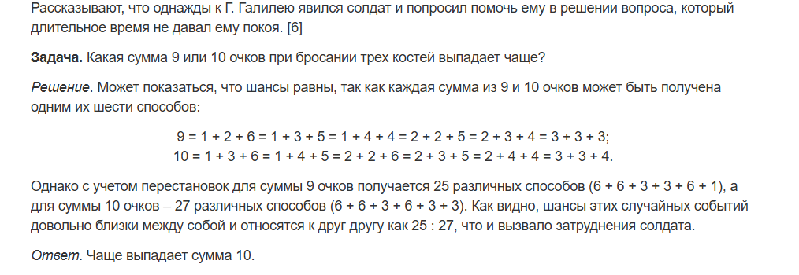

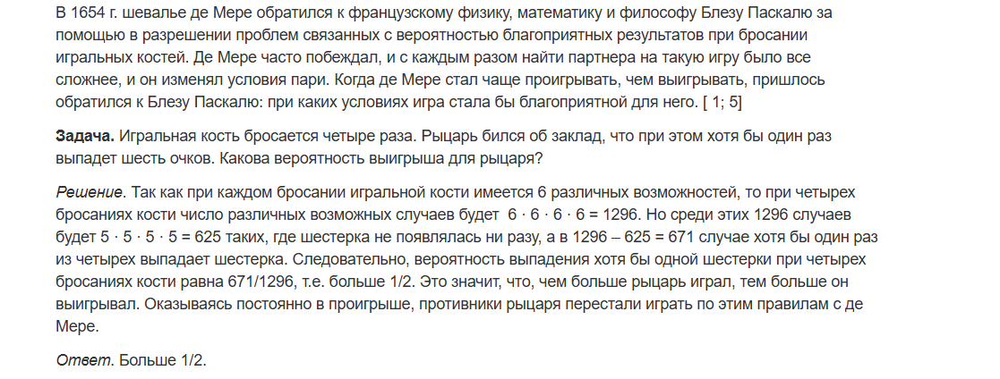

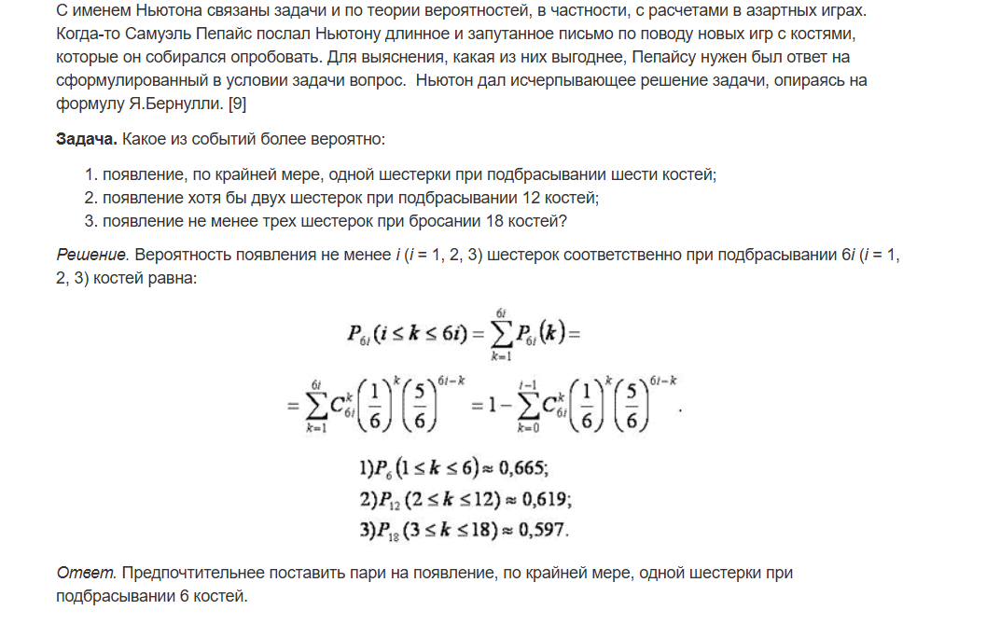

## Как математики ломали блэкджек

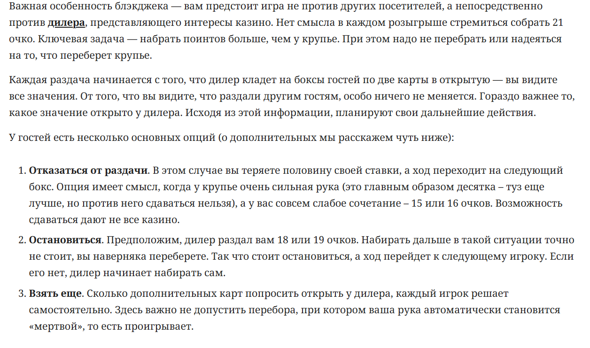

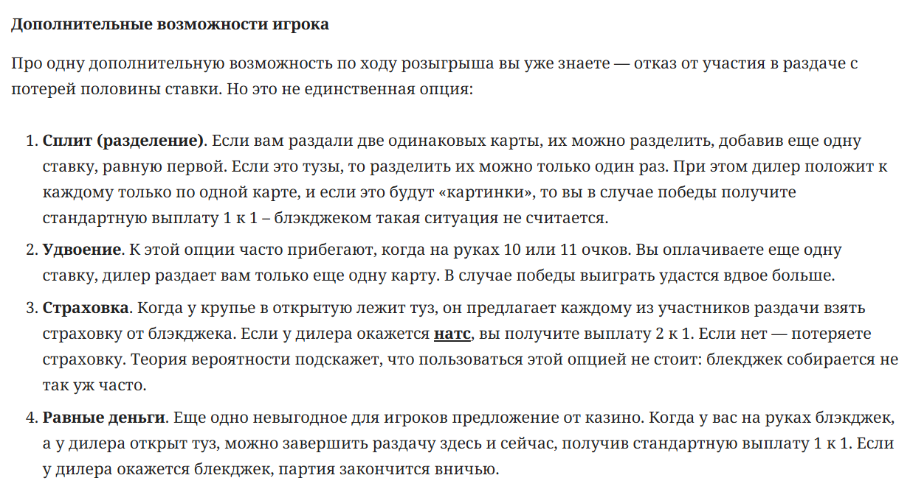

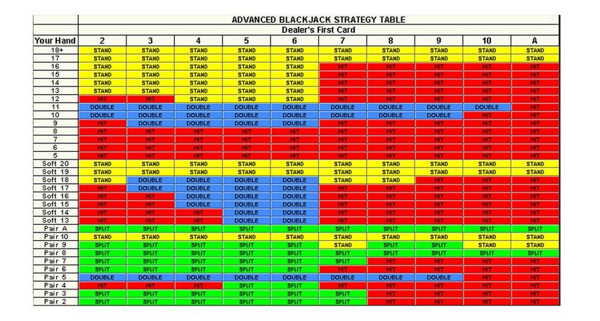

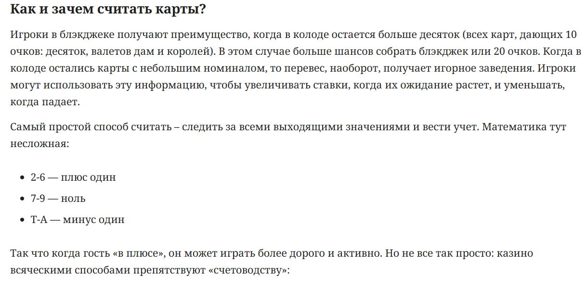

- Шансы при обычной игре — 45%
- При использовании таблиц — 49%
- При использовании счёта — 51%

## Что не так с монополией?

Какие зоны наиболее выгодны?

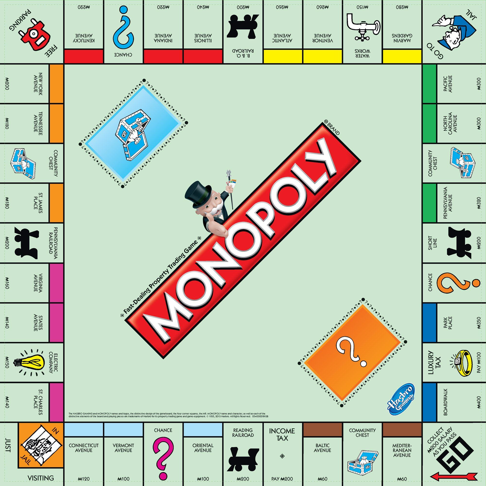

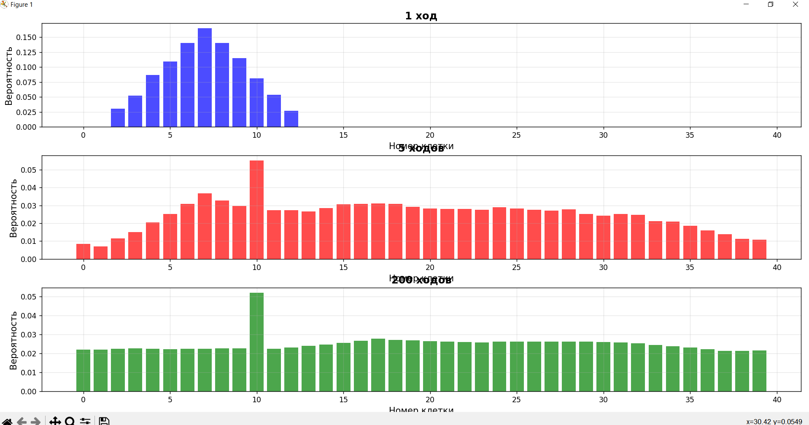

## Собака бывает кусачей от знаний теорвера

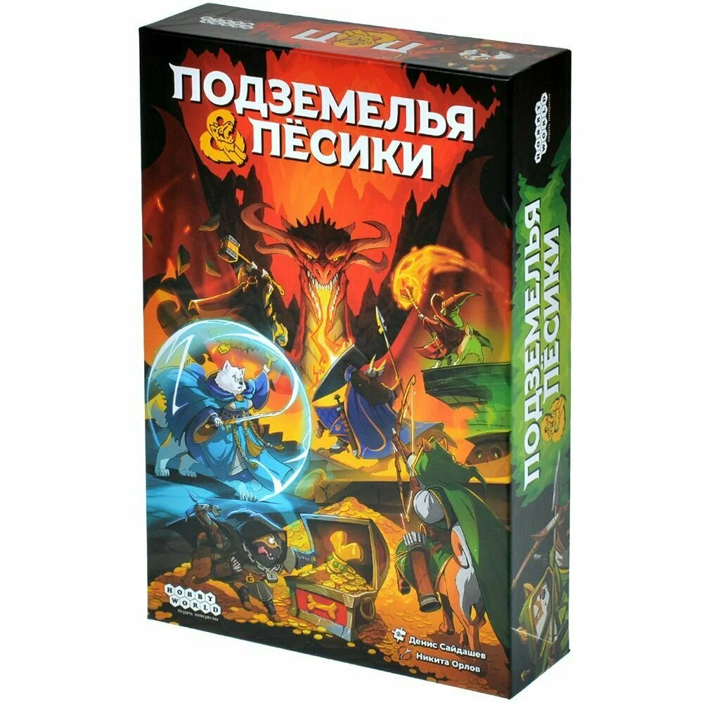

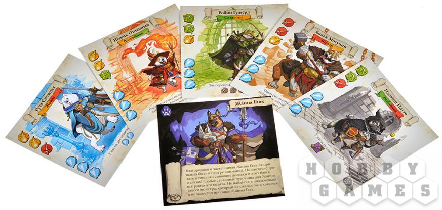

В конце игры нужно сбежать из подземелья. По пути встречаются противники 1 и 2 уровня.

- 1 уровень: просит 2 какие-либо характеристики, даёт 1 характеристику при победе, $-1$ защиту при поражении.
- 2 уровень: просит 3 характеристики, даёт 1 защиту при победе, $-2$ защиты при поражении.

Вероятность бежать через 5+ монстров — не более пары процентов.

У обоих способности направлены на игнорирование монстров — значит, смотрим только наборы, которых мы не можем победить.

- Если на пути есть хотя бы 1 монстр 2 уровня — Жанна будет не хуже Руты.
- Если на пути 3− или 5+ монстров — разницы не будет.
- Разница только когда ровно 4 монстра 1 уровня, которых ни один из игроков не может победить.
- Во всех прочих случаях Жанна лучше.

А ещё там ужасный баланс числа игроков и числа карт после первого побега.

## Считаем ресурсы

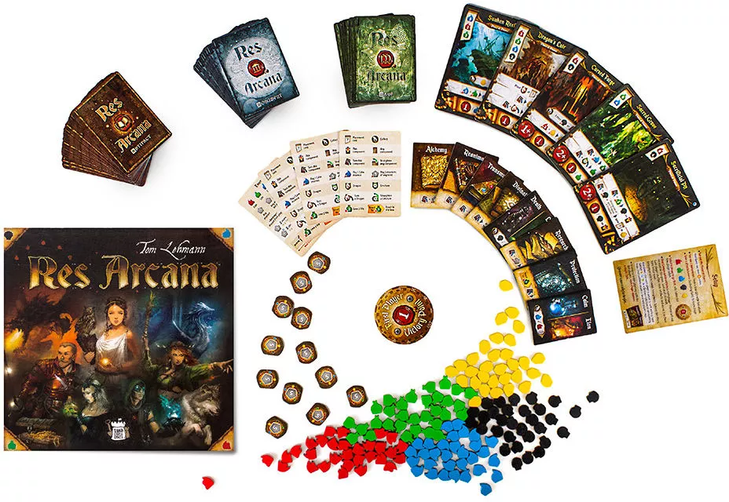

Карты в руке, колода и 6 стартовых ресурсов. В свой ход можно построить карту с руки за ресурсы или сбросить карту, чтобы получить 2 любых ресурса.

В начале игры выбрать один из предметов:

- получить 1 огонь или 1 воду;
- получить 1 смерть или 1 жизнь;
- потратить 1 ресурс и взять 1 карту из колоды в руку.

В чём дисбаланс?

Фиксится тем, что игроки выбирают предметы начиная с последнего. Правда, у первого игрока в этой игре нет никаких преимуществ.

Сравнение двух карт:

- **Алхимический камень** — раз в ход потратить 2 любых ресурса и превратить $X$ любого ресурса в $X$ золота.
- **Атанор** — раз в ход потратить 1 огонь и положить 2 огня на карту. Когда на карте 6 огня — сбросить и превратить $X$ любого ресурса в $X$ золота.

## Запретные персонажи в Forbidden Desert

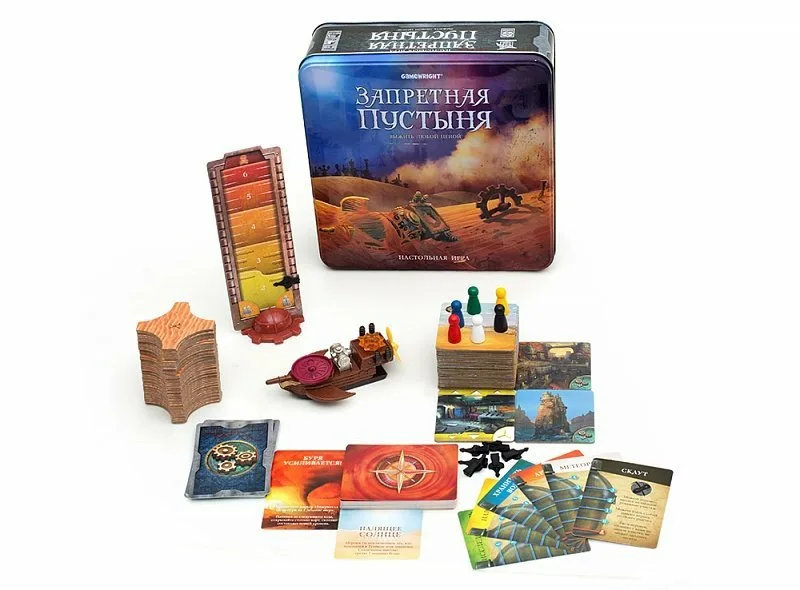

Умереть можно из-за того, что закончились тайлы песка (редко, их 48) или закончилась вода (часто).

В свой ход 4 действия:

- переместиться, чтобы поискать деталь для победы;
- убрать 1 песок;
- вскрыть 1 из 2 колодцев, чтобы все на клетке получили 2 воды (колодцы одноразовые).

В конце хода каждого игрока тянут от 3 до 6 карточек событий из колоды в 31 карту.

- 25 выкладывают песок;
- 4 заставляют всех терять по 1 воде (со старта у всех от 3 до 5);
- 3 усиливают бурю (больше карт событий после хода).

В среднем колода событий прокручивается 3–6 раз за игру.

Три персонажа:

- **Хранитель воды** — действием получить 2 воды из использованного колодца, может передавать воду.
- **Метеоролог** — потратить 1 действие, чтобы тянуть на 1 карту событий меньше.
- **Археолог** — одним действием убирать сразу 2 песка с 1 клетки.

Что с балансом? Баланс жив?

## Лотерея

Как гарантированно выиграть в лотерею?

42 возможных числа, для джекпота нужно угадать 5 из 5. Какой шанс?

[История румына, который 14 раз законно выиграл в лотерею](https://vc.ru/money/771401-kenguru-s-karmanom-nabitym-dengami-istoriya-rumyna-s-zarplatoi-v-10-kotoryi-14-raz-zakonno-vyigral-v-lotereyu)

## Главное блюдо: DnD

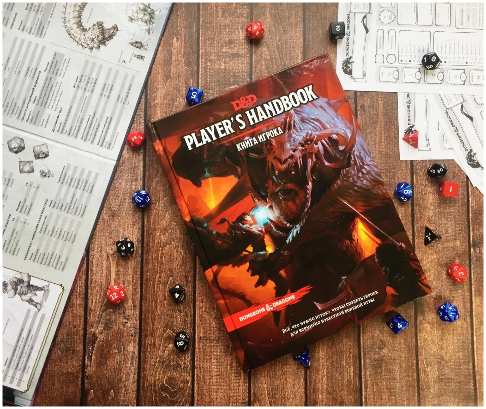

Где может сломаться баланс?

- Игра кооперативная ⇒ баланс между персонажами не так важен.
- Баланс первого хода тоже не про это.
- Баланс сложности лежит на ДМ (Wizards of the Coast пытаются балансить бои — забудем).
- Баланс промежуточных шагов нужен, но в большей мере определяется фантазией игроков и ситуациями ДМ.

В бою у игроков одна цель — победить противников, поэтому кооперативный дисбаланс ощущается остро. Хочется отыгрывать того персонажа, которого создали, и не хочется быть слабым на фоне других.

Где есть дисбаланс:

- классы не равны между собой;
- подклассы одного класса не равны;
- самое болезненное: классы, кажется, разрабатывались в отрыве друг от друга — мультикласс собирает поломанные сборки.

Самое смешное:

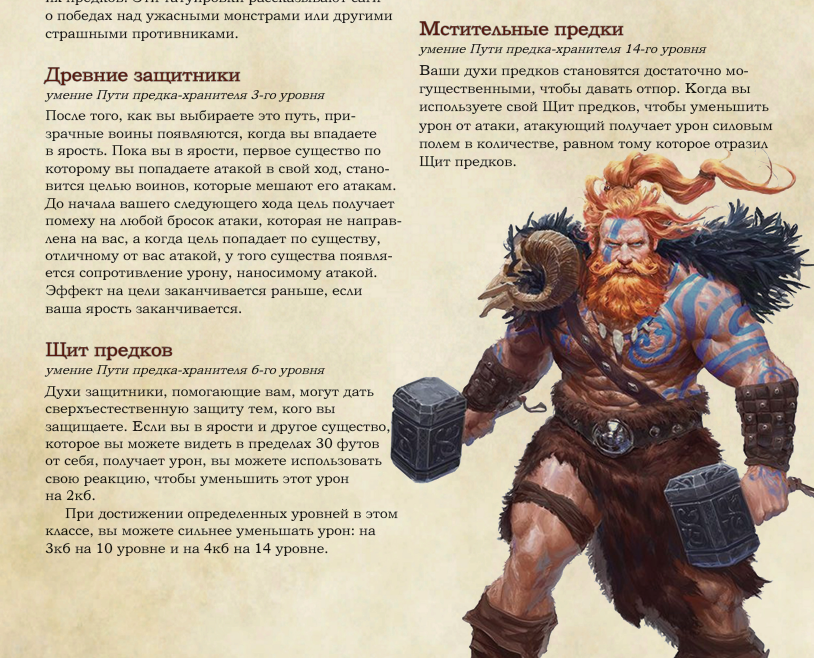

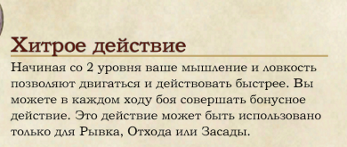

У берсерка в ярости повышенная скорость.

Паладин имеет урон с руки от Силы и урон с магии от Харизмы — вынужден качать разные параметры.

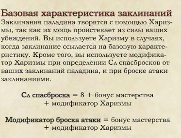

Но колдун «Ведьмовской клинок» уже на первом уровне имеет вот такую способность:

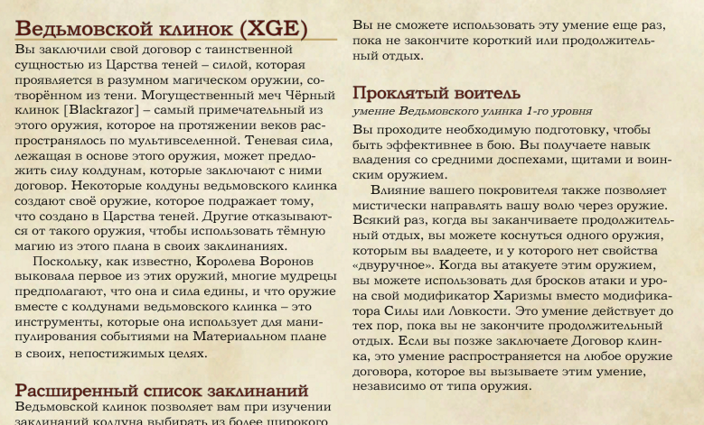

Про то, что делает с противниками паладин, наложивший проклятие ведьмовского клинка, божественную кару и сглаз, предпочту промолчать.

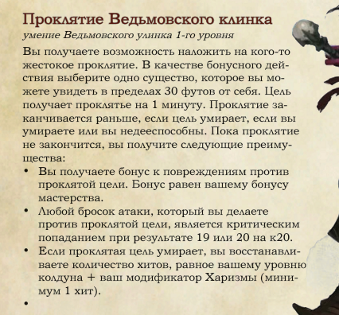

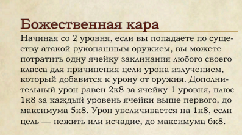

В DnD местами очень кривые формулировки.

Убийца — один из самых разочаровывающих подклассов: единственная сильная особенность срабатывает только при ударе из засады.

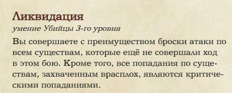

Следопыт / сумеречный охотник:

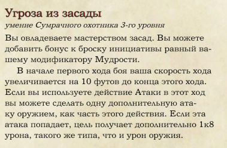

Плюс заклинание маскировки, чтобы с засадами всё было хорошо. Дальше орки с усиленными критами, мультиатаки через воина ради второго дыхания — и к 13 уровню средний урон $\sim 350$, который игнорирует защиту, потому что все атаки — криты.

Древний дракон 21 уровня, которого потенциально могут выдать группе, имеет как раз примерно столько здоровья. Б — баланс.

В примерах выше достаточно нескольких простых начальных способностей. Сложное билдостроение почти не понадобилось.

Чтобы сломать игру, билд вообще не обязателен. Самый сломанный класс — жрец домена Сумерек.

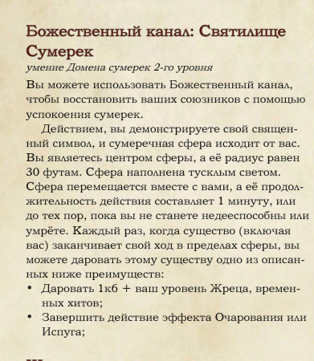

Если группа не попала в засаду, урон распределяется по воинам, а жрец хотя бы иногда вспоминает, что умеет лечить — ГМ не будет наносить группе никакого урона.

Всё выше — конкретные промахи в дизайне способностей. Бывают ещё комплексные проблемы: кривые механики, которые потом постоянно мешают разработчику. Часто это экономика (много типов ресурсов и слишком простой обмен), баланс типов (маги сильнее воинов) или формулы, которые толкают на скучную, но эффективную прокачку.

Если у воина есть урон, здоровье, защита, уклонение, скорость атаки:

- **Хороший баланс** — один параметр усиливает полезность другого. В формулах это часто умножение: эффективное здоровье $=$ здоровье $\times$ защита.
- **Приемлемый** — параметры складываются: здоровье $\times$ защита $+$ временное здоровье.
- **Плохой** — параметр усиливает сам себя. Простой пример — отрицание в знаменателе:

$$
\text{эффективное здоровье} = \frac{\text{здоровье}}{1 - \text{защита}/20} + \text{временное здоровье}
$$

Угадайте, откуда формула.

## Самый простой способ сломать DnD

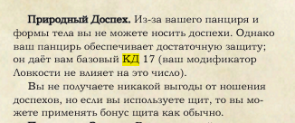

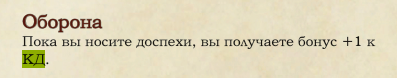

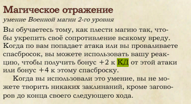

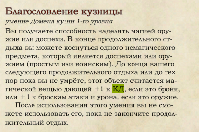

Ещё $+2$ от щитов.

Итого 23 КД на 3 уровне, не считая предметы и баффы союзных магов.

Противники на этом уровне вряд ли имеют бонус к атакам больше $+4$, поэтому эффективное здоровье $\sim 30 \times 20 = 600$, а у большей части группы — $25 \times 1{,}7 = 40$.

Если противники не маги, мастер может автоматически заканчивать бой. И это можно получить без манчкинизма — просто захотев бронированного персонажа.
