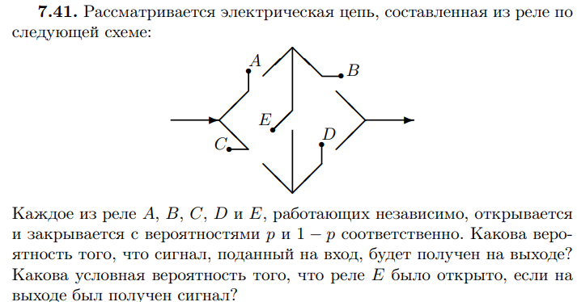

# Практика 1. Повторение дискретной ТВ: события и условные вероятности

**Цель.** События, классическая вероятность, независимость и формула Байеса; зарядить ружьё на базовую частоту.

**Ход пары**

1. Ружьё: профессии Стива
2. Элементарные исходы
3. Суммы и произведения
4. Комбинаторика
5. Условная вероятность
6. Независимость
7. Полная вероятность и Байес

## Чеховское ружьё

На доске в начале пары — четыре профессии. Зачитать описание, спросить, какая профессия наиболее вероятна. Ответ не раскрывать: выстрел в [практическом примере про Стива](#практический-пример-стив).

- Библиотекарь
- Фармацевт
- Продавец
- Пожарный

Некто описывает своего соседа: «Стив очень застенчив и нелюдим, всегда готов помочь, но мало интересуется окружающими и действительностью. Он тихий и аккуратный, любит порядок и систематичность и очень внимателен к деталям». Кем вероятнее работает Стив?

## Элементарные исходы

### Теория

!!! abstract "На доску"
    === "Дискретное"

        *Дискретным вероятностным пространством* (англ. *discrete probability space*) называется пара из некоторого (не более чем счётного) множества $\Omega$ и функции $p: \Omega \rightarrow \mathbb{R}_+$ ($\Omega$ — *множество элементарных исходов*, $\omega \in \Omega$ — *элементарный исход*), такая, что $\sum_{\omega \in \Omega} p(\omega) = 1$.

    === "Общее $(\Omega, \mathcal{F}, P)$"

        Пусть $\Omega$ — непустое множество элементарных исходов.
        Класс $\mathcal{F}$ подмножеств образует $\sigma$-алгебру:

        1. $\Omega \in \mathcal{F}$;
        2. если $A \in \mathcal{F}$, то $\overline{A} \in \mathcal{F}$;
        3. если $A_1, A_2, \dots \in \mathcal{F}$, то $\bigcup_{i=1}^{\infty} A_i \in \mathcal{F}$.

        Элементы $\mathcal{F}$ — *события*. $\Omega$ — достоверное, $\varnothing$ — невозможное. $A$ и $B$ несовместны, если $AB = \varnothing$.

        Функция $P : \mathcal{F} \rightarrow [0, 1]$ — *вероятность*, если $P(\Omega) = 1$ и

        $$
        P\left( \bigcup_{i=1}^{\infty} A_i \right) = \sum_{i=1}^{\infty} P(A_i)
        $$

        для попарно несовместных $A_i$. Тройка $(\Omega, \mathcal{F}, P)$ — *вероятностное пространство*.

У текущего потока нет теории мер перед теорвером.
Поэтому, следует

Четыре отличия общего определения от дискретного:
- Снято ограничение «не более чем счётно» на $\Omega$ (Для работы на непрерывных мн-вах).
- Вероятность задаётся не на элементарных исходах, а на событиях (Для работы на непрерывных мн-вах)..
- Введены сложные правила, какие множества считаются событиями (Т.К. есть неизмеримые мн-ва).
- Счётную аддитивность приходится требовать явно: в дискретном случае она следовала из того, что сумма по всем исходам равна 1.

!!! abstract "На доску"
    Классическое определение: $\Omega = \{\omega_1, \dots, \omega_n\}$, $\mathcal{F}$ — все подмножества,

    $$
    P(A) = \frac{\text{число элементов в } A}{n}.
    $$

    Исходы равновозможны.

## Суммы и перемножения событий

### Теория

!!! abstract "На доску"
    **Сложение несовместных.** Вероятность появления одного из двух несовместных событий, безразлично какого:

    $$
    P(A + B) = P(A) + P(B).
    $$

Следствие для попарно несовместных:

$$
P(A_1 + \dots + A_n) = P(A_1) + \dots + P(A_n).
$$

!!! abstract "На доску"
    **Сложение совместных.** Вероятность хотя бы одного из двух совместных:

    $$
    P(A + B) = P(A) + P(B) - P(AB).
    $$

Для трёх:

$$
P(A + B + C) = P(A) + P(B) + P(C) - P(AB) - P(AC) - P(BC) + P(ABC).
$$

!!! abstract "На доску"
    **Умножение.** Вероятность совместного появления двух событий:

    $$
    P(AB) = P(A) \cdot P(B \mid A).
    $$

    Для независимых $P(AB) = P(A)P(B)$.

Для нескольких:

$$
P(A_1 A_2 \dots A_n) = P(A_1)\, P(A_2 \mid A_1)\, P(A_3 \mid A_1 A_2) \cdots P(A_n \mid A_1 \dots A_{n-1}).
$$

Если независимы в совокупности — просто произведение безусловных.

### Задача 1. Два орудия

Вероятность одного попадания в цель при одном залпе из двух орудий равна 0,38. Найти вероятность поражения цели при одном выстреле первым из орудий, если для второго эта вероятность равна 0,8.

#### Решение

??? question "Открыть"
    Пусть $A$ — попадание первого орудия, $B$ — второго, $P(B) = 0{,}8$. Орудия независимы, «одно попадание при залпе» — ровно одно из двух:

    $$
    P(A\overline{B}) + P(\overline{A}B) = P(A)(1 - 0{,}8) + (1 - P(A)) \cdot 0{,}8 = 0{,}38.
    $$

    Отсюда $0{,}2\,P(A) + 0{,}8 - 0{,}8\,P(A) = 0{,}38$, то есть $0{,}6\,P(A) = 0{,}42$, значит $P(A) = 0{,}7$.

## Комбинаторика

### Теория

Задачи на комбинаторику обычно решаются через классическую вероятность: нашли число благоприятных исходов, нашли число всех, поделили.

!!! abstract "На доску"
    | Формула | Что считает |
    | --- | --- |
    | $n!$ | перестановки $n$ различных |
    | $A_n^k = n!/(n-k)!$ | размещения (порядок важен) |
    | $C_n^k = n!/(k!(n-k)!)$ | сочетания (порядок не важен) |
    | $n!/(n_1! \dots n_k!)$ | перестановки с повторениями |

### Задача 2. МАТЕМАТИКА

Ребёнок играет с 10 буквами разрезной азбуки: А, А, А, Е, И, К, М, М, Т, Т. Какова вероятность, что при случайном расположении букв в ряд получится слово МАТЕМАТИКА?

#### Решение

??? question "Открыть"
    Буквы в наборе те же, что в слове МАТЕМАТИКА: три А, по две М и Т, по одной Е, И, К.

    Всего различных рядов:

    $$
    \frac{10!}{3!\,2!\,2!} = 151200.
    $$

    Благоприятный исход один. Значит $P = 1/151200$.

### Задача 3. Сенаторы

В США каждый из 48 штатов представлен двумя сенаторами. События: в комитете из 48 сенаторов, выбранных случайно, (1) представлен данный штат, (2) представлены все штаты.

#### Решение

??? question "Открыть"
    (1) Удобнее дополнительное событие: данный штат не представлен. Сенаторов 96, из них 94 не из этого штата:

    $$
    q = \frac{C_{94}^{48}}{C_{96}^{48}} = \frac{48 \cdot 47}{96 \cdot 95} = 0{,}24737\dots
    $$

    Искомая вероятность: $1-q$.

    (2) Комитет с одним сенатором от каждого штата: $2^{48}$ способов. Тогда $p = 2^{48} / C_{96}^{48}$. По формуле Стирлинга $n! \sim \sqrt{2\pi n}\,(n/e)^n$ получается $p \approx (3\pi)^{1/2} 2^{-46} \approx 4 \cdot 10^{-14}$.

    Ту же задачу можно считать через перестановки с повторениями.

## Условная вероятность

### Теория

!!! abstract "На доску"
    *Условная вероятность* $P(A \mid B)$ события $A$ при условии, что произошло событие $B$ ненулевой вероятности:

    $$
    P(A \mid B) = \frac{P(AB)}{P(B)}, \quad P(B) > 0.
    $$

### Задача 4. Следствия независимости

Пусть $P(A_1 \mid A_2) = P(A_1)$. Показать:

- а) $P(A_1 \mid \overline{A}_2) = P(A_1)$;
- б) $P(\overline{A}_1 \mid A_2) = P(\overline{A}_1)$.

#### Решение

??? question "Открыть"
    Условие означает независимость: $P(A_1 A_2) = P(A_1)P(A_2)$ (и $P(A_2) > 0$).

    **а)** $P(A_1 \overline{A}_2) = P(A_1) - P(A_1 A_2) = P(A_1)(1 - P(A_2))$, поэтому при $P(A_2) < 1$

    $$
    P(A_1 \mid \overline{A}_2) = \frac{P(A_1)(1 - P(A_2))}{1 - P(A_2)} = P(A_1).
    $$

    **б)** $P(\overline{A}_1 \mid A_2) = 1 - P(A_1 \mid A_2) = 1 - P(A_1) = P(\overline{A}_1)$.

### Задача 5. Какие равенства верны

Верны ли равенства:

- а) $P(B \mid A) + P(\overline{B} \mid A) = 1$;
- б) $P(B \mid A) + P(B \mid \overline{A}) = 1$?

#### Решение

??? question "Открыть"
    **а)** Верно при $P(A) > 0$: при фиксированном $A$ события $B$ и $\overline{B}$ несовместны и покрывают всё.

    **б)** Неверно. Если $A$ и $B$ независимы, левая часть равна $2P(B)$ и равна 1 только при $P(B) = 1/2$. Контрпример: независимые $A$ и $B$ с $P(B) = 0{,}3$, тогда $0{,}3 + 0{,}3 = 0{,}6 \neq 1$.

## Независимость

### Теория

!!! abstract "На доску"
    События $A$ и $B$ независимы, если $P(AB) = P(A)P(B)$.

!!! abstract "На доску"
    $A_1, \dots, A_n$ независимы в совокупности, если для любого $\{i_1, \dots, i_k\} \subset \{1, \dots, n\}$

    $$
    P(A_{i_1} \dots A_{i_k}) = P(A_{i_1}) \cdots P(A_{i_k}).
    $$

### Задача 6. Тетраэдр Бернштейна

На плоскость бросается тетраэдр: три грани покрашены в красный, синий и зелёный, на четвёртую нанесены все три цвета. К — выпала грань с красным, С — с синим, З — с зелёным. Проверить независимость в совокупности и попарную независимость К, С и З.

### Задача 7. Квадрат · дополнительно

Точка $\xi = (\xi_1, \xi_2)$ выбрана наудачу в квадрате $[0, 1]^2$. Пусть $A = \{\xi_1 \le 1/2\}$, $B = \{\xi_2 \le 1/2\}$ и $C = \{(\xi_1 - 1/2)(\xi_2 - 1/2) < 0\}$. Зависимы ли эти события

- а) в совокупности;
- б) попарно?

### Задача 8. Независимость от себя · дополнительно

Пусть событие $A$ не зависит от самого себя. Показать, что тогда $P(A) = 0$ или $P(A) = 1$.

### Практический пример: Стив {: #практический-пример-стив }

Вернуться к опросу с начала пары. Сначала собрать голоса, потом открыть решение.

#### Решение

??? question "Открыть"
    Правильный ответ — продавец.

    Описание больше подходит библиотекарю или фармацевту, и этот человек с большей вероятностью *пошёл бы* в одну из этих профессий. Но одни профессии просто чаще встречаются.

    Статистика по США на 2023 год:

    | Профессия | Численность | К библиотекарям |
    | --- | ---: | ---: |
    | Библиотекарь | 125 тыс | 1 |
    | Фармацевт | 333 тыс | $\approx 2{,}7$ |
    | Продавец | 4000 тыс | 32 |
    | Пожарный | 302 тыс | $\approx 2{,}4$ |

    Пусть даже Стив вчетверо охотнее пошёл бы в библиотекари — продавцов больше в 32 раза, и по условной вероятности он всё равно чаще продавец, чем библиотекарь.

    !!! quote "Канеман, «Думай медленно… решай быстро»"
        Все немедленно отмечают сходство Стива с типичным библиотекарем, но почти всегда игнорируют не менее важные статистические соображения. Вспомнилось ли вам, что на каждого мужчину-библиотекаря в США приходится более 20 фермеров? Фермеров настолько больше, что «тихие и аккуратные» почти наверняка окажутся за рулём трактора, а не за библиотекарским столом. И всё же участники экспериментов игнорировали статистические факты и полагались исключительно на сходство. Мы предположили, что испытуемые использовали сходство как упрощающую эвристику, чтобы легче прийти к сложному оценочному суждению. Доверие к эвристике вело к прогнозируемым искажениям в предсказаниях.

## Формула полной вероятности и формула Байеса

### Теория

!!! abstract "На доску"
    Гипотезы $B_1, \dots, B_n$ положительной вероятности, попарно несовместны, $A \subset (B_1 + \dots + B_n)$. Тогда

    $$
    P(A) = \sum_{i=1}^{n} P(A \mid B_i) P(B_i).
    $$

!!! abstract "На доску"
    Если произошло $A$, апостериорные вероятности гипотез:

    $$
    P(B_j \mid A) = \frac{P(A \mid B_j) P(B_j)}{\sum_{i=1}^{n} P(A \mid B_i) P(B_i)}.
    $$

### Задача 9. Списывание

Если КТшник нашёл решения задач по теорверу, то спишет с вероятностью $P(A \mid B_1) = 0{,}7$, если не найдёт — с вероятностью $P(A \mid B_2) = 0{,}5$. Вероятность найти решения $P(B_1) = 0{,}5$.

Какова вероятность, что он списывал из решения, а не у соседа, если известно, что списал?

### Задача 10. Цепь · дополнительно

Рассматривается электрическая цепь из реле:

Каждое из реле $A$, $B$, $C$, $D$ и $E$ независимо открывается и закрывается с вероятностями $p$ и $1-p$. Какова вероятность, что сигнал со входа дойдёт до выхода? Какова условная вероятность, что реле $E$ было открыто, если сигнал получен?

#### Решение

??? question "Открыть"
    Разложить по мостику $E$. Реле открыто (пропускает ток) с вероятностью $p$.

    Если $E$ закрыто (вероятность $1-p$), остаются две независимые цепочки $AB$ и $CD$:

    $$
    P(S \mid \overline{E}) = 1 - (1 - p^2)^2 = 2p^2 - p^4.
    $$

    Если $E$ открыто (вероятность $p$), средние точки короткозамкнуты: нужен хотя бы один из $\{A, C\}$ и хотя бы один из $\{B, D\}$:

    $$
    P(S \mid E) = \bigl(1 - (1-p)^2\bigr)^2 = (2p - p^2)^2.
    $$

    Итого

    $$
    P(S) = p(2p - p^2)^2 + (1-p)(2p^2 - p^4) = 2p^2 + 2p^3 - 5p^4 + 2p^5.
    $$

    $$
    P(E \mid S) = \frac{P(S \mid E)\, p}{P(S)} = \frac{p(2-p)^2}{2 + 2p - 5p^2 + 2p^3}.
    $$

### Практический пример: Солнце {: #практический-пример-солнце }

Пусть у нас есть устройство с вероятностью 99,99% раз в день показывает, правда ли, что взорвалось Солнце. Сегодня показывает, что взорвалось.    
Вопрос в зал: поверите ли устройству?    
Ожидаемый ответ - «нет»
Тогда, просим доказать Байесом, почему ответ "нет" разумен, при условии что априор взрыва Солнца в конкретный день: $10^{-10}$.

#### Решение

??? question "Открыть"
    $H$ — Солнце взорвалось, $D$ — прибор показал взрыв. $P(D \mid H) = 0{,}9999$, $P(D \mid \overline{H}) = 0{,}0001$, $P(H) = 10^{-10}$.

    $$
    P(D) = 0{,}9999 \cdot 10^{-10} + 0{,}0001 \cdot (1 - 10^{-10}) \approx 10^{-4}.
    $$

    $$
    P(H \mid D) = \frac{0{,}9999 \cdot 10^{-10}}{P(D)} \approx 10^{-6}.
    $$

    Даже после срабатывания вероятность взрыва порядка миллионной: ложные срабатывания на фоне почти достоверного $\overline{H}$ перевешивают.

    Карл Саган: экстраординарные утверждения требуют экстраординарных доказательств.     
    Если априор слишком мал, нужны очень точные измерения, иначе ошибка перевешивает.

### Практический пример: Казино

Пусть вы зашли в деревенское казино: старое деревянное здание, вывеска маркерами по потёртой жёлтой бумаге «Рулетка». Рулетки нет — под вывеской усатый дед в ушанке подкидывает монетку. Ставите на сторону. Предыдущие 6 бросков — решка. На что ставить: решка, орёл или 50/50?

#### Решение

??? question "Открыть"
    Кто не знает теорвер: «орёл, не может так часто падать решка».
    Кто знает теорвер: «50/50, броски независимы».
    Кто знает матстат: «решка».

    Вероятность бывает от чистой случайности и от неопределённости. Чистая случайность — в основном в задачах. Перемешивание колоды в задачнике случайно; в жизни это детерминированный процесс. Инопланетянин с идеальным зрением знал бы, где какая карта. «Случайность» — это дыра в ваших знаниях.

    Раз процесс детерминирован, у него могут быть закономерности. Прошлые испытания про них сообщают. Шесть решек — намёк, что монета, техника деда или глаз смещают шанс. Логичнее ставить на решку, а не на орла.

## Самостоятельная

Пишется в начале следующей пары.

**5 минут.** Вероятность убить вампира ударом осинового кола в тело $P(A) = 0{,}4$. Вероятность убить человека таким ударом $P(B) = 0{,}7$. Вы убили кого-то ударом осинового кола в тело. Вероятность, что это вампир и вас не посадят. Соотношение людей к вампирам $99:1$.

#### Решение

??? question "Открыть"
    $V$ — вампир, $H$ — человек, $K$ — убили колом. По соотношению $99:1$ априоры $P(V)=1/100$, $P(H)=99/100$. По условию $P(K\mid V)=0{,}4$, $P(K\mid H)=0{,}7$. Не посадят, если это вампир:

    $$
    P(V\mid K) = \frac{0{,}4\cdot 1/100}{0{,}4\cdot 1/100 + 0{,}7\cdot 99/100} = \frac{0{,}4}{0{,}4 + 69{,}3} = \frac{4}{697} \approx 0{,}0057.
    $$

    Людей много, колом человека убить легче — даже после «успеха» вампир остаётся редкой гипотезой.

**8 минут.** 13 разобранных вампиров, каждый из 2 частей. Наугад берёте 6 частей. Шанс собрать хотя бы одного вампира?

#### Решение

??? question "Открыть"
    Всего $26$ частей, способов взять $6$: $C_{26}^{6}$. Дополнение: ни одной пары, то есть $6$ частей от $6$ разных вампиров. Выбрать вампиров $C_{13}^{6}$, от каждого одну из двух частей: $2^{6}$.

    $$
    P = 1 - \frac{C_{13}^{6}\, 2^{6}}{C_{26}^{6}} = 1 - \frac{1716\cdot 64}{230230} = \frac{421}{805}.
    $$

!!! note "Домашнее задание"
    Выдаётся после пары. `HW1_y2023.pdf` — файл пока не переносился на сайт.
