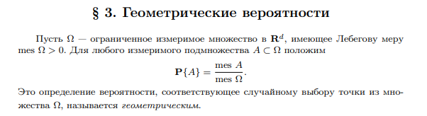
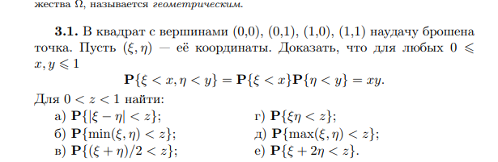
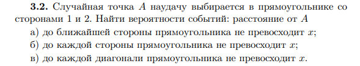
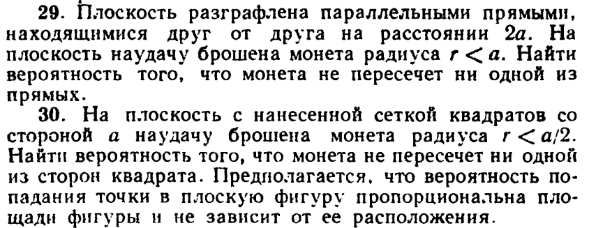
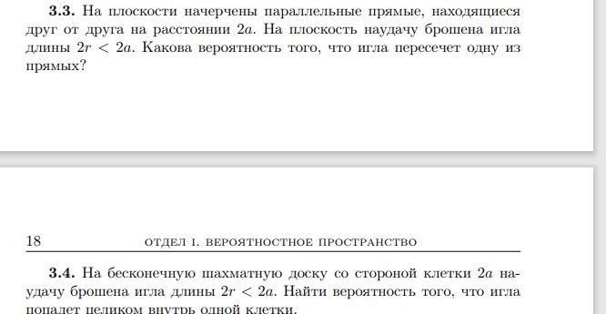
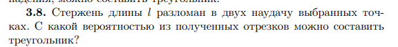
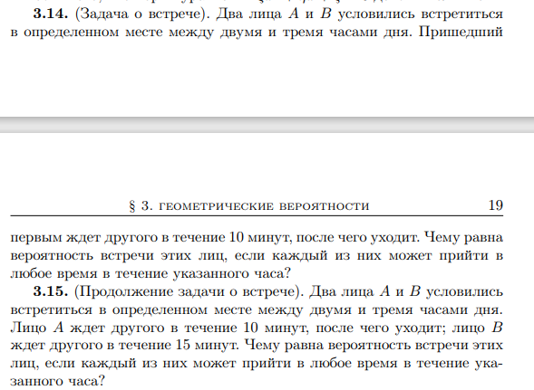

# Практика 3. Геометрическая вероятность

В Word эта пара почти целиком на слайдах.

!!! note "Домашнее задание"
    `HW3_y2023.pdf`

!!! example "Самостоятельная"

    **5 минут.** Есть 2 человека, которые друг друга ненавидят. Они устроились в компанию, в которой нужно работать 1 день в 2 недели. Один выбирает случайное время $t$ внутри недели и работает с $t$ до $t+24\mathrm{h}$ на каждой чётной неделе, другой выбирает случайное время $r$ и работает с $r$ до $r+24\mathrm{h}$ на каждой нечётной неделе. Какова вероятность, что они встретятся?

    **5 минут.** На окружности наудачу выбраны три точки $A$, $B$ и $C$. Найти вероятность того, что треугольник $ABC$ будет тупоугольным.
