# Практика 4. Дискретные распределения

Выписать на доску:

- равномерное
- Бернулли
- биномиальное
- Паскаля
- геометрическое
- отрицательное биномиальное
- гипергеометрическое
- Пуассона

## Виды задания случайной величины

- табличка
- функция плотности
- многоугольник распределения
- функция распределения
- график распределения
- объект

Постройте все виды задания СВ для шестигранного кубика.

## Биномиальное

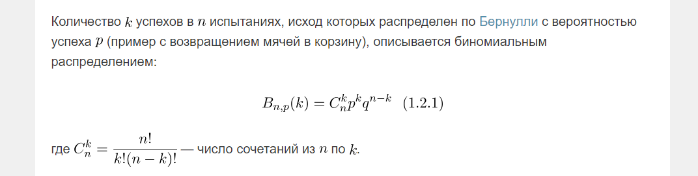

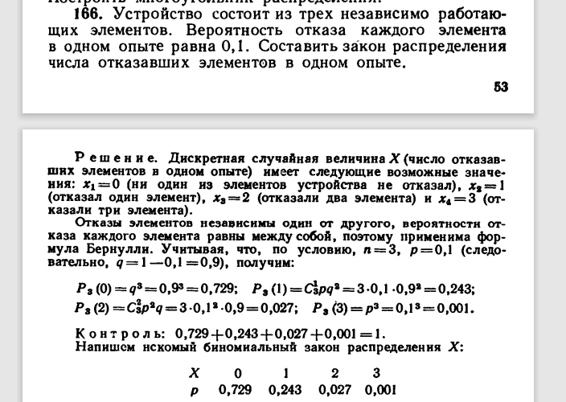

## Геометрическое

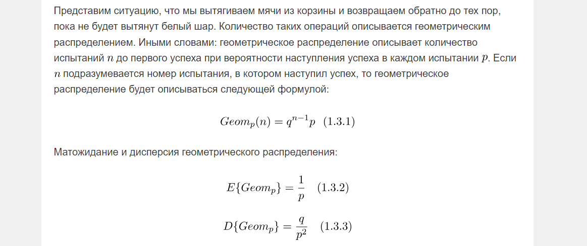

Вероятность сдать экзамен: $0{,}4$. Найдите распределение количества неудачных попыток. (Геометрическое.)

Вероятность сдать экзамен: $0{,}4$. Найдите распределение количества попыток сдачи (суммарно).

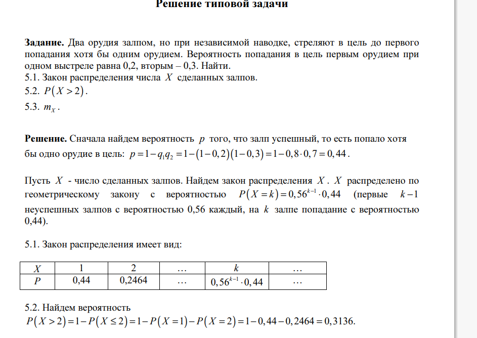

## Паскаля

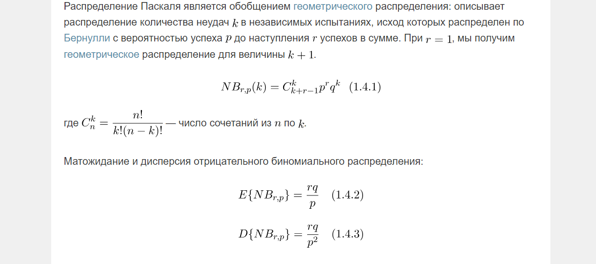

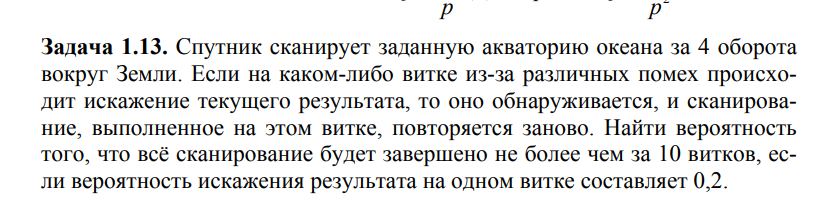

$S = 4$, $p = 0.8$. $P(k$ — суммарное число неудач$) = ?$

Показываем, что для $k$ неудач $+ r$ успехов нужна вероятность $q^k p^r$, домноженная на число сочетаний $C_{k+r-1}^{r-1}$.

## Гипергеометрическое

Испытания **не** независимы.

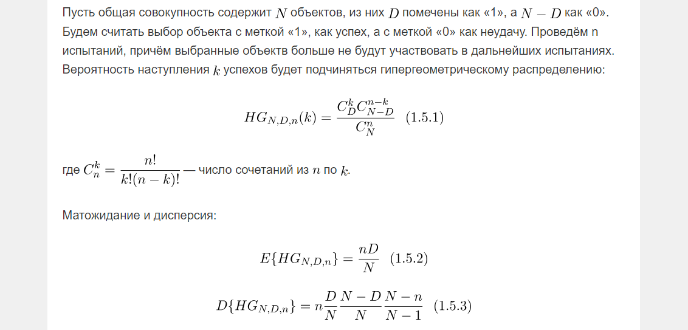

- Ч — успех
- $N = \operatorname{count}(\text{Ч}) + \operatorname{count}(\text{Б})$
- $D = \operatorname{count}(\text{Б})$
- $n$ — выбранное количество

## Пуассон

- $n < 20$ / $n < 200$: биномиальное $P(k) = C_n^k p^k q^{n-k}$
- $n > 50$ и $p > 0.1$: локальная теорема Муавра–Лапласа
- $n > 50$ и $p < 0.1$: теорема Пуассона $P(k) = \lambda^k e^{-\lambda} / k!$

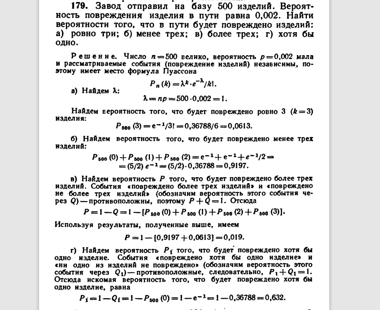

## Простейший поток событий

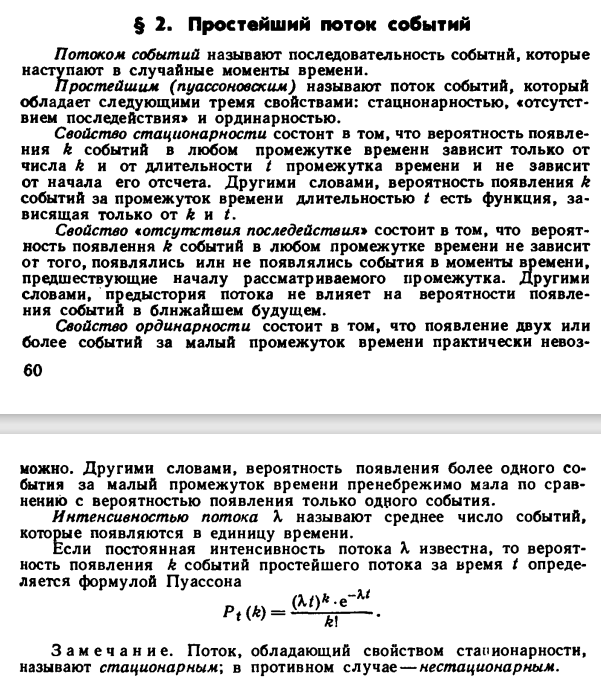

Почему на примере со звонками: в каждый момент времени $t$ у вас очень низкая вероятность $p$, что позвонит каждый конкретный человек из большого множества в $n$ людей.

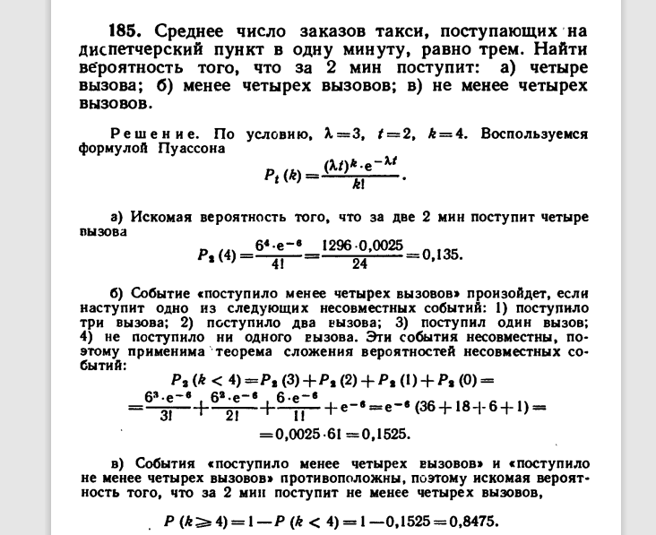

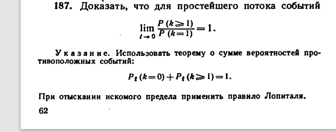

!!! note "Домашнее задание"
    `HW4_y2023.pdf`

!!! example "Самостоятельная"

    **4 минуты.** Человек $X$ идёт под сосульками. Каждая сосулька может упасть на него с вероятностью $0{,}2$. Голова выдерживает 3 сосульки (на четвёртой он теряет сознание). Посчитайте вероятность, что он успеет пройти под $k+4$ сосульками.

    **4 минуты.** Человек $Y$ видит валяющегося в отключке $X$ и $\sim 20$ упавших сосулек позади него. Он знает, что $X$ вырубится, если на голову упадут 4 сосульки. Берёт 5 случайных упавших сосулек, чтобы наказать их. Найдите вероятность, что среди наказанных будут хотя бы 3 упавшие на голову $X$.
