# Практика 5. Производящие функции

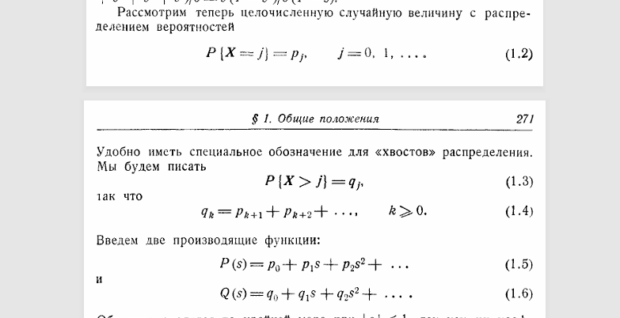

Подстановка $1$ в $P(s)$ даёт нам вероятности (для данной ситуации не очень осмысленно, но когда мы будем вычислять формулы из производящих функций, это станет полезным замечанием).

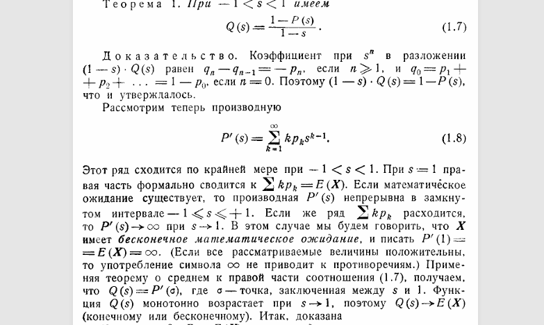

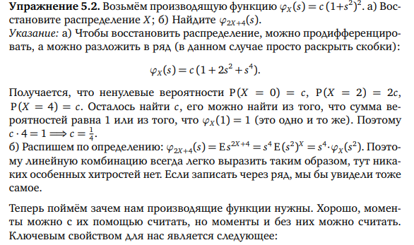

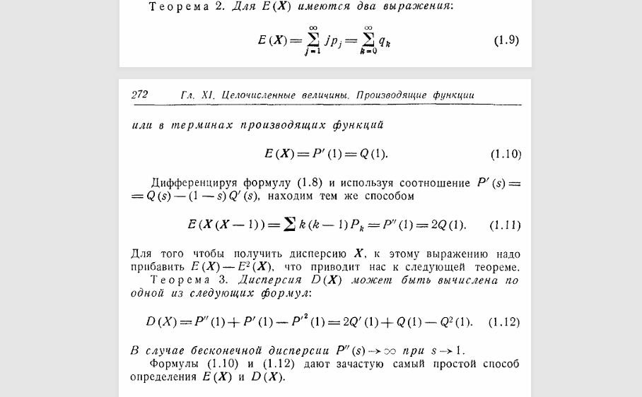

## Задача

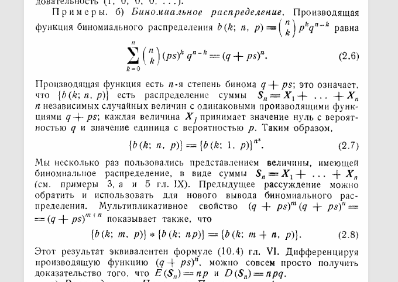

## Случайные блуждания в производящих функциях

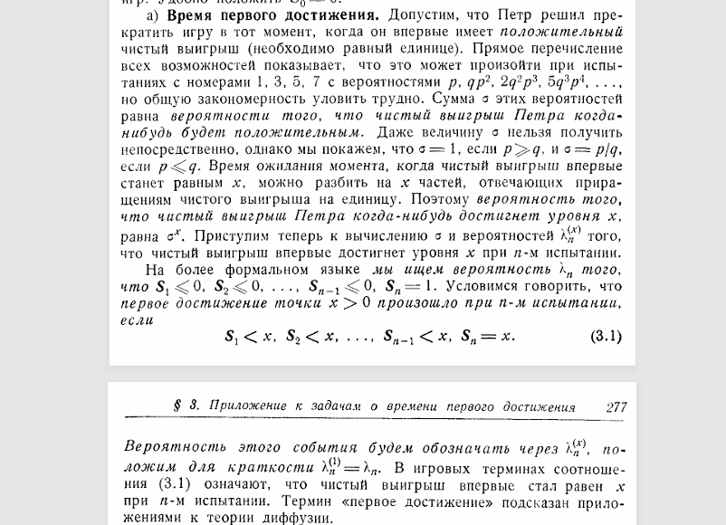

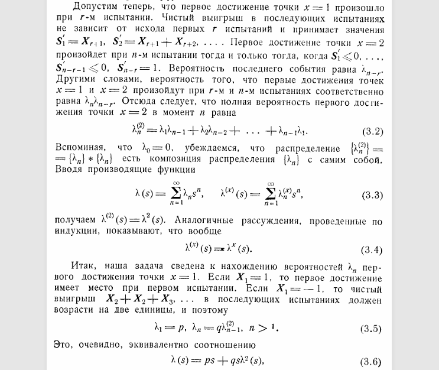

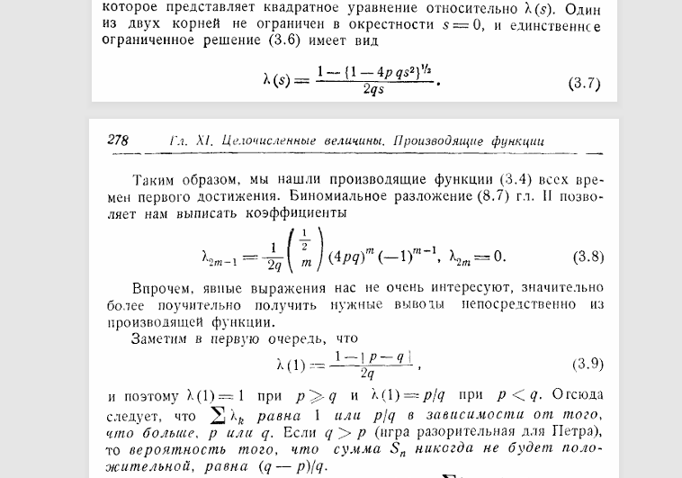

## Теорема непрерывности

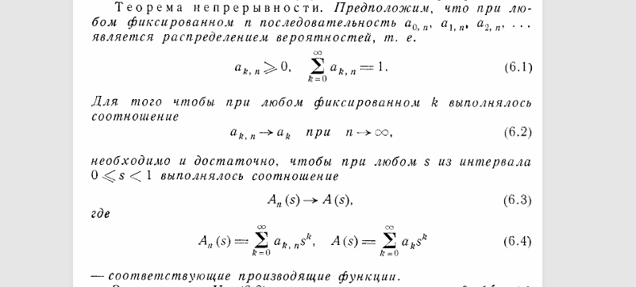

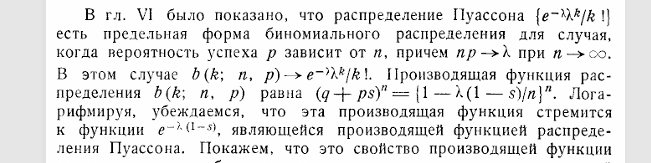

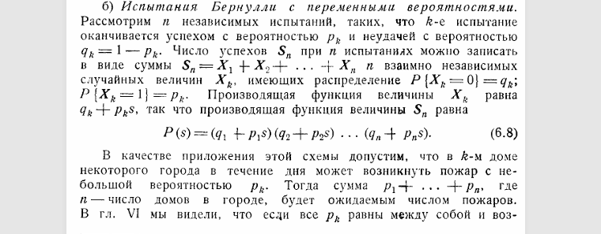

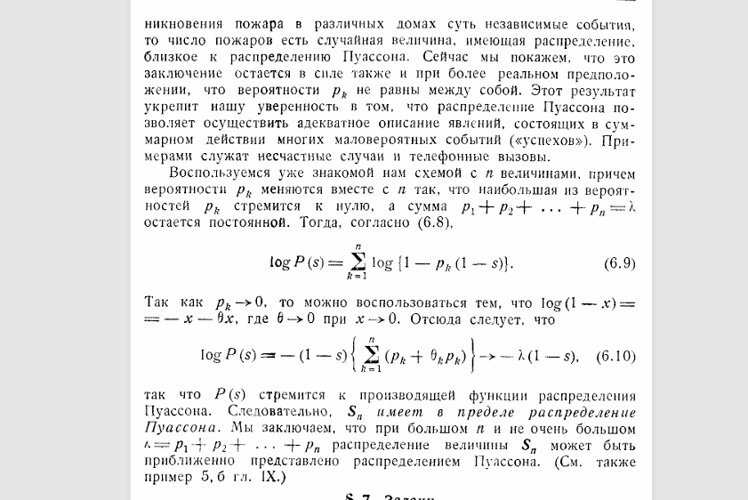

!!! note "Домашнее задание"
    `HW5_y2023.pdf`

!!! example "Самостоятельная"

    **5 минут.** Найти производящую функцию и матожидание (через производящую функцию) распределения Пуассона.

    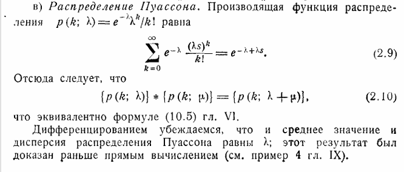

    **6 минут.** Найти производящую функцию и матожидание (через производящую функцию) геометрического распределения.

    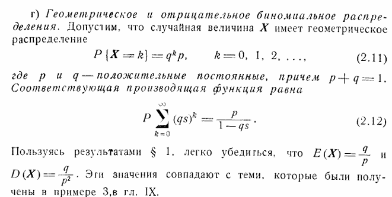
