# Практика 7. Непрерывные СВ и преобразования

**Цель.** Функция распределения и плотность; преобразования непрерывных СВ — монотонные, немонотонные и многомерные.

**Ход пары**

1. Функции распределения и плотности
2. Преобразование одномерной СВ
3. Строго монотонные преобразования
4. Немонотонные преобразования
5. Многомерные преобразования
6. Дискретные распределения

Из двух пар (7 и 8) **7 — почти полностью теория**, 8 — закрепление и нарешивание.

## Функции распределения и плотности

### Теория

!!! abstract "На доску"
    Функцией распределения называют функцию $F(x)$, определяющую для каждого значения $x$ вероятность того, что случайная величина $X$ примет значение, меньшее $x$,

    $$
    F(x) = P(X < x).
    $$

!!! abstract "На доску"
    Свойство 1. Значения функции распределения принадлежат отрезку $[0; 1]$:

    $$
    0 \leqslant F(x) \leqslant 1.
    $$

!!! abstract "На доску"
    Свойство 2. Функция распределения есть неубывающая функция:

    $$
    F(x_2) \geqslant F(x_1), \quad \text{если } x_2 > x_1.
    $$

!!! abstract "На доску"
    Следствие 1. Вероятность того, что случайная величина $X$ примет значение, заключенное в интервале $(a, b)$, равна приращению функции распределения на этом интервале:

    $$
    P(a < X < b) = F(b) - F(a).
    $$

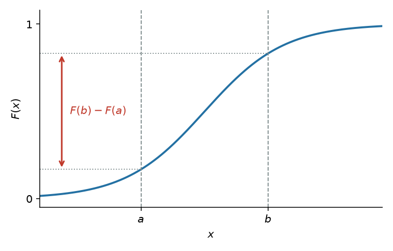

!!! abstract "На доску"
    Следствие 2. Вероятность того, что непрерывная случайная величина $X$ примет одно определенное значение, например $x_1$, равна нулю:

    $$
    P(X = x_1) = 0.
    $$

!!! abstract "На доску"
    Свойство 3. Если все возможные значения случайной величины $X$ принадлежат интервалу $(a, b)$, то

    $$
    F(x) = 0 \text{ при } x \leqslant a; \qquad F(x) = 1 \text{ при } x \geqslant b.
    $$

!!! abstract "На доску"
    Следствие. Справедливы следующие предельные соотношения:

    $$
    \lim_{x \to -\infty} F(x) = 0, \qquad \lim_{x \to +\infty} F(x) = 1.
    $$

!!! abstract "На доску"
    Свойство 4. Функция распределения непрерывна слева:

    $$
    \lim_{x \uparrow x_0} F(x) = F(x_0).
    $$

В современных курсах чаще пишут $F(x)=P(X\leqslant x)$ и непрерывность справа. Здесь — формулировка с $P(X<x)$, как в задачниках.

### Плотность

!!! abstract "На доску"
    Плотностью распределения вероятностей непрерывной случайной величины называют первую производную от функции распределения: $f(x) = F'(x)$.

!!! abstract "На доску"
    Вероятность того, что непрерывная случайная величина $X$ примет значение, принадлежащее интервалу $(a, b)$, определяется равенством

    $$
    P(a < X < b) = \int_a^b f(x)\, dx.
    $$

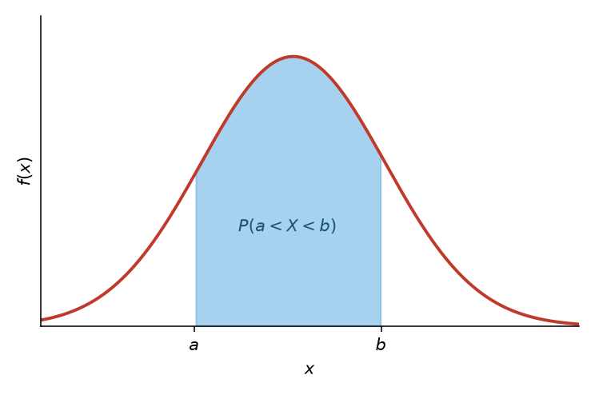

!!! abstract "На доску"
    Зная плотность распределения, можно найти функцию распределения

    $$
    F(x) = \int_{-\infty}^{x} f(x)\, dx.
    $$

!!! abstract "На доску"
    Свойство 1. Плотность распределения неотрицательна, т. е. $f(x) \geqslant 0$.

!!! abstract "На доску"
    Свойство 2. Несобственный интеграл от плотности распределения в пределах от $-\infty$ до $\infty$ равен единице: $\int_{-\infty}^{\infty} f(x)\, dx = 1$.

В частности, если все возможные значения случайной величины принадлежат интервалу $(a, b)$, то $\int_a^b f(x)\, dx = 1$.

### Задача 7.1. Кусочная $F$

Случайная величина $X$ задана функцией распределения

$$
F(x) =
\begin{cases}
0, & x \leqslant -1, \\
\dfrac{3}{4}x + \dfrac{3}{4}, & -1 < x \leqslant \dfrac{1}{3}, \\
1, & x > \dfrac{1}{3}.
\end{cases}
$$

Найти вероятность того, что в результате испытания величина $X$ примет значение, заключенное в интервале $(0, 1/3)$ и найти плотность.

#### Решение

??? question "Открыть"
    $P(a < X < b) = F(b) - F(a)$. Положив $a = 0$, $b = 1/3$,

    $$
    P\bigl(0 < X < 1/3\bigr) = F(1/3) - F(0) = 1 - \tfrac{3}{4} = \tfrac{1}{4}.
    $$

    Плотность — производная там, где $F$ гладкая: $f(x) = 3/4$ при $-1 < x < 1/3$, и $f(x)=0$ вне этого интервала. Скачки $F$ нет, в $\pm$ концах носителя плотность не обязана быть определена.

    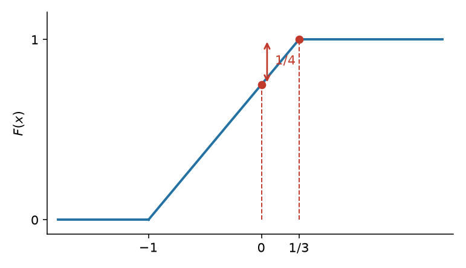

### Задача 7.2. Арктангенс

Случайная величина $X$ задана на всей оси $Ox$ функцией распределения $F(x) = 1/2 + (\operatorname{arctg} x)/\pi$. Найти вероятность того, что в результате испытания величина $X$ примет значение, заключенное в интервале $(0, 1)$ и найти плотность.

#### Решение

??? question "Открыть"
    $$
    P(0 < X < 1) = F(1) - F(0) = \Bigl(\tfrac12 + \tfrac{\operatorname{arctg} 1}{\pi}\Bigr) - \tfrac12 = \tfrac{1}{4}.
    $$

    $$
    f(x) = F'(x) = \frac{1}{\pi(1+x^2)}.
    $$

    Это плотность Коши (с точностью до сдвига/масштаба — стандартная).

    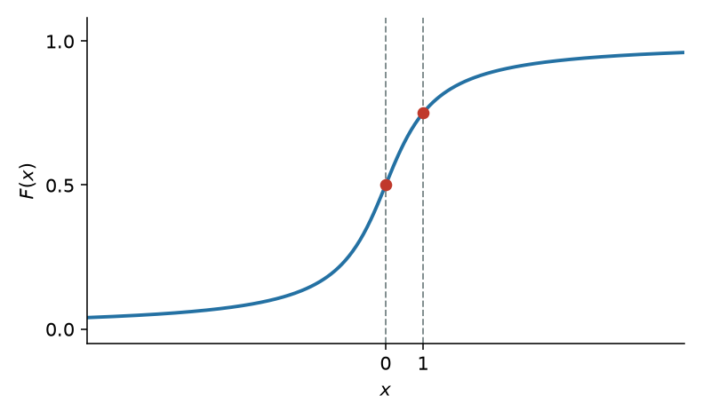

## Преобразование одномерной СВ

### Теория

!!! abstract "На доску"
    Пусть $X \sim f_X(x)$ — непрерывная случайная величина с носителем $\mathcal{X}$. Пусть случайная величина $Y$ задана через преобразование $Y = g(X)$. Тогда $Y$ имеет функцию распределения

    $$
    F_Y(y) = \int_{\{x \in \mathcal{X} : g(x) \leqslant y\}} f_X(x)\, dx.
    $$

Дальше есть два пути: посчитать напрямую по этой формуле или разбить на монотонно возрастающие/убывающие интервалы, чтобы взять обратную функцию.

Давайте один раз попробуем первый вариант — чтобы больше к нему не возвращаться.

### Задача 7.3. $\sin^2$ напрямую

Рассмотрим случайную величину $X \sim \mathrm{uniform}(0, 2\pi)$ и преобразование $Y = g(X) = \sin^2 X$.

График $\sin^2$ на $[0, 2\pi]$: два горба, горизонталь $y$ пересекает кривую в четырёх точках $x_1 < x_2 < \pi < x_3 < x_4$.

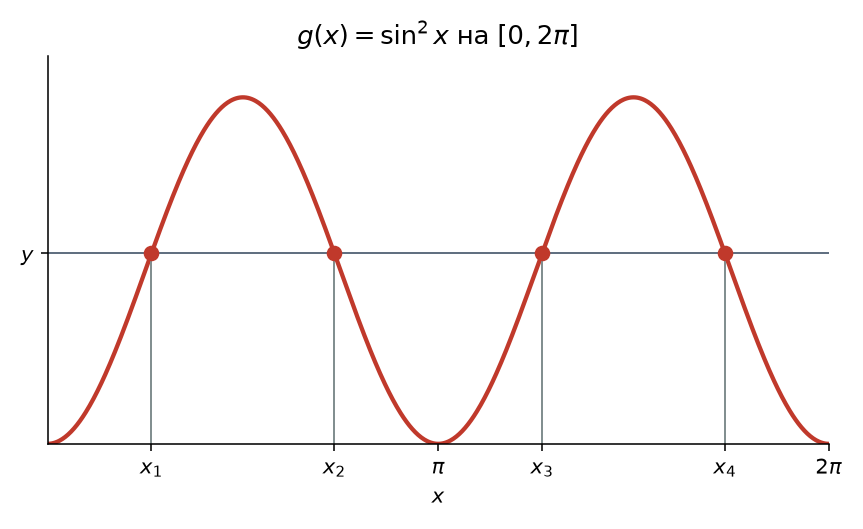

#### Решение

??? question "Открыть"

    $$
    X \sim \mathrm{uniform}(0, 2\pi) \implies f_X(x) = \frac{1}{2\pi},\ x \in [0; 2\pi]
    \implies F_X(x) = \int_0^x \frac{1}{2\pi}\, dt = \frac{x}{2\pi},\ x \in [0; 2\pi].
    $$

    $$
    Y = g(X) = \sin^2 X
    $$

    $$
    \begin{aligned}
    F_Y(y) &= P(Y \leqslant y) = P\bigl(g(X) \leqslant y\bigr) \\
    &= P(X \leqslant x_1) + P(x_2 \leqslant X \leqslant x_3) + P(X \geqslant x_4) \\
    &= 2P(X \leqslant x_1) + 2P(x_2 \leqslant X \leqslant \pi) \\
    &= 2\bigl[F_X(x_1) + F_X(\pi) - F_X(x_2)\bigr] \\
    &= \frac{1}{\pi}(x_1 - x_2 + \pi).
    \end{aligned}
    $$

    Носитель $Y$ — $[0, 1]$. Для $y\in(0,1)$ положим $\alpha=\arcsin\sqrt{y}\in(0,\pi/2)$. Тогда

    $$
    x_1=\alpha,\quad x_2=\pi-\alpha,\quad x_3=\pi+\alpha,\quad x_4=2\pi-\alpha.
    $$

    Подставить в уже полученное:

    $$
    F_Y(y)=\frac{1}{\pi}\bigl(\alpha-(\pi-\alpha)+\pi\bigr)=\frac{2\alpha}{\pi}=\frac{2}{\pi}\arcsin\sqrt{y}.
    $$

    На краях $F_Y(y)=0$ при $y\leqslant 0$ и $F_Y(y)=1$ при $y\geqslant 1$. Плотность:

    $$
    f_Y(y)=F_Y'(y)=\frac{2}{\pi}\cdot\frac{1}{\sqrt{1-y}}\cdot\frac{1}{2\sqrt{y}}=\frac{1}{\pi\sqrt{y(1-y)}}, \qquad y\in(0,1).
    $$

    Это арксинусное распределение (бета $1/2$, $1/2$). Дальше к общему интегралу по $\{g\leqslant y\}$ не возвращаемся: режем на монотонные куски.

## Строго монотонные преобразования

### Теория

!!! abstract "На доску"
    Пусть $X \sim F_X(x)$ и $Y = g(X)$, где $g(x)$ является строго монотонным преобразованием. Тогда

    1. $g$ возрастает на $\mathcal{X}$ $\implies$ $F_Y(y) = F_X\bigl(g^{-1}(y)\bigr)$, $y \in \mathcal{Y}$;
    2. $g$ убывает на $\mathcal{X}$ и $X$ является непрерывной $\implies$ $F_Y(y) = 1 - F_X\bigl(g^{-1}(y)\bigr)$, $y \in \mathcal{Y}$.

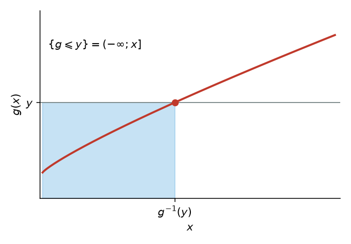

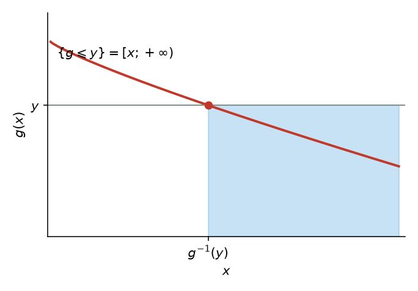

!!! abstract "На доску"
    Диффеоморфизмом называется такая биективная функция $g(x)$, обратная $g^{-1}(y)$ которой является непрерывно дифференцируемой.

!!! abstract "На доску"
    Пусть $X \sim f_X(x)$ является непрерывной случайной величиной и $Y = g(X)$, где $g$ является диффеоморфизмом и строго монотонной функцией. Тогда плотность вероятности $Y$ имеет вид

    $$
    f_Y(y) =
    \begin{cases}
    f_X\bigl(g^{-1}(y)\bigr) \left|\dfrac{d}{dy} g^{-1}(y)\right|, & y \in \mathcal{Y}, \\
    0, & y \notin \mathcal{Y},
    \end{cases}
    $$

    где $\mathcal{Y}$ — носитель распределения $Y$.

Модуль производной — якобиан в одномерии: сжимаете ось $x$ в $y$, плотность пересчитывается.

### Немонотонные преобразования

!!! abstract "На доску"
    Пусть $X \sim f_X(x)$ и $Y = g(X)$. Пусть существует такое разбиение $A_0, A_1, \dots, A_k$ для носителя $\mathcal{X}$ случайной величины $X$, что $f_X(x)$ непрерывна на всех $A_i$ и $P(X \in A_0) = 0$. Пусть существуют функции $g_1(x), \dots, g_k(x)$, определенные на $A_1, \dots, A_k$ соответственно и удовлетворяющие условиям:

    1. $g(x) = g_i(x)$, $x \in A_i$;
    2. множество $\mathcal{Y} = \{ y : y = g_i(x) \text{ для } x \in A_i \}$ одинаково для каждого $i = 1, \dots, k$;
    3. $g_i(x)$, как отображение из $A_i$ в $\mathcal{Y}$, является диффеоморфизмом.

    Тогда плотность вероятности $Y$ имеет вид:

    $$
    f_Y(y) = \sum_{i=1}^{k} f_X\bigl(g_i^{-1}(y)\bigr) \left|\frac{d}{dy} g_i^{-1}(y)\right|, \qquad y \in \mathcal{Y}.
    $$

На графике куски $g_{i-1}$, $g_i$, $g_{i+1}$ живут на $A_{i-1}$, $A_i$, $A_{i+1}$.

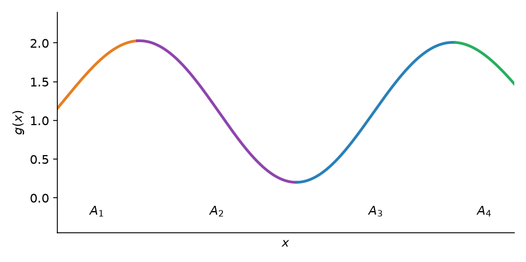

### Задача 7.4. $Y=3X$

Задана плотность распределения $f(x)$ случайной величины $X$, возможные значения которой заключены в интервале $(a, b)$. Найти плотность распределения случайной величины $Y = 3X$.

#### Решение

??? question "Открыть"
    Так как функция $y = 3x$ дифференцируема и строго возрастает, то применима формула

    $$
    g(y) = f\bigl[\psi(y)\bigr] \cdot \bigl|\psi'(y)\bigr|,
    $$

    где $\psi(y)$ — функция, обратная функции $y = 3x$.

    $\psi(y) = y/3$, $f\bigl[\psi(y)\bigr] = f(y/3)$, $|\psi'(y)| = 1/3$.

    Искомая плотность $g(y) = (1/3)\, f(y/3)$. Так как $x$ изменяется в интервале $(a, b)$ и $y = 3x$, то $3a < y < 3b$.

### Задача 7.5. Квадрат нормальной

Рассмотрим случайную величину $X \sim n(0, 1)$:

$$
f_X(x) = \frac{1}{\sqrt{2\pi}} \exp\Bigl(-\frac{x^2}{2}\Bigr), \qquad x \in \mathbb{R},
$$

и квадратичное преобразование $Y = X^2$.

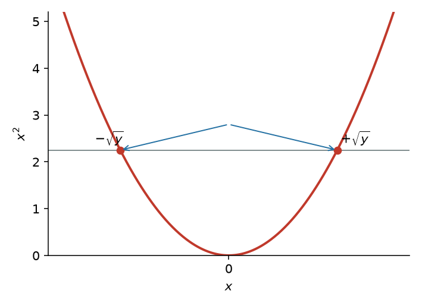

#### Решение

??? question "Открыть"
    $$
    \mathcal{Y} = (0; \infty),\quad
    A_1 = (-\infty; 0) \implies g_1(x) = x^2,\ g_1^{-1}(y) = -\sqrt{y},
    $$

    $$
    A_2 = (0; \infty) \implies g_2(x) = x^2,\ g_2^{-1}(y) = \sqrt{y},
    $$

    $$
    A_0 = \{0\}.
    $$

    Плотность $Y$:

    $$
    \begin{aligned}
    f_Y(y)
    &= f_X\bigl(g_1^{-1}(y)\bigr) \Bigl|\frac{d}{dy} g_1^{-1}(y)\Bigr| + f_X\bigl(g_2^{-1}(y)\bigr) \Bigl|\frac{d}{dy} g_2^{-1}(y)\Bigr| \\
    &= \frac{1}{\sqrt{2\pi}} \exp\Bigl(-\frac{y}{2}\Bigr) \cdot \frac{1}{2\sqrt{y}} + \frac{1}{\sqrt{2\pi}} \exp\Bigl(-\frac{y}{2}\Bigr) \cdot \frac{1}{2\sqrt{y}} \\
    &= \frac{1}{\sqrt{2\pi y}} \exp\Bigl(-\frac{y}{2}\Bigr).
    \end{aligned}
    $$

    Это распределение хи-квадрат!

## Многомерные преобразования

### Теория

Несмотря на то, что двумерные распределения ещё не проходили, бояться их не нужно. Это отображения из пар $(x, y)$ в вероятности; функции распределения и плотности определяются похожим образом. С преобразованиями: просто расширяем на многомерный случай.

Теория вероятностей #24: многомерные преобразования / сумма, разность и отношение случайных величин.

Одномерная случайная величина:

- случайная величина $X \sim f_X$;
- диффеоморфизм: $Y = g(X)$;
- плотность вероятности для $Y$:

!!! abstract "На доску"
    $$
    f_Y(y) = f_X\bigl(g^{-1}(y)\bigr) \left|\frac{d}{dy} g^{-1}(y)\right| \mathbf{1}_{\Omega_Y}(y).
    $$

Двумерная случайная величина:

- случайная величина $(X, Y) \sim f_{X,Y}$;
- диффеоморфизм: $U = g_1(X, Y)$, $V = g_2(X, Y)$;
- плотность вероятности для $(U, V)$:

$$
f_{U,V}(u, v) = f_{X,Y}\bigl(h_1(u, v), h_2(u, v)\bigr) |J| \mathbf{1}_{\Omega_{U,V}}(u, v).
$$

Так как $g_1(x, y)$ и $g_2(x, y)$ являются диффеоморфизмом, можно выразить обратные отображения: $X = h_1(U, V)$ и $Y = h_2(U, V)$.

В многомерном случае производная обратной функции заменяется на якобиан:

!!! abstract "На доску"
    $$
    J = \begin{vmatrix}
    \dfrac{\partial h_1(u, v)}{\partial u} & \dfrac{\partial h_1(u, v)}{\partial v} \\[6pt]
    \dfrac{\partial h_2(u, v)}{\partial u} & \dfrac{\partial h_2(u, v)}{\partial v}
    \end{vmatrix}
    = \frac{\partial h_1}{\partial u}\frac{\partial h_2}{\partial v} - \frac{\partial h_2}{\partial u}\frac{\partial h_1}{\partial v},
    $$

    где $J \ne 0$ и $(u, v) \in \Omega_{U,V}$.

Небиективное преобразование.

Необходимо построить разбиение $A_0, A_1, \dots, A_k \subset \Omega_{X,Y}$:

- $P\bigl((X, Y) \in A_0\bigr) = 0$;
- для $A_i$ дан диффеоморфизм $(U, V) = \bigl(g_{1i}(X, Y), g_{2i}(X, Y)\bigr)$, отображающий $A_i$ в $\Omega_{U,V}$;
- обратное преобразование: $(X, Y) = \bigl(h_{1i}(U, V), h_{2i}(U, V)\bigr)$.

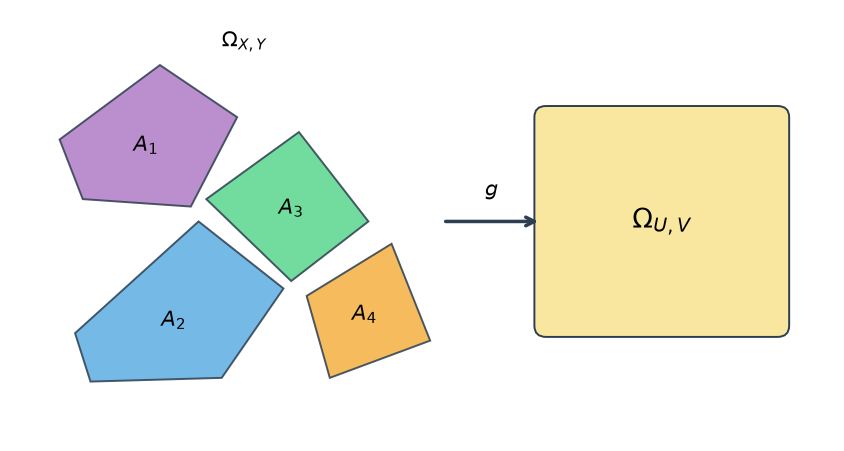

Совместное распределение для $(U, V)$:

!!! abstract "На доску"
    $$
    f_{U,V}(u, v) = \sum_{i=1}^{k} f_{X,Y}\bigl(h_{1i}(u, v), h_{2i}(u, v)\bigr) |J_i|,
    $$

    где якобиан имеет вид

    $$
    J_i = \begin{vmatrix}
    \dfrac{\partial h_{1i}}{\partial u} & \dfrac{\partial h_{1i}}{\partial v} \\[6pt]
    \dfrac{\partial h_{2i}}{\partial u} & \dfrac{\partial h_{2i}}{\partial v}
    \end{vmatrix}.
    $$

### Задача 7.6. Формула суммы

Выведите формулу суммы двумерной СВ.
Для начала поймём, что сумма является преобразованием двумерной СВ в одномерную СВ.
К сожалению, нам это не совсем подходит, т.к. преобразование не биективно, поэтому, посчитаем формулу для $(x, y) \to (x + y, y)$

$$
\varphi = (x + y,\ y), \qquad u = x + y,\quad v = y, \qquad J = 1\cdot 1 - 1\cdot 0 = 1.
$$

Обратное: $\psi = (u - v,\ v)$, $x = u - v$, $y = v$.

$$
f_{U,V}(u, v) = f_{X,Y}(u - v,\ v) \cdot |J| = f_{X,Y}(u - v,\ v).
$$

Fun facts:

1. Если $X \sim f_X$, $Y \sim f_Y$, $X$ и $Y$ независимы $\implies$ $(X, Y) \sim f_X f_Y = f_{XY}$.
2. $\int f_{X,Y}\, dy = f_X$ (маргинал).

Отсюда

$$
f_U(u) = \int_{-\infty}^{+\infty} f_X(u - v)\, f_Y(v)\, dv.
$$

#### Решение

??? question "Открыть"
    После замены $(U,V)=(X+Y,Y)$ маргинал $U$ — интеграл совместной по $v$. При независимости $f_{X,Y}(u-v,v)=f_X(u-v)f_Y(v)$, откуда свёртка выше. Поправка: интеграл берётся только по совместной области определения $v$ и $u-v$.

    Произведение $Z=XY$ тем же жестом через $F_Z$, либо сразу якобианом $(Z,X)=(XY,X)$: $x=x$, $y=z/x$, $|J|=1/|x|$,

    $$
    f_Z(z) = \int_{-\infty}^{\infty} f_X(x)\, f_Y(z/x)\, \frac{1}{|x|}\, dx.
    $$

### Задача 7.7. Сумма двух нормальных

Независимые нормально распределенные случайные величины $X$ и $Y$ заданы плотностями распределений:

$$
f_1(x) = \frac{1}{\sqrt{2\pi}} e^{-x^2/2}, \qquad f_2(y) = \frac{1}{\sqrt{2\pi}} e^{-y^2/2}.
$$

Доказать, что композиция этих законов, т. е. плотность распределения случайной величины $Z = X + Y$, также есть нормальный закон.

#### Решение

??? question "Открыть"
    Используем формулу $g(z) = \int_{-\infty}^{\infty} f_1(x) f_2(z - x)\, dx$. Тогда

    $$
    g(z) = \frac{1}{2\pi} \int_{-\infty}^{\infty} e^{-x^2/2} e^{-(z-x)^2/2}\, dx.
    $$

    Выполнив элементарные выкладки, получим

    $$
    g(z) = \frac{1}{2\pi} e^{-z^2/2} \int_{-\infty}^{\infty} e^{-(x^2 - zx)}\, dx.
    $$

    Дополнив показатель степени показательной функции, стоящей под знаком интеграла, до полного квадрата, вынесем $e^{z^2/4}$ за знак интеграла:

    $$
    g(z) = \frac{1}{2\pi} e^{-z^2/2} e^{z^2/4} \int_{-\infty}^{\infty} e^{-(x - z/2)^2}\, dx.
    $$

    Учитывая, что интеграл Пуассона, стоящий в правой части равенства, равен $\sqrt{\pi}$, окончательно имеем

    $$
    g(z) = \frac{1}{2\sqrt{\pi}} e^{-z^2/4}.
    $$

    Это $n(0,2)$: дисперсии сложились.

## Дискретные распределения

### Задача 7.8. Линейное $2X+1$

Дискретная случайная величина $X$ задана законом распределения:

| $X$ | 3 | 6 | 10 |
| --- | --- | --- | --- |
| $p$ | 0,2 | 0,1 | 0,7 |

Найти закон распределения случайной величины $Y = 2X + 1$.

#### Решение

??? question "Открыть"
    $y=2x+1$ взаимно однозначно, вероятности едут вместе со значениями: $7$, $13$, $21$ с теми же $0{,}2$, $0{,}1$, $0{,}7$.

    | $Y$ | 7 | 13 | 21 |
    | --- | --- | --- | --- |
    | $p$ | 0,2 | 0,1 | 0,7 |

### Задача 7.9. Квадрат дискретной

Дискретная случайная величина $X$ задана законом распределения:

| $X$ | −1 | −2 | 1 | 2 |
| --- | --- | --- | --- | --- |
| $p$ | 0,3 | 0,1 | 0,2 | 0,4 |

Найти закон распределения случайной величины $Y = X^2$.

#### Решение

??? question "Открыть"
    Возможные значения $Y$: $1$, $4$, $1$, $4$. Различным значениям $X$ соответствуют одинаковые значения $Y$: $X^2$ не монотонна.

    $P(Y=1)=P(X=-1)+P(X=1)=0{,}3+0{,}2=0{,}5$,
    $P(Y=4)=P(X=-2)+P(X=2)=0{,}1+0{,}4=0{,}5$.

    | $Y$ | 1 | 4 |
    | --- | --- | --- |
    | $p$ | 0,5 | 0,5 |

### Задача 7.10. Сумма двух дискретных

Дискретные независимые случайные величины $X$ и $Y$ заданы распределениями:

| $X$ | 1 | 3 |
| --- | --- | --- |
| $P$ | 0,3 | 0,7 |

| $Y$ | 2 | 4 |
| --- | --- | --- |
| $P$ | 0,6 | 0,4 |

Найти распределение случайной величины $Z = X + Y$.

#### Решение

??? question "Открыть"
    Возможные суммы: $1+2=3$, $1+4=5$, $3+2=5$, $3+4=7$. Независимость — произведение,

    $$
    P(Z=3)=0{,}3\cdot 0{,}6=0{,}18,\quad
    P(Z=5)=0{,}3\cdot 0{,}4+0{,}7\cdot 0{,}6=0{,}54,\quad
    P(Z=7)=0{,}7\cdot 0{,}4=0{,}28.
    $$

    | $Z$ | 3 | 5 | 7 |
    | --- | --- | --- | --- |
    | $P$ | 0,18 | 0,54 | 0,28 |

    Контроль: $0{,}18+0{,}54+0{,}28=1$.

## Самостоятельная

**9 минут.** Независимые случайные величины $X$ и $Y$ заданы плотностями распределений:

$$
f_1(x) = \tfrac{1}{3} e^{-x/3}\ (0 \leqslant x < \infty),\qquad
f_2(y) = \tfrac{1}{5} e^{-y/5}\ (0 \leqslant y < \infty).
$$

Найти композицию этих законов, т. е. плотность распределения случайной величины $Z = X + Y$.

#### Решение

??? question "Открыть"
    Носители неотрицательны, свёртка по $[0,z]$:

    $$
    g(z)=\int_0^z \frac13 e^{-x/3}\cdot\frac15 e^{-(z-x)/5}\, dx = \frac1{15}e^{-z/5}\int_0^z e^{-(2/15)x}\, dx = \frac12\bigl(e^{-z/5}-e^{-z/3}\bigr),
    $$

    при $z>0$, и $g(z)=0$ при $z<0$.

**6 минут.** Случайная величина $X$ равномерно распределена в интервале $(-\pi/2, \pi/2)$. Найти плотность распределения $g(y)$ случайной величины $Y = \sin X$.

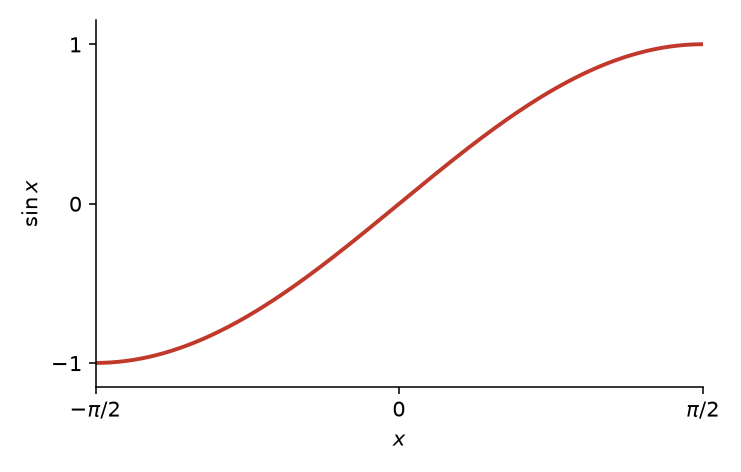

#### Решение

??? question "Открыть"
    Найдем плотность распределения $f(x)$ случайной величины $X$. Величина $X$ распределена равномерно в интервале $(-\pi/2, \pi/2)$, поэтому в этом интервале

    $$
    f(x) = \frac{1}{\pi/2 - (-\pi/2)} = \frac{1}{\pi};
    $$

    вне рассматриваемого интервала $f(x) = 0$.

    Функция $y = \sin x$ в интервале $(-\pi/2, \pi/2)$ монотонна, следовательно, в этом интервале она имеет обратную функцию $x = \psi(y) = \arcsin y$. Найдем производную $\psi'(y)$:

    $$
    \psi'(y) = \frac{1}{\sqrt{1 - y^2}}.
    $$

    Найдем искомую плотность распределения по формуле

    $$
    g(y) = f\bigl[\psi(y)\bigr] \cdot \bigl|\psi'(y)\bigr|.
    $$

    Учитывая, что $f(x) = 1/\pi$ (следовательно, $f\bigl[\psi(y)\bigr] = 1/\pi$) и $|\psi'(y)| = 1/\sqrt{1-y^2}$, получим

    $$
    g(y) = \frac{1}{\pi \sqrt{1 - y^2}}.
    $$

    Так как $y = \sin x$, причем $-\pi/2 < x < \pi/2$, то $-1 < y < 1$. Таким образом, в интервале $(-1, 1)$ имеем $g(y) = 1/(\pi\sqrt{1-y^2})$; вне этого интервала $g(y) = 0$.

    Контроль:

    $$
    \int_{-1}^{1} g(y)\, dy = \frac{1}{\pi} \int_{-1}^{1} \frac{dy}{\sqrt{1-y^2}} = \frac{2}{\pi} \int_{0}^{1} \frac{dy}{\sqrt{1-y^2}} = \frac{2}{\pi} \operatorname{arcsin} y \Big|_{0}^{1} = \frac{2}{\pi} \cdot \frac{\pi}{2} = 1.
    $$

!!! note "Домашнее задание"
    `HW7_y2023.pdf`
