# Практика 7. Непрерывные СВ и преобразования

Из двух пар (7 и 8) **7 — почти полностью теория**, 8 — закрепление и нарешивание.

## Функции распределения и плотности

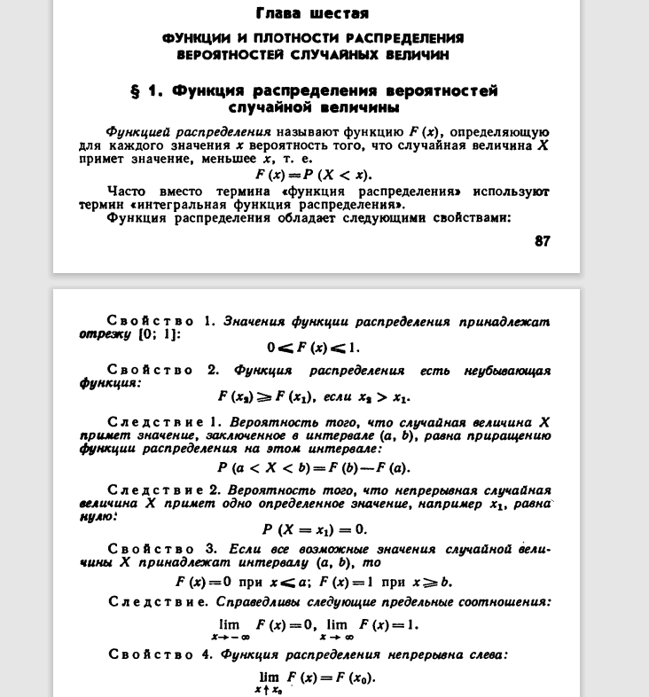

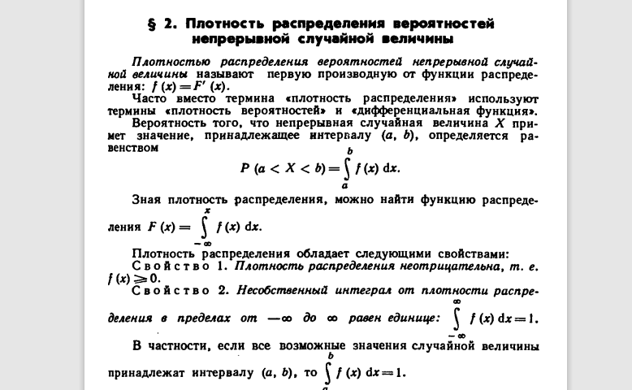

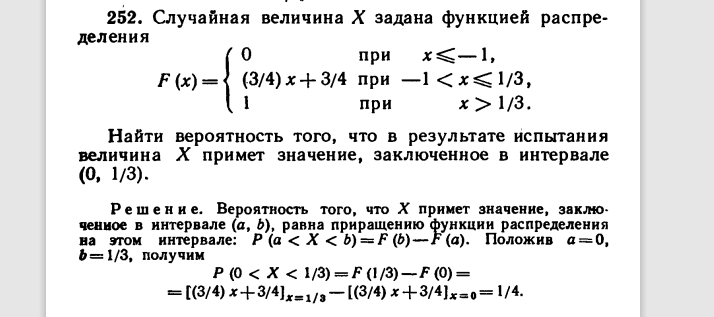

Найти плотность:

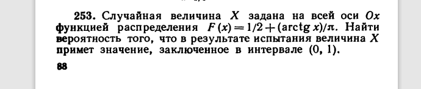

Найти плотность.

## Преобразование одномерной СВ

Теория вероятностей #11: преобразования случайных величин.

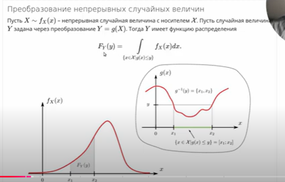

Дальше есть два пути: посчитать напрямую по этой формуле или разбить на монотонно возрастающие/убывающие интервалы, чтобы взять обратную функцию.

Давайте один раз попробуем первый вариант — и больше к нему не возвращаться.

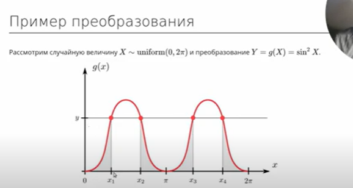

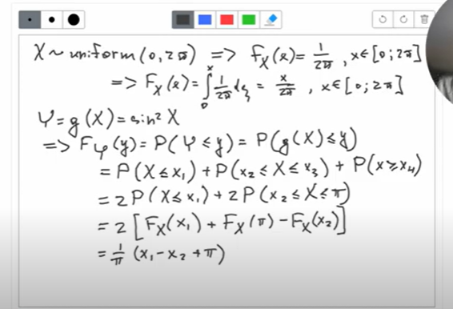

## Строго монотонные преобразования

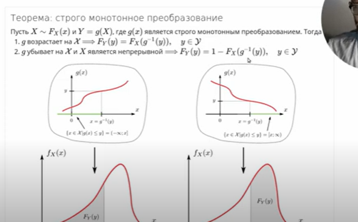

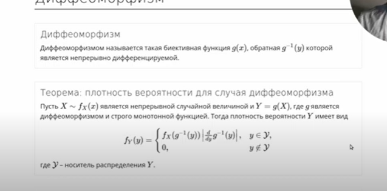

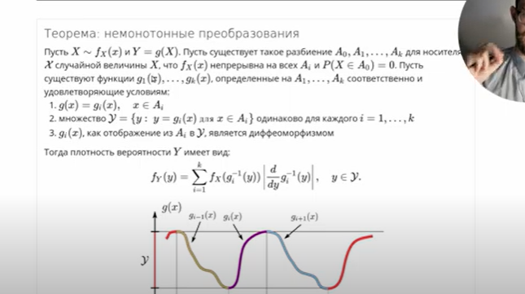

### Пример 1

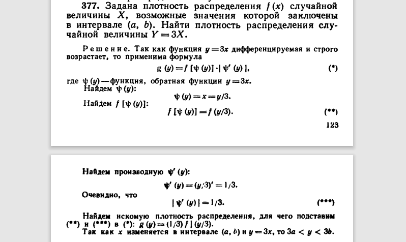

### Пример 2

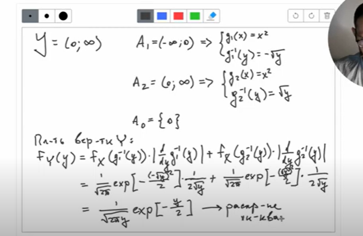

Это распределение хи-квадрат!

### Пример 3

$X \sim U(0, 5)$

$$
Y =
\begin{cases}
3 + X, & 0 < x < 2 \\
7 - X, & 2 < x < 5
\end{cases}
$$

Если не обратить внимания на интервалы для $y$, получится функция распределения $Y = 2/5$ на интервале от 2 до 5, что приводит к вероятности $> 1$. Нужна точная теорема:

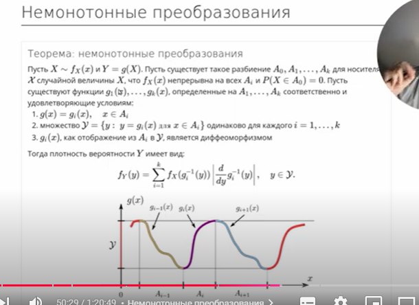

## Многомерные преобразования

Несмотря на то, что двумерные распределения ещё не проходили, бояться их не нужно. Это отображения из пар $(x, y)$ в вероятности; функции распределения и плотности определяются похожим образом. С преобразованиями: просто расширяем на многомерный случай.

Теория вероятностей #24: многомерные преобразования / сумма, разность и отношение случайных величин.

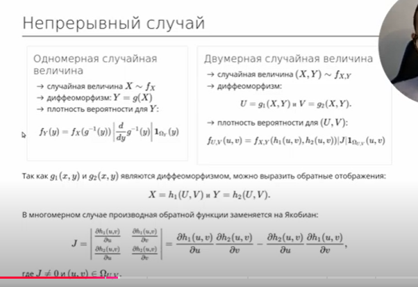

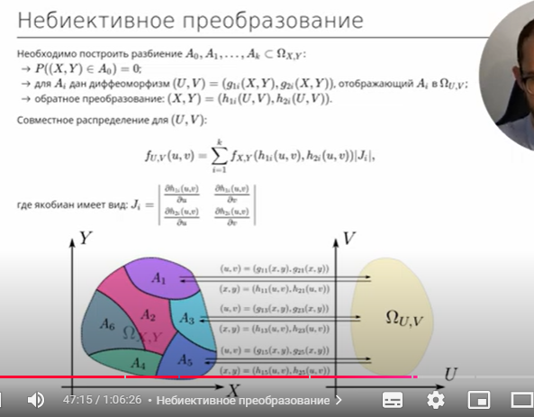

### Формула суммы

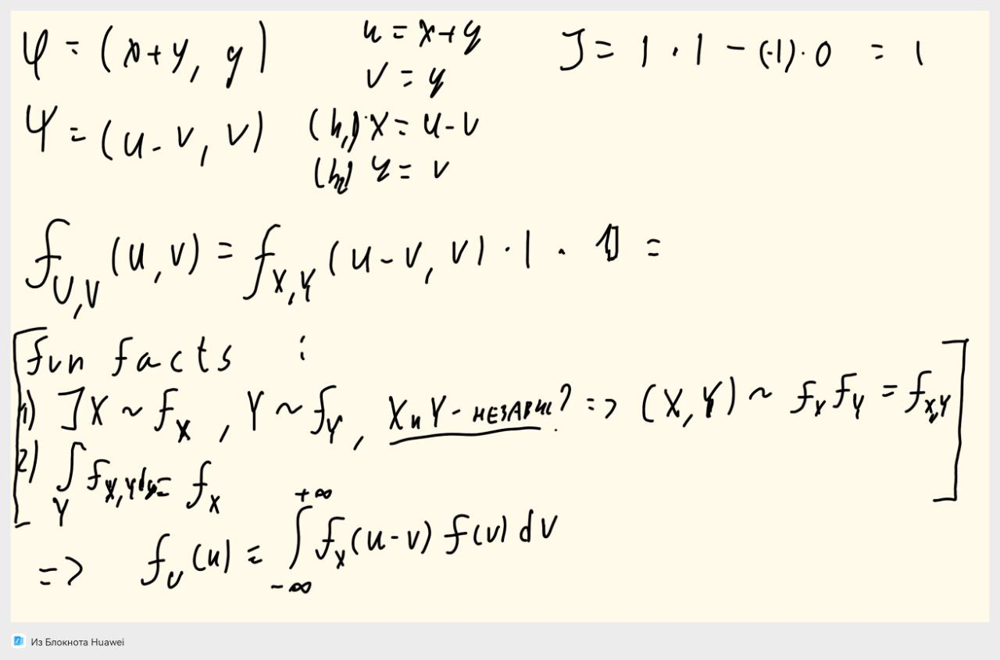

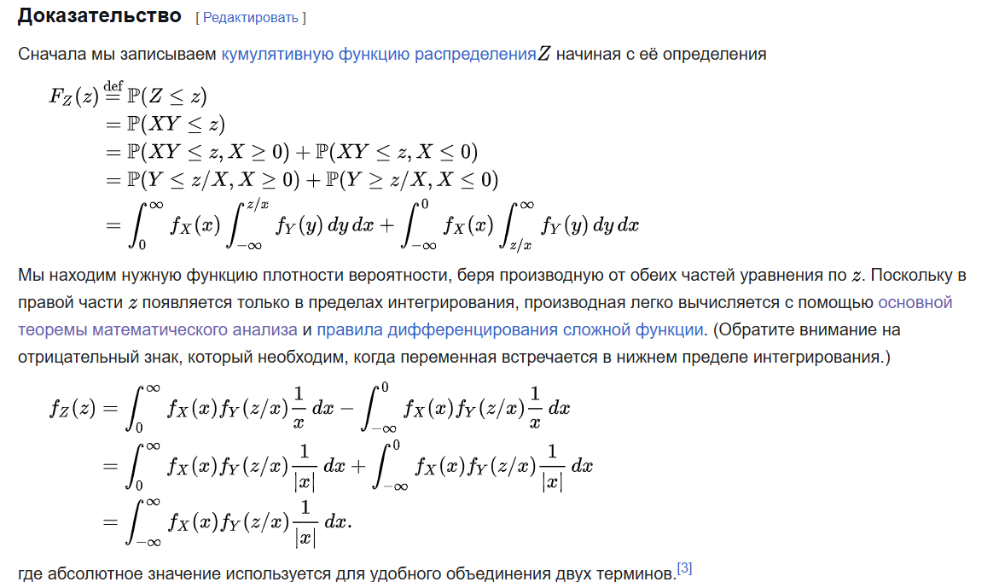

Поправка: интеграл берётся только по совместной области определения $v$ и $u-v$.

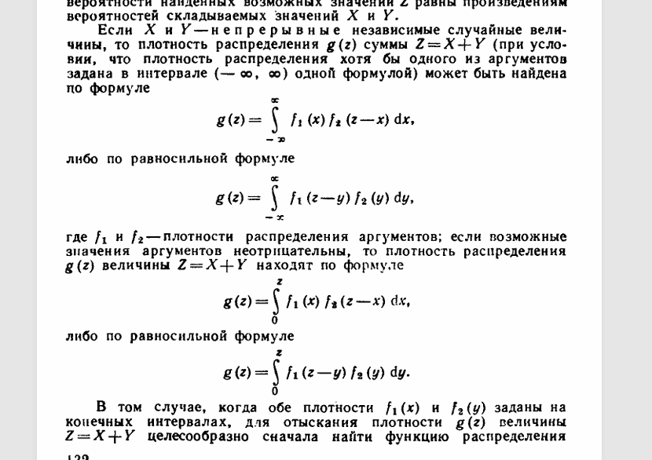

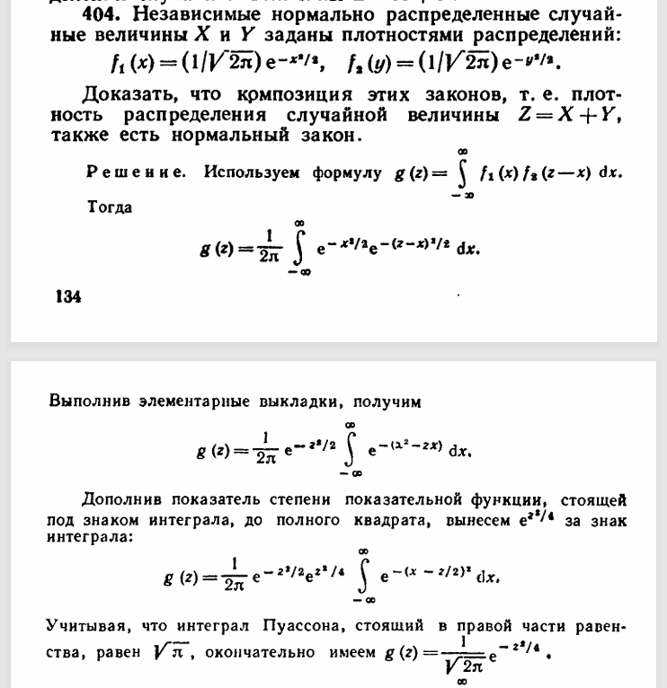

## Дискретные распределения

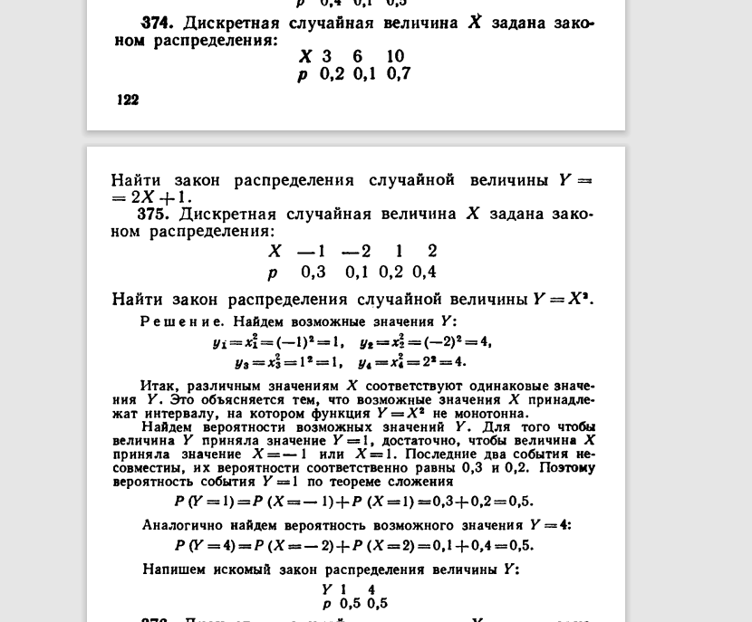

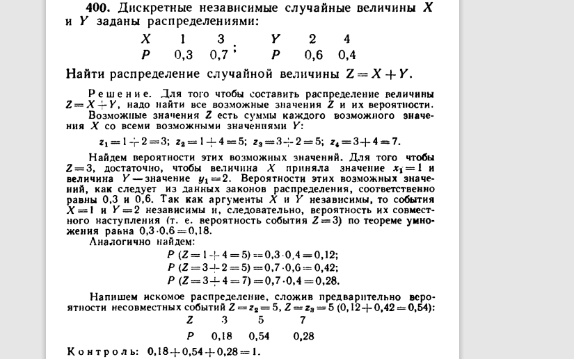

!!! note "Домашнее задание"
    `HW7_y2023.pdf`

!!! example "Самостоятельная"

    **9 минут.**

    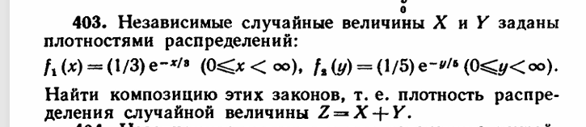

    **6 минут.**

    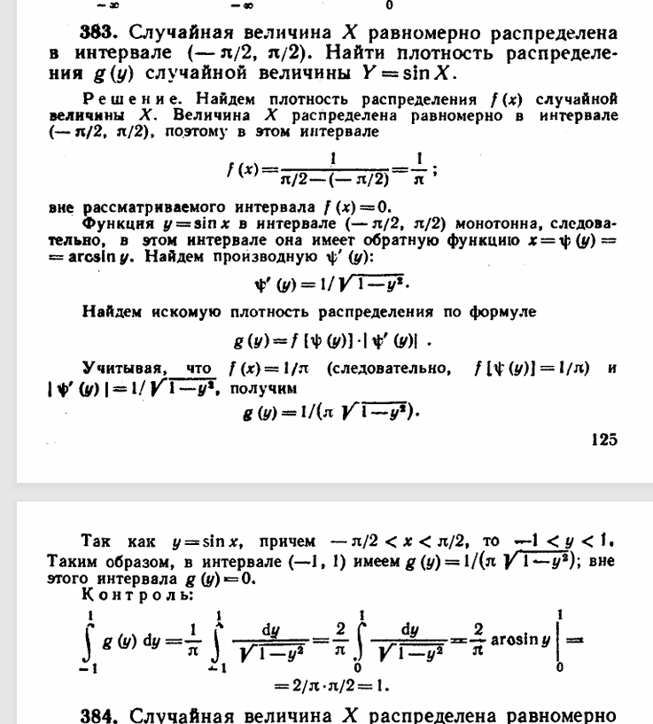
