# Практика 8. Зоопарк непрерывных распределений

В отличие от дискретных распределений, где каждое создано под конкретную цель, основная польза известных непрерывных — в том, что они удобно связаны друг с другом.

Берём три распределения с понятным физическим смыслом (равномерное, экспоненциальное, нормальное) и выводим из них остальные.

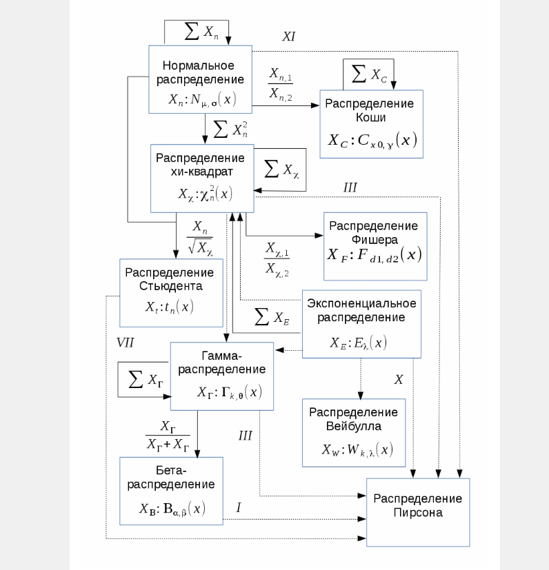

## Равномерное

Чаще всего возникает в геометрических задачах и в задачах, где мы ничего не знаем об объекте (привет пример про Джона из Канемана).

**Задача.** Светофор 20 секунд горит зелёным и 40 секунд красным. Посчитайте вероятность, что когда вы подойдёте, придётся ждать не менее 15 секунд.

## Экспоненциальное

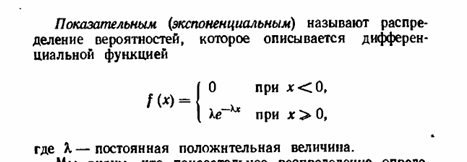

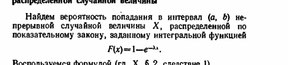

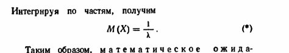

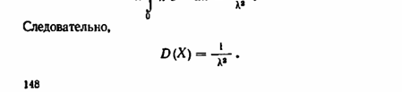

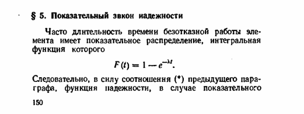

Экспоненциальное можно использовать **только** при отсутствии старения: вероятность поломки за промежуток $X$ не зависит от того, где этот $X$ расположен.

И наоборот: при отсутствии старения можно использовать **только** экспоненциальное. Должно выполняться $P(X)P(Y) = P(X+Y)$, а решения этого уравнения всегда вида $e^{ax}$.

Доказательство последнего — на домашнее задание.

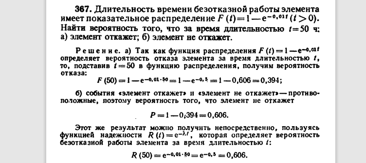

## Нормальное

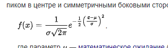

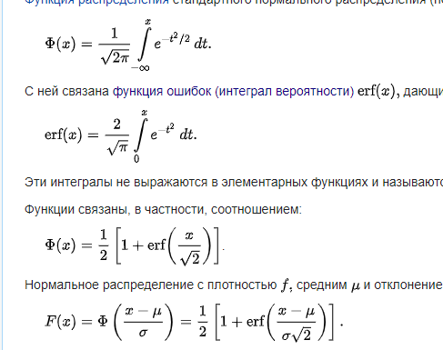

Существует ЦПТ:

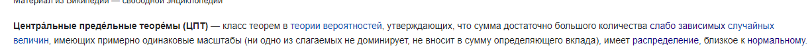

Из-за этого распределение многих вещей в природе близко к нормальному:

- погрешности измерений
- рост людей
- точка, куда попадёт стрела по оси $X$

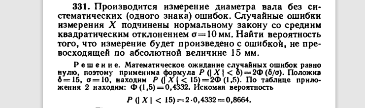

## Хи-квадрат

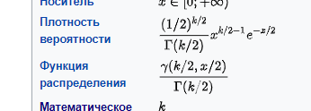

Его уже получили в практике 7, возведением стандартного нормального в квадрат. Теперь доказать, что сумма хи-квадрат есть хи-квадрат.

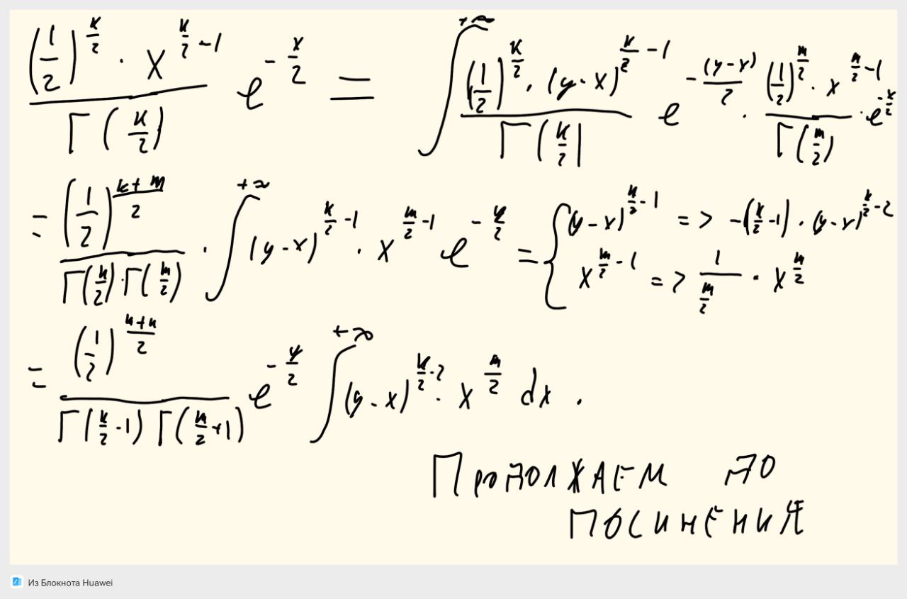

## Гамма

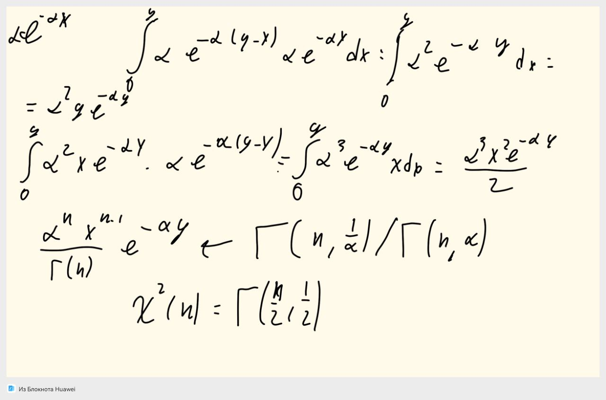

## Коши

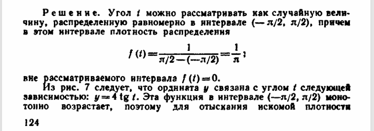

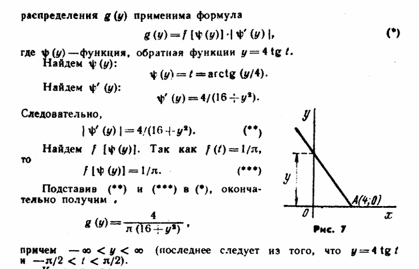

## Стьюдент, Фишер, логнормальное

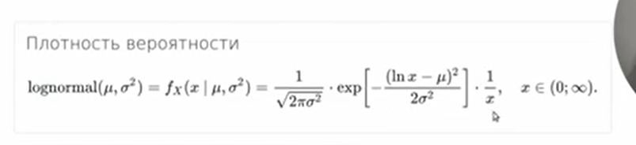

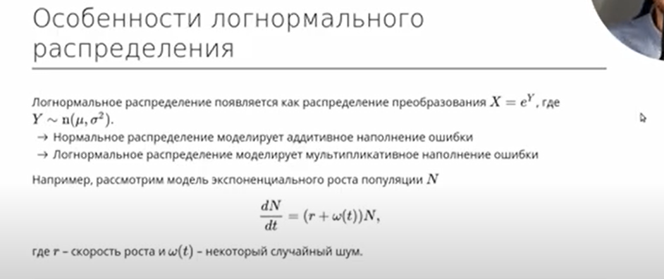

!!! note "Домашнее задание"
    `HW8_y2023.pdf`

!!! example "Самостоятельная"

    **3 минуты.** Бомбардировщик пролетел вдоль моста $30 \times 8$ м и сбросил бомбы. $X$ и $Y$ (расстояния от вертикальной и горизонтальной осей симметрии моста до места падения) независимы, СКО равны 6 и 4, матожидания равны 0. Найти вероятность попадания в мост (можно формулу).

    **3 минуты.** Умный ученик получает в среднем 1 озарение за 40 минут домашки. Считая озарения простейшим потоком, вероятность получить $2{,}5$ озарения не более чем за час (можно формулу).
