# Практика 8. Зоопарк непрерывных распределений

**Цель.** Три базовых непрерывных — равномерное, экспоненциальное, нормальное — и зоопарк производных: таблица, плотность, где живёт каждое.

**Ход пары**

1. Равномерное
2. Экспоненциальное
3. Нормальное
4. Хи-квадрат
5. Гамма
6. Коши
7. Стьюдент
8. Фишер
9. Логнормальное

В отличие от дискретных распределений, где каждое создано под конкретную цель, основная польза известных непрерывных — в том, что они удобно связаны друг с другом.

Берём три распределения с понятным физическим смыслом (равномерное, экспоненциальное, нормальное) и выводим из них остальные.

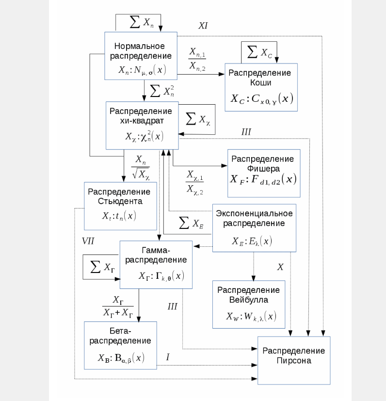

## Равномерное

### Теория

| | $U(a,b)$ |
|---|---|
| Носитель | $x\in[a,b]$ |
| Функция распределения | $0$ при $x<a$; $\dfrac{x-a}{b-a}$ при $a\le x\le b$; $1$ при $x>b$ |
| Плотность | $\dfrac{1}{b-a}$ на $(a,b)$ |
| Матожидание | $\dfrac{a+b}{2}$ |
| Дисперсия | $\dfrac{(b-a)^2}{12}$ |

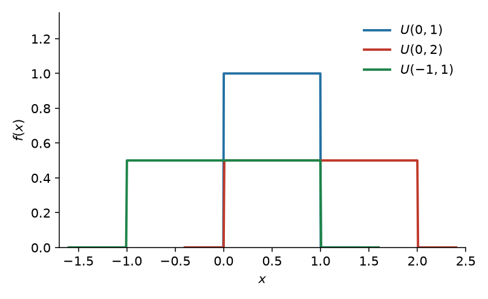

Чаще всего возникает в геометрических задачах и в задачах, где мы ничего не знаем об объекте.

### Задача 8.1. Светофор

Светофор 20 секунд горит зелёным и 40 секунд красным. Посчитайте вероятность, что когда вы подойдёте, придётся ждать не менее 15 секунд.

#### Решение

??? question "Открыть"
    Цикл 60 с, момент подхода равномерен на цикле. Ждать можно только на красном: если от начала красного прошло $u$ секунд, остаток $40-u$. Нужно $40-u\ge 15$, то есть $u\le 25$. Окно 25 с из 60:

    $$
    P=\frac{25}{60}=\frac{5}{12}.
    $$

## Экспоненциальное

### Теория

| | $\operatorname{Exp}(\lambda)$ |
|---|---|
| Носитель | $x\in[0;+\infty)$ |
| Функция распределения | $1-e^{-\lambda x}$ при $x\ge 0$ |
| Плотность | $\lambda e^{-\lambda x}$ при $x\ge 0$ |
| Матожидание | $\dfrac{1}{\lambda}$ |
| Дисперсия | $\dfrac{1}{\lambda^2}$ |

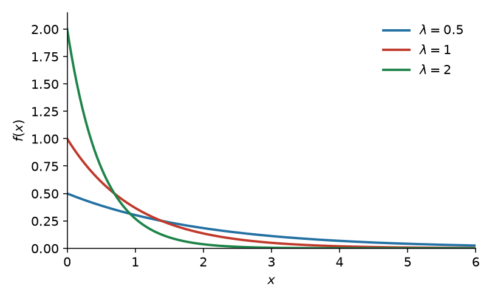

### Практический пример:
Показательный закон надёжности: длительность времени безотказной работы элемента. Интервалы простейшего потока событий — тоже экспоненциальные: время до первого события.

Экспоненциальное можно использовать **только** при отсутствии старения: вероятность поломки за промежуток $X$ не зависит от того, где этот $X$ расположен и наоборот: при отсутствии старения можно использовать **только** экспоненциальное. Должно выполняться $P(X)P(Y) = P(X+Y)$, а решения этого уравнения всегда вида $e^{ax}$.

Для жизни одной детали этого достаточно. Если отказ — первое событие потока, к отсутствию старения добавляется постоянная интенсивность (стационарность); ординарность нужна, чтобы в $dt$ писать $\lambda\,dt$.

### Задача 8.2. Надёжность элемента

Длительность времени безотказной работы элемента имеет показательное распределение $F(t)=1-e^{-0{,}01t}$ $(t>0)$. Найти вероятность того, что за время длительностью $t=50$ ч элемент не откажет.

#### Решение

??? question "Открыть"
    Функция надёжности $R(t)=e^{-\lambda t}$ определяет вероятность безотказной работы элемента за время длительностью $t$:

    $$
    R(50)=e^{-0{,}01\cdot 50}=e^{-0{,}5}=0{,}606.
    $$

    Тот же ответ как дополнение: $F(50)=1-e^{-0{,}5}=0{,}394$, отсюда $1-0{,}394=0{,}606$.

## Нормальное

### Теория

| | $N(\mu,\sigma^2)$ |
|---|---|
| Носитель | $x\in(-\infty;+\infty)$ |
| Функция распределения | $\Phi\bigl((x-\mu)/\sigma\bigr)$, где $\Phi(x)=\dfrac{1}{\sqrt{2\pi}}\displaystyle\int_{-\infty}^{x} e^{-t^{2}/2}\,dt$ |
| Плотность | $\dfrac{1}{\sigma\sqrt{2\pi}}\,e^{-\frac12\bigl((x-\mu)/\sigma\bigr)^2}$ |
| Матожидание | $\mu$ |
| Дисперсия | $\sigma^2$ |

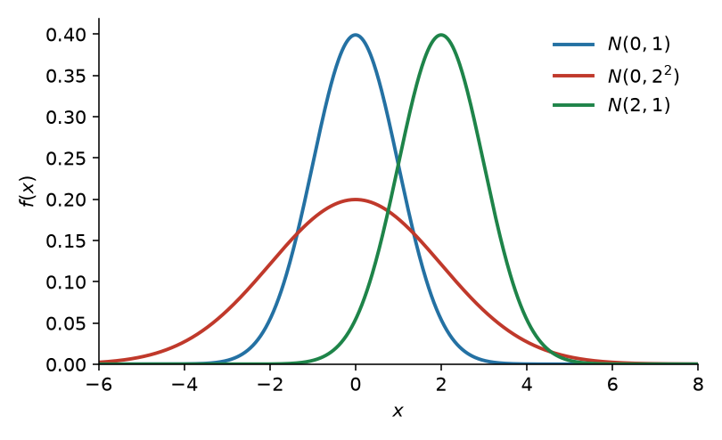

Существует ЦПТ: центральные предельные теоремы (ЦПТ) — класс теорем в теории вероятностей, утверждающих, что сумма достаточно большого количества слабо зависимых случайных величин, имеющих примерно одинаковые масштабы (ни одно из слагаемых не доминирует, не вносит в сумму определяющего вклада), имеет распределение, близкое к нормальному.

Из-за этого распределение многих вещей в природе близко к нормальному:
- погрешности измерений
- рост людей
- точка, куда попадёт стрела по оси $X$

### Задача 8.3. Ошибка измерения вала

Производится измерение диаметра вала без систематических (одного знака) ошибок. Случайные ошибки измерения $X$ подчинены нормальному закону со средним квадратическим отклонением $\sigma=10$ мм. Найти вероятность того, что измерение будет произведено с ошибкой, не превышающей по абсолютной величине 15 мм.

#### Решение

??? question "Открыть"
    Математическое ожидание случайных ошибок равно нулю, поэтому применим формулу $P(|X|<\delta)=2\Phi(\delta/\sigma)$. Положив $\delta=15$, $\sigma=10$, находим $P(|X|<15)=2\Phi(1{,}5)$. По таблице приложения 2 находим: $\Phi(1{,}5)=0{,}4332$. Искомая вероятность

    $$
    P(|X|<15)=2\cdot 0{,}4332=0{,}8664.
    $$

    Здесь $\Phi$ — функция Лапласа Гмурмана. Через стандартную ФР из таблички: $2\Phi(1{,}5)-1$.

## Хи-квадрат

### Теория

| | $\chi^2(k)$ |
|---|---|
| Носитель | $x\in[0;+\infty)$ |
| Функция распределения | $\dfrac{\gamma(k/2,\,x/2)}{\Gamma(k/2)}$ |
| Плотность | $\dfrac{(1/2)^{k/2}}{\Gamma(k/2)}\,x^{k/2-1}e^{-x/2}$ |
| Матожидание | $k$ |
| Дисперсия | $2k$ |

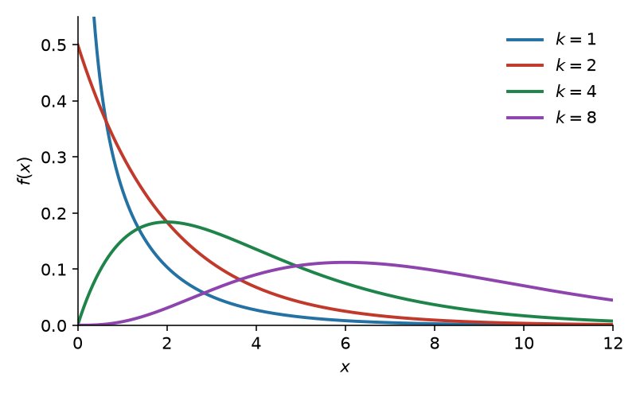

Его уже получили в практике 7, возведением стандартного нормального в квадрат: если $Z_1,\ldots,Z_k$ независимы и $N(0,1)$, то $Z_1^2+\cdots+Z_k^2\sim\chi^2(k)$. Живёт в матстате: выборочная дисперсия нормальной выборки, критерий согласия Пирсона.

### Задача 8.4. Сумма хи-квадрат

Доказать, что сумма хи-квадрат есть хи-квадрат.

#### Решение

??? question "Открыть"
    Независимые $X\sim\chi^2(k)$, $Y\sim\chi^2(m)$. По формуле суммы с практики 7

    $$
    f_{X+Y}(z)=\int_{-\infty}^{+\infty} f_X(z-x)\,f_Y(x)\,dx.
    $$

    Носители $[0,+\infty)$, поэтому интеграл по $x\in[0,z]$ при $z>0$:

    $$
    f_{X+Y}(z)
    =
    \frac{(1/2)^{k/2}}{\Gamma(k/2)}\,
    \frac{(1/2)^{m/2}}{\Gamma(m/2)}
    \int_0^z (z-x)^{k/2-1}e^{-(z-x)/2}\,x^{m/2-1}e^{-x/2}\,dx
    $$

    $$
    =
    \frac{(1/2)^{(k+m)/2}}{\Gamma(k/2)\,\Gamma(m/2)}\,e^{-z/2}
    \int_0^z (z-x)^{k/2-1}\,x^{m/2-1}\,dx.
    $$

    Замена $x=zt$, $dx=z\,dt$:

    $$
    \int_0^z (z-x)^{k/2-1}\,x^{m/2-1}\,dx
    =
    z^{(k+m)/2-1}\int_0^1 t^{m/2-1}(1-t)^{k/2-1}\,dt.
    $$

    Интеграл Эйлера: $\displaystyle\int_0^1 t^{a-1}(1-t)^{b-1}\,dt=\Gamma(a)\Gamma(b)/\Gamma(a+b)$ при $a=m/2$, $b=k/2$. Тогда

    $$
    f_{X+Y}(z)
    =
    \frac{(1/2)^{(k+m)/2}}{\Gamma((k+m)/2)}\,z^{(k+m)/2-1}e^{-z/2},
    $$

    а это плотность $\chi^2(k+m)$.

    Если не хочется вспоминать интеграл Эйлера: достаточно свёртки с $\chi^2(2)$. У $\chi^2(2)$ плотность $\frac12 e^{-x/2}$, интеграл становится $\int_0^z x^{k/2-1}\,dx$, и $\Gamma(k/2+1)=(k/2)\Gamma(k/2)$ даёт $\chi^2(k+2)$. Дальше индукция по чётному слагаемому.

## Гамма

### Теория

Форма $k>0$, интенсивность $\lambda>0$ (как у экспоненциального). Другая параметризация — масштаб $\theta=1/\lambda$.

| | $\Gamma(k,\lambda)$ |
|---|---|
| Носитель | $x\in(0;+\infty)$ |
| Функция распределения | $\dfrac{\gamma(k,\,\lambda x)}{\Gamma(k)}$ |
| Плотность | $\dfrac{\lambda^k}{\Gamma(k)}\,x^{k-1}e^{-\lambda x}$ |
| Матожидание | $\dfrac{k}{\lambda}$ |
| Дисперсия | $\dfrac{k}{\lambda^2}$ |

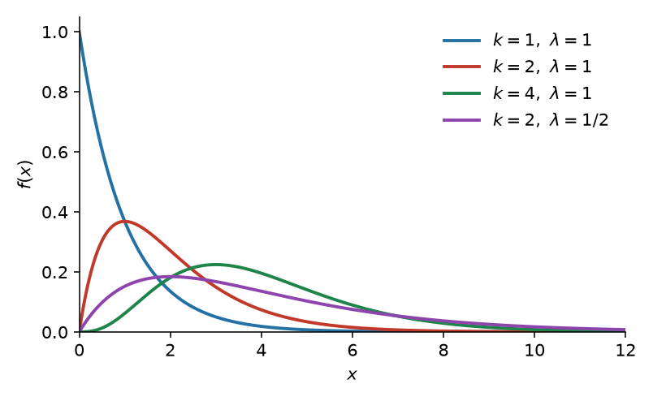

Время до $n$-го события простейшего потока; суммы времён обслуживания, осадки, страховые выплаты. Для этого нужны все три аксиомы простейшего потока: интервалы н.о.р. экспоненциальные с постоянным $\lambda$, события поодиночке.

Связь с уже известными:

- $\operatorname{Exp}(\lambda)=\Gamma(1,\lambda)$
- Эрланг: $\Gamma(n,\lambda)$ при целом $n$ — сумма $n$ независимых $\operatorname{Exp}(\lambda)$
- $\chi^2(k)=\Gamma(k/2,\,\lambda=1/2)$

### Задача 8.5. Сумма экспоненциальных

Посчитать сумму $N$ экспоненциальных распределений.

#### Решение

??? question "Открыть"
    Независимые $X_i\sim\operatorname{Exp}(\alpha)$, плотность $\alpha e^{-\alpha x}$. Свёртка двух:

    $$
    \int_0^y \alpha e^{-\alpha(y-x)}\,\alpha e^{-\alpha x}\,dx
    =
    \alpha^2 e^{-\alpha y}\int_0^y dx
    =
    \alpha^2 y\, e^{-\alpha y}.
    $$

    С третьим:

    $$
    \int_0^y \alpha^2 x e^{-\alpha x}\cdot\alpha e^{-\alpha(y-x)}\,dx
    =
    \alpha^3 e^{-\alpha y}\int_0^y x\,dx
    =
    \frac{\alpha^3 y^2 e^{-\alpha y}}{2}.
    $$

    По индукции сумма $N$ штук:

    $$
    f_{S_N}(y)=\frac{\alpha^N y^{N-1}e^{-\alpha y}}{(N-1)!}=\Gamma(N,\,\alpha)
    $$

    (Эрланг). В общем виде $\dfrac{\alpha^n x^{n-1}e^{-\alpha x}}{\Gamma(n)}$; $\chi^2(n)=\Gamma(n/2,\,1/2)$.

## Коши

### Теория

| | $C(x_0,y)$ |
|---|---|
| Носитель | $x\in(-\infty;+\infty)$ |
| Функция распределения | $\dfrac{1}{\pi}\operatorname{arctg}\dfrac{x-x_0}{y}+\dfrac12$ |
| Плотность | $\dfrac{1}{\pi y\bigl(1+\bigl((x-x_0)/y\bigr)^2\bigr)}$ |
| Матожидание | не существует |
| Дисперсия | не существует |

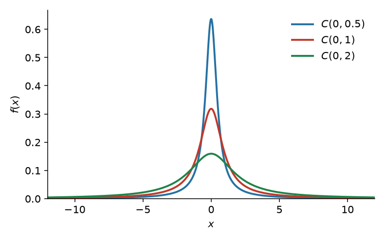

Отношение двух независимых стандартных нормальных; ордината случайного луча (задача ниже). Хвосты настолько тяжёлые, что нет матожидания: выборочное среднее не сходится к константе (снова Коши), ЦПТ не работает. Стандартное $C(0,1)$ — это Стьюдент с $\nu=1$.

### Задача 8.6. Луч Коши

В прямоугольной системе координат $xOy$ из точки $A(4; 0)$ наудачу (под произвольным углом $t$) проведён луч, пересекающий ось $Oy$. Найти плотность $g(y)$ распределения вероятностей ординаты $y$ точки пересечения проведённого луча с осью $Oy$.

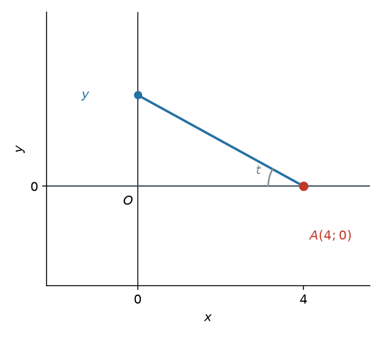

#### Решение

??? question "Открыть"
    Угол $t$ можно рассматривать как случайную величину, распределённую равномерно в интервале $(-\pi/2,\,\pi/2)$, причём в этом интервале плотность распределения

    $$
    f(t)=\frac{1}{\pi/2-(-\pi/2)}=\frac{1}{\pi};
    $$

    вне рассматриваемого интервала $f(t)=0$.

    Из рис. 7 следует, что ордината $y$ связана с углом $t$ следующей зависимостью: $y=4\operatorname{tg} t$. Эта функция в интервале $(-\pi/2,\,\pi/2)$ монотонно возрастает, поэтому для отыскания искомой плотности распределения $g(y)$ применима формула

    $$
    g(y)=f\bigl[\psi(y)\bigr]\cdot\bigl|\psi'(y)\bigr|, \qquad (*)
    $$

    где $\psi(y)$ — функция, обратная функции $y=4\operatorname{tg} t$.

    Найдём $\psi(y)$:

    $$
    \psi(y)=t=\operatorname{arctg}(y/4).
    $$

    Найдём $\psi'(y)$:

    $$
    \psi'(y)=4/(16+y^2).
    $$

    Следовательно,

    $$
    \bigl|\psi'(y)\bigr|=4/(16+y^2). \qquad (**)
    $$

    Найдём $f\bigl[\psi(y)\bigr]$. Так как $f(t)=1/\pi$, то

    $$
    f\bigl[\psi(y)\bigr]=1/\pi. \qquad (***)
    $$

    Подставив $(**)$ и $(***)$ в $(*)$, окончательно получим

    $$
    g(y)=\frac{4}{\pi(16+y^2)},
    $$

    причём $-\infty<y<\infty$ (последнее следует из того, что $y=4\operatorname{tg} t$ и $-\pi/2<t<\pi/2$). Это $C(0,4)$.

## Стьюдент

### Теория

| | $t_\nu$ |
|---|---|
| Носитель | $x\in(-\infty;+\infty)$ |
| Функция распределения | $\dfrac12+\dfrac{x\,\Gamma\bigl((\nu+1)/2\bigr)}{\sqrt{\nu\pi}\,\Gamma(\nu/2)}\,{}_2F_1\bigl(\tfrac12,\tfrac{\nu+1}{2};\tfrac32;-x^2/\nu\bigr)$ |
| Плотность | $\dfrac{\Gamma\bigl((\nu+1)/2\bigr)}{\sqrt{\nu\pi}\,\Gamma(\nu/2)}\bigl(1+x^2/\nu\bigr)^{-(\nu+1)/2}$ |
| Матожидание | $0$ при $\nu>1$; иначе не существует |
| Дисперсия | $\dfrac{\nu}{\nu-2}$ при $\nu>2$; иначе не существует |

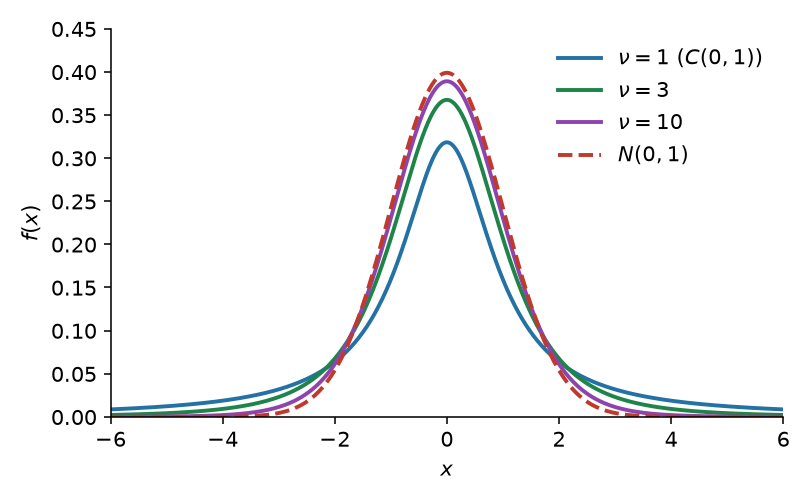

Если $Z\sim N(0,1)$ и $V\sim\chi^2(\nu)$ независимы, то

$$
t=\frac{Z}{\sqrt{V/\nu}}\sim t_\nu.
$$

На схеме пары: нормальное, делённое на корень из хи-квадрат. При $\nu=1$ это Коши; при $\nu\to\infty$ плотность идёт в $N(0,1)$.

В матстате: нормальная выборка, $\sigma$ неизвестна — статистика $(\bar X-\mu)/(s/\sqrt n)$ имеет распределение Стьюдента. Отсюда $t$-критерии и доверительные интервалы для среднего.

## Фишер

### Теория

| | $F(d_1,d_2)$ |
|---|---|
| Носитель | $x\in(0;+\infty)$ |
| Функция распределения | $I_{\frac{d_1 x}{d_1 x+d_2}}\bigl(\tfrac{d_1}{2},\tfrac{d_2}{2}\bigr)$ |
| Плотность | $\dfrac{1}{B(d_1/2,\,d_2/2)}\Bigl(\dfrac{d_1}{d_2}\Bigr)^{d_1/2} x^{d_1/2-1}\bigl(1+\tfrac{d_1}{d_2}x\bigr)^{-(d_1+d_2)/2}$ |
| Матожидание | $\dfrac{d_2}{d_2-2}$ при $d_2>2$ |
| Дисперсия | $\dfrac{2d_2^2(d_1+d_2-2)}{d_1(d_2-2)^2(d_2-4)}$ при $d_2>4$ |

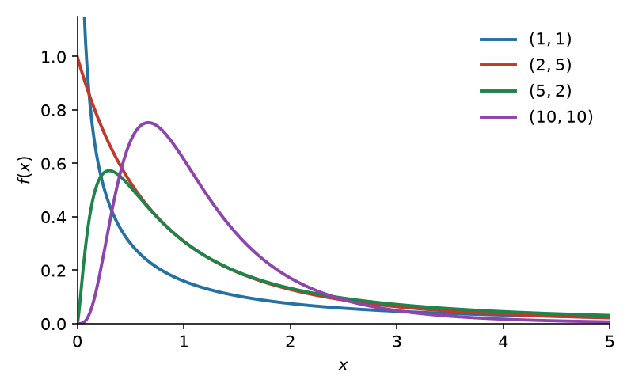

Если независимые $U\sim\chi^2(d_1)$, $V\sim\chi^2(d_2)$, то

$$
F=\frac{U/d_1}{V/d_2}\sim F(d_1,d_2).
$$

На схеме: отношение двух хи-квадрат. В матстате — сравнение двух выборочных дисперсий, дисперсионный анализ.

## Логнормальное

### Теория

| | $\operatorname{LogN}(\mu,\sigma^2)$ |
|---|---|
| Носитель | $x\in(0;+\infty)$ |
| Функция распределения | $\Phi\bigl((\ln x-\mu)/\sigma\bigr)$ |
| Плотность | $\dfrac{1}{x\sigma\sqrt{2\pi}}\exp\bigl[-(\ln x-\mu)^2/(2\sigma^2)\bigr]$ |
| Матожидание | $e^{\mu+\sigma^2/2}$ |
| Дисперсия | $\bigl(e^{\sigma^2}-1\bigr)e^{2\mu+\sigma^2}$ |

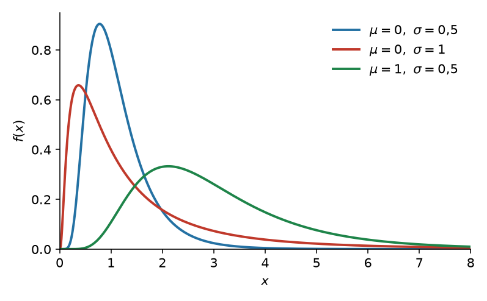

Логнормальное распределение появляется как распределение преобразования $X=e^Y$, где $Y\sim n(\mu,\sigma^2)$.

- Нормальное распределение моделирует аддитивное наполнение ошибки
- Логнормальное распределение моделирует мультипликативное наполнение ошибки

Например, рассмотрим модель экспоненциального роста популяции $N$

$$
\frac{dN}{dt}=(r+\omega(t))N,
$$

где $r$ — скорость роста и $\omega(t)$ — некоторый случайный шум.

## Самостоятельная

**3 минуты.** Бомбардировщик пролетел вдоль моста $30 \times 8$ м и сбросил бомбы. $X$ и $Y$ (расстояния от вертикальной и горизонтальной осей симметрии моста до места падения) независимы, СКО равны 6 и 4, матожидания равны 0. Найти вероятность попадания в мост (можно формулу).

#### Решение

??? question "Открыть"
    Попадание: $|X|<15$, $|Y|<4$. Независимость и нормальность $N(0,6^2)$, $N(0,4^2)$. Через стандартную ФР из таблички:

    $$
    P=\bigl(2\Phi(15/6)-1\bigr)\bigl(2\Phi(4/4)-1\bigr)=\bigl(2\Phi(2{,}5)-1\bigr)\bigl(2\Phi(1)-1\bigr).
    $$

**3 минуты.** Умный ученик получает в среднем 1 озарение за 40 минут домашки. Считая озарения простейшим потоком, вероятность получить $2{,}5$ озарения не более чем за час (можно формулу).

#### Решение

??? question "Открыть"
    Простейший поток, $\lambda=1/40$ (в минуту). Время до $n$-го события — $\Gamma(n,\lambda)$. Нужно $P(S_{2{,}5}\le 60)$:

    $$
    P=\frac{\gamma\bigl(5/2,\,60/40\bigr)}{\Gamma(5/2)}=\frac{\gamma(5/2,\,3/2)}{\Gamma(5/2)}.
    $$

    Для целого $n$ это то же самое, что $P(N(t)\ge n)$; здесь $n$ не целое — поэтому гамма, а не Пуассон.

!!! note "Домашнее задание"
    `HW8_y2023.pdf`
