# Практика 9. Многомерные, ЗБЧ и ЦПТ

## Многомерная функция распределения

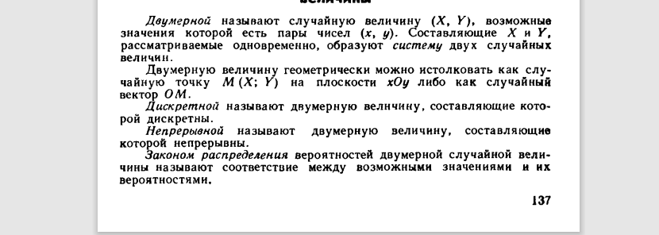

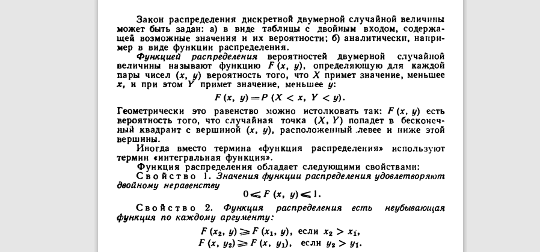

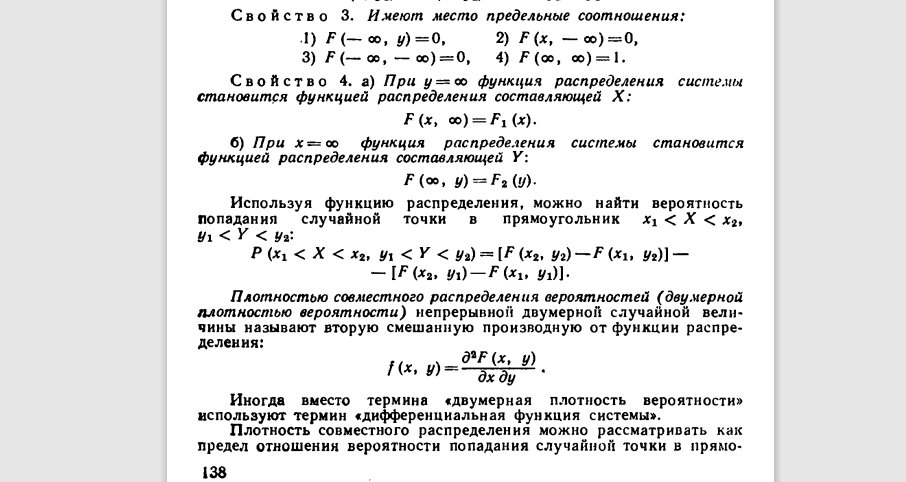

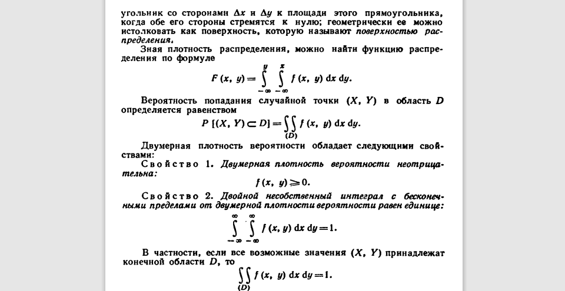

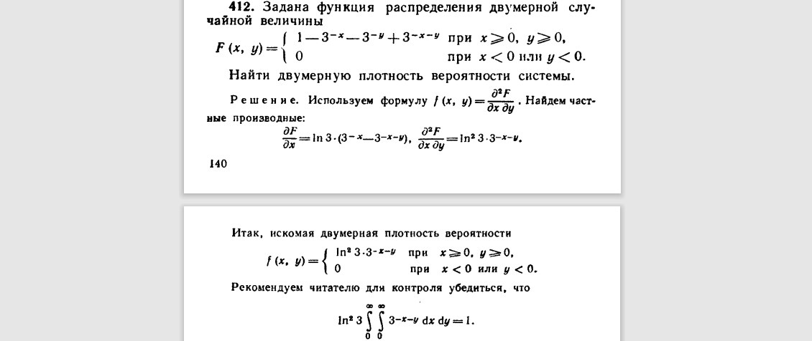

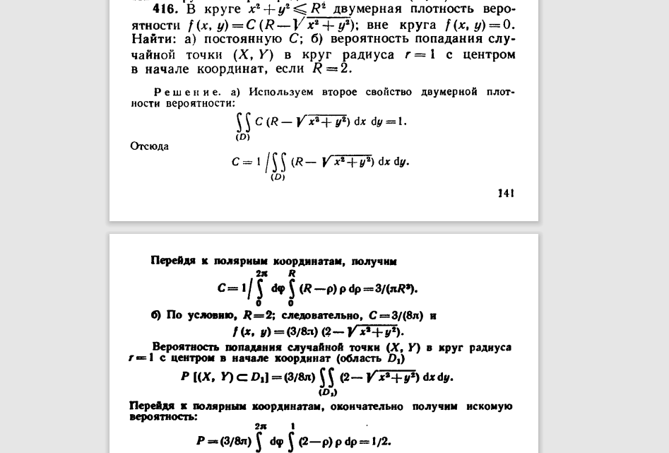

## Маргинальные распределения

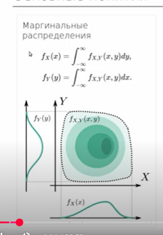

Аналогично для суммы:

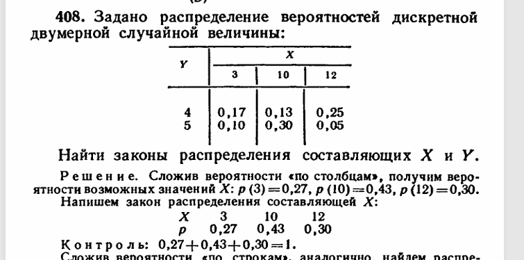

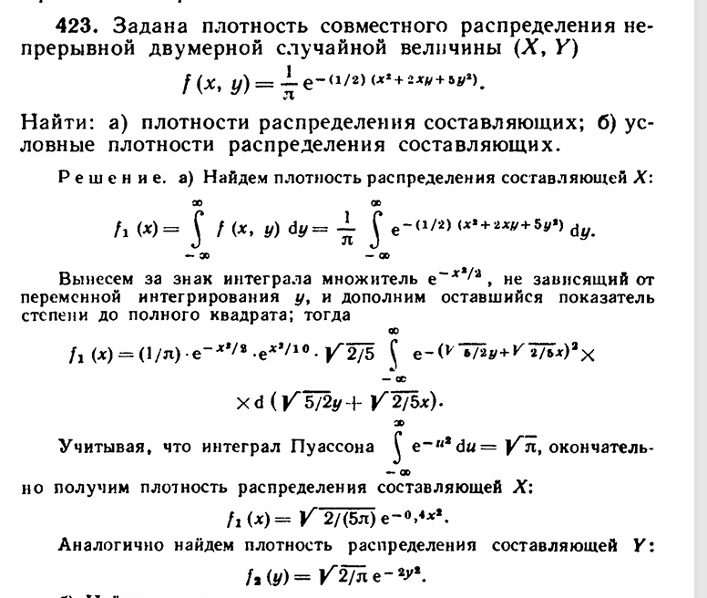

!!! warning "Заметка себе"
    Кажется, здесь в примере лажа: должно быть $\sqrt{1/5}$ перед $x$.

## Условные распределения

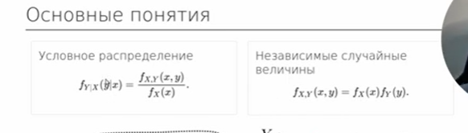

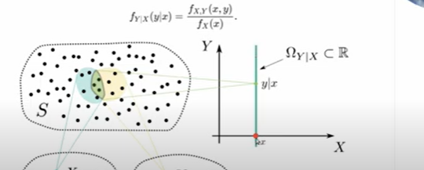

Добьём предыдущие 2 примера.

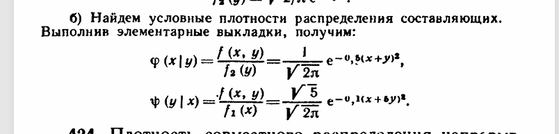

С дискретными тоже должно быть просто.

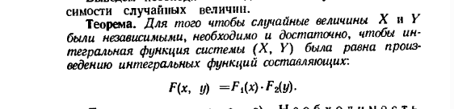

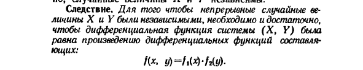

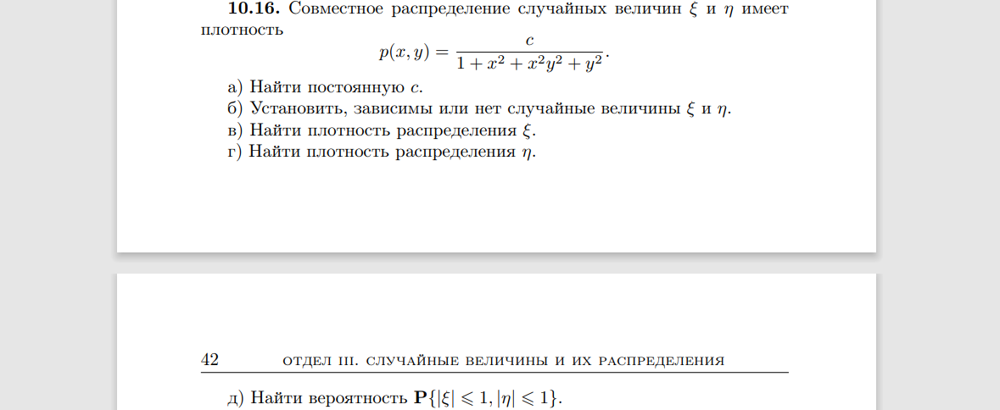

## Совместные распределения

Хотелось бы посчитать матожидание, но сделаем это на следующей паре: пока матожидания многомерных ещё не проходили.

## ЗБЧ и ЦПТ

Пример: генеральная совокупность — вероятность 1 к 99 людей и вампиров; выборка — подходим к случайным людям на улице и спрашиваем. ЗБЧ говорит, что среднее выборочное стремится к матожиданию.

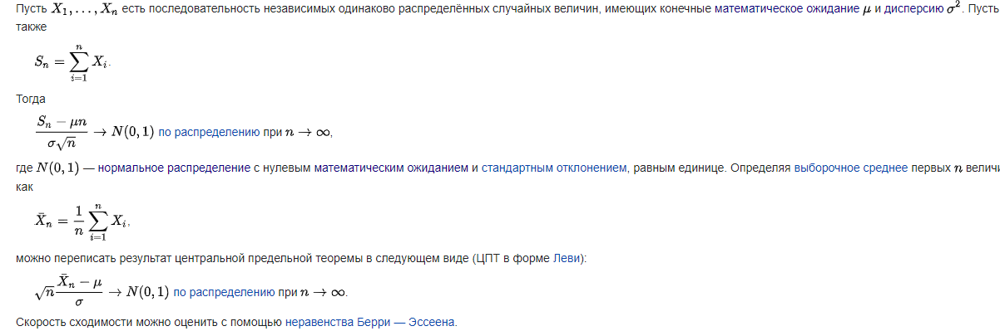

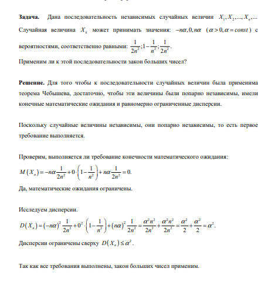

## Вероятностные неравенства и правило трёх сигм

С точки зрения практических задач эти неравенства нужны, чтобы упрощать вычисления.

Часто мы уже можем честно посчитать сложную модель. Иногда задача вовсе не просит такого подхода — и силы тратятся зря.

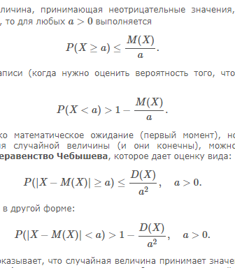

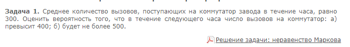

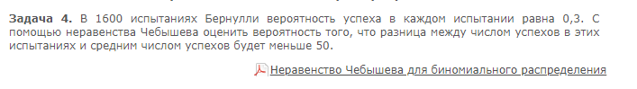

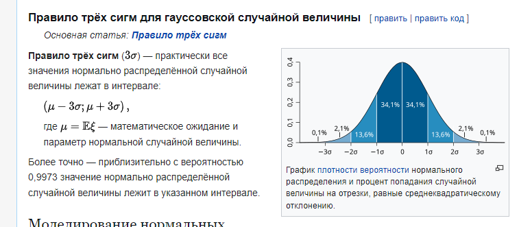

!!! note "Домашнее задание"
    `HW9_y2023.pdf`

!!! example "Самостоятельная"

    **3 минуты.**

    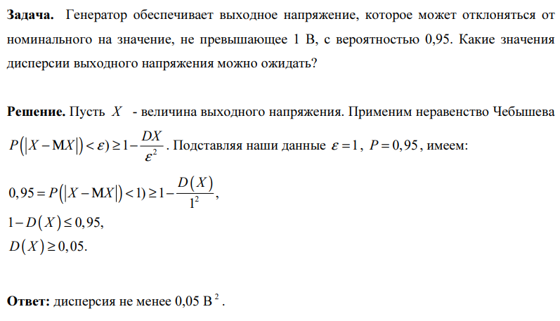

    **6 минут.**

    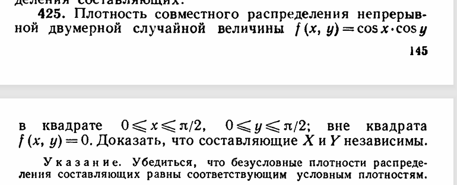
