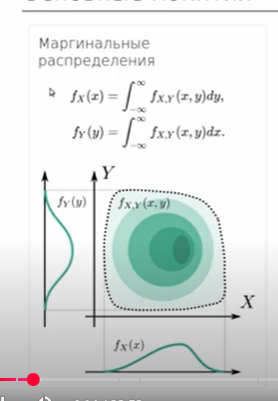
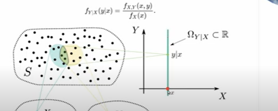
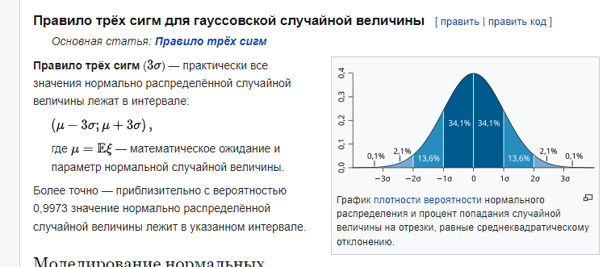

# Практика 9. Многомерные, ЗБЧ и ЦПТ

## Многомерная функция распределения

Двумерной называют случайную величину $(X, Y)$, возможные значения которой есть пары чисел $(x, y)$. Составляющие $X$ и $Y$, рассматриваемые одновременно, образуют систему двух случайных величин.    
Двумерную величину геометрически можно истолковать как случайную точку $M(X; Y)$ на плоскости $xOy$ либо как случайный вектор $\overrightarrow{OM}$.   

Функцией распределения вероятностей двумерной случайной величины называют функцию $F(x, y)$, определяющую для каждой пары чисел $(x, y)$ вероятность того, что $X$ примет значение, меньшее $x$, и при этом $Y$ примет значение, меньшее $y$:

$$
F(x, y) = P(X < x,\ Y < y).
$$

Геометрически это равенство можно истолковать так: $F(x, y)$ есть вероятность того, что случайная точка $(X, Y)$ попадет в бесконечный квадрант с вершиной $(x, y)$, расположенный левее и ниже этой вершины.

Функция распределения обладает следующими свойствами.

Свойство 1. Значения функции распределения удовлетворяют двойному неравенству

$$
0 \leqslant F(x, y) \leqslant 1.
$$

Свойство 2. Функция распределения есть неубывающая функция по каждому аргументу:

$$
F(x_2, y) \geqslant F(x_1, y), \quad \text{если } x_2 > x_1,
$$

$$
F(x, y_2) \geqslant F(x, y_1), \quad \text{если } y_2 > y_1.
$$

Свойство 3. Имеют место предельные соотношения:

1) $F(-\infty, y) = 0$,
2) $F(x, -\infty) = 0$,
3) $F(-\infty, -\infty) = 0$,
4) $F(\infty, \infty) = 1$.

Свойство 4. а) При $y = \infty$ функция распределения системы становится функцией распределения составляющей $X$:

$$
F(x, \infty) = F_1(x).
$$

б) При $x = \infty$ функция распределения системы становится функцией распределения составляющей $Y$:

$$
F(\infty, y) = F_2(y).
$$

Плотностью совместного распределения вероятностей (двумерной плотностью вероятности) непрерывной двумерной случайной величины называют вторую смешанную производную от функции распределения:

$$
f(x, y) = \frac{\partial^2 F(x, y)}{\partial x\, \partial y}.
$$

Зная плотность распределения, можно найти функцию распределения по формуле

$$
F(x, y) = \int_{-\infty}^{y} \int_{-\infty}^{x} f(x, y)\, dx\, dy.
$$

Вероятность попадания случайной точки $(X, Y)$ в область $D$ определяется равенством

$$
P\bigl[(X, Y) \subset D\bigr] = \iint\limits_{(D)} f(x, y)\, dx\, dy.
$$

Двумерная плотность вероятности обладает следующими свойствами:

Свойство 1. Двумерная плотность вероятности неотрицательна:

$$
f(x, y) \geqslant 0.
$$

Свойство 2. Двойной несобственный интеграл с бесконечными пределами от двумерной плотности вероятности равен единице:

$$
\int_{-\infty}^{\infty} \int_{-\infty}^{\infty} f(x, y)\, dx\, dy = 1.
$$

В частности, если все возможные значения $(X, Y)$ принадлежат конечной области $D$, то

$$
\iint\limits_{(D)} f(x, y)\, dx\, dy = 1.
$$

**412.** Задана функция распределения двумерной случайной величины

$$
F(x, y) =
\begin{cases}
1 - 3^{-x} - 3^{-y} + 3^{-x-y} & \text{при } x \geqslant 0,\ y \geqslant 0, \\
0 & \text{при } x < 0 \text{ или } y < 0.
\end{cases}
$$

Найти двумерную плотность вероятности системы.

Решение. Используем формулу $f(x, y) = \dfrac{\partial^2 F}{\partial x\, \partial y}$. Найдем частные производные:

$$
\frac{\partial F}{\partial x} = \ln 3 \cdot \bigl(3^{-x} - 3^{-x-y}\bigr),
\qquad
\frac{\partial^2 F}{\partial x\, \partial y} = \ln^2 3 \cdot 3^{-x-y}.
$$

Итак, искомая двумерная плотность вероятности

$$
f(x, y) =
\begin{cases}
\ln^2 3 \cdot 3^{-x-y} & \text{при } x \geqslant 0,\ y \geqslant 0, \\
0 & \text{при } x < 0 \text{ или } y < 0.
\end{cases}
$$

Рекомендуем читателю для контроля убедиться, что

$$
\ln^2 3 \int_0^{\infty} \int_0^{\infty} 3^{-x-y}\, dx\, dy = 1.
$$

**416.** В круге $x^2 + y^2 \leqslant R^2$ двумерная плотность вероятности $f(x, y) = C\bigl(R - \sqrt{x^2 + y^2}\bigr)$; вне круга $f(x, y) = 0$. Найти: 
а) постоянную $C$;     
б) вероятность попадания случайной точки $(X, Y)$ в круг радиуса $r = 1$ с центром в начале координат, если $R = 2$.    

Решение. а) Используем второе свойство двумерной плотности вероятности:

$$
\iint\limits_{(D)} C\bigl(R - \sqrt{x^2 + y^2}\bigr)\, dx\, dy = 1.
$$

Отсюда

$$
C = 1 \Big/ \iint\limits_{(D)} \bigl(R - \sqrt{x^2 + y^2}\bigr)\, dx\, dy.
$$

Перейдя к полярным координатам, получим

$$
C = 1 \Big/ \int_0^{2\pi} d\varphi \int_0^{R} (R - \rho)\,\rho\, d\rho = 3/(\pi R^3).
$$

б) По условию, $R = 2$; следовательно, $C = 3/(8\pi)$ и

$$
f(x, y) = (3/8\pi)\bigl(2 - \sqrt{x^2 + y^2}\bigr).
$$

Вероятность попадания случайной точки $(X, Y)$ в круг радиуса $r = 1$ с центром в начале координат (область $D_1$)

$$
P\bigl[(X, Y) \subset D_1\bigr] = (3/8\pi) \iint\limits_{(D_1)} \bigl(2 - \sqrt{x^2 + y^2}\bigr)\, dx\, dy.
$$

Перейдя к полярным координатам, окончательно получим искомую вероятность:

$$
P = (3/8\pi) \int_0^{2\pi} d\varphi \int_0^{1} (2 - \rho)\,\rho\, d\rho = 1/2.
$$

## Маргинальные распределения

$$
f_X(x) = \int_{-\infty}^{\infty} f_{X,Y}(x, y)\, dy,
\qquad
f_Y(y) = \int_{-\infty}^{\infty} f_{X,Y}(x, y)\, dx.
$$

Аналогично для суммы:

**408.** Задано распределение вероятностей дискретной двумерной случайной величины:

| $Y \backslash X$ | 3 | 10 | 12 |
|---|---|---|---|
| 4 | 0,17 | 0,13 | 0,25 |
| 5 | 0,10 | 0,30 | 0,05 |

Найти законы распределения составляющих $X$ и $Y$.

Решение. Сложив вероятности «по столбцам», получим вероятности возможных значений $X$: $p(3) = 0{,}27$, $p(10) = 0{,}43$, $p(12) = 0{,}30$.

Напишем закон распределения составляющей $X$:

| $X$ | 3 | 10 | 12 |
|---|---|---|---|
| $p$ | 0,27 | 0,43 | 0,30 |

Контроль: $0{,}27 + 0{,}43 + 0{,}30 = 1$.

Сложив вероятности «по строкам», аналогично найдем распределение $Y$.

**423.** Задана плотность совместного распределения непрерывной двумерной случайной величины $(X, Y)$

$$
f(x, y) = \frac{1}{\pi}\, e^{-(1/2)(x^2 + 2xy + 5y^2)}.
$$

Найти: а) плотности распределения составляющих; б) условные плотности распределения составляющих.

Решение. а) Найдем плотность распределения составляющей $X$:

$$
f_1(x) = \int_{-\infty}^{\infty} f(x, y)\, dy = \frac{1}{\pi} \int_{-\infty}^{\infty} e^{-(1/2)(x^2 + 2xy + 5y^2)}\, dy.
$$

Вынесем за знак интеграла множитель $e^{-x^2/2}$, не зависящий от переменной интегрирования $y$, и дополним оставшийся показатель степени до полного квадрата; тогда

$$
f_1(x) = (1/\pi) \cdot e^{-x^2/2} \cdot e^{x^2/10} \cdot \sqrt{2/5} \int_{-\infty}^{\infty} e^{-\bigl(\sqrt{5/2}\, y + \sqrt{2/5}\, x\bigr)^2}\, d\bigl(\sqrt{5/2}\, y + \sqrt{2/5}\, x\bigr).
$$

Учитывая, что интеграл Пуассона $\displaystyle\int_{-\infty}^{\infty} e^{-u^2}\, du = \sqrt{\pi}$, окончательно получим плотность распределения составляющей $X$:

$$
f_1(x) = \sqrt{2/(5\pi)}\, e^{-0{,}4 x^2}.
$$

Аналогично найдем плотность распределения составляющей $Y$:

$$
f_2(y) = \sqrt{2/\pi}\, e^{-2 y^2}.
$$

!!! warning "Заметка себе"
    Кажется, здесь в примере лажа: должно быть $\sqrt{1/5}$ перед $x$.

## Условные распределения

Условное распределение

$$
f_{Y\mid X}(y\mid x) = \frac{f_{X,Y}(x, y)}{f_X(x)}.
$$

Независимые случайные величины

$$
f_{X,Y}(x, y) = f_X(x)\, f_Y(y).
$$

Добьём предыдущие 2 примера.

б) Найдем условные плотности распределения составляющих. Выполнив элементарные выкладки, получим:

$$
\varphi(x\mid y) = \frac{f(x, y)}{f_2(y)} = \frac{1}{\sqrt{2\pi}}\, e^{-0{,}5(x+y)^2},
$$

$$
\psi(y\mid x) = \frac{f(x, y)}{f_1(x)} = \frac{\sqrt{5}}{\sqrt{2\pi}}\, e^{-0{,}1(x+5y)^2}.
$$

С дискретными тоже должно быть просто.

Теорема. Для того чтобы случайные величины $X$ и $Y$ были независимыми, необходимо и достаточно, чтобы интегральная функция системы $(X, Y)$ была равна произведению интегральных функций составляющих:

$$
F(x, y) = F_1(x) \cdot F_2(y).
$$

Следствие. Для того чтобы непрерывные случайные величины $X$ и $Y$ были независимыми, необходимо и достаточно, чтобы дифференциальная функция системы $(X, Y)$ была равна произведению дифференциальных функций составляющих:

$$
f(x, y) = f_1(x) \cdot f_2(y).
$$

**10.16.** Совместное распределение случайных величин $\xi$ и $\eta$ имеет плотность

$$
p(x, y) = \frac{c}{1 + x^2 + x^2 y^2 + y^2}.
$$

а) Найти постоянную $c$.

б) Установить, зависимы или нет случайные величины $\xi$ и $\eta$.

в) Найти плотность распределения $\xi$.

г) Найти плотность распределения $\eta$.

д) Найти вероятность $\mathbf{P}\bigl\{|\xi| \leqslant 1,\ |\eta| \leqslant 1\bigr\}$.

## Совместные распределения

Составное распределение / compound (mixture) distribution.

Случайная величина $X$ задается составным распределением, если её распределение зависит от величины, которая так же имеет распределение.

Пример: венчурный фонд.

$$
\begin{aligned}
Y &\sim \mathrm{Poisson}(\lambda), \\
X \mid Y &\sim \mathrm{binomial}(Y, p), \\
\mathbb{E}[X \mid Y] &= pY, \\
\mathbb{E}\bigl[\mathbb{E}[X \mid Y]\bigr] &= \mathbb{E}[pY] = p\,\mathbb{E} Y = p\lambda = \mathbb{E} X.
\end{aligned}
$$

Хотелось бы посчитать матожидание, но сделаем это на следующей паре: пока матожидания многомерных ещё не проходили.

## ЗБЧ и ЦПТ

Теорема: слабый закон больших чисел / weak law of large numbers.

Пусть $X_1, \ldots, X_n$ являются i.i.d. случайными величинами с $\mathbb{E} X_i = \mu$ и $\mathrm{Var}\, X_i = \sigma^2 < \infty$. Пусть $\bar X_n$ является соответствующим выборочным средним. Тогда для любого $\varepsilon > 0$

$$
\lim_{n \to \infty} \mathrm{P}\bigl(|\bar X_n - \mu| < \varepsilon\bigr) = 1.
$$

В таком случае мы говорим, что $\bar X_n$ сходится к $\mu$ по вероятности.

Пример: генеральная совокупность — вероятность 1 к 99 людей и вампиров; выборка — подходим к случайным людям на улице и спрашиваем. ЗБЧ говорит, что среднее выборочное стремится к матожиданию.

Пусть $X_1, \ldots, X_n$ есть последовательность независимых одинаково распределённых случайных величин, имеющих конечные математическое ожидание $\mu$ и дисперсию $\sigma^2$. Пусть также

$$
S_n = \sum_{i=1}^{n} X_i.
$$

Тогда

$$
\frac{S_n - \mu n}{\sigma\sqrt{n}} \to N(0,1)
$$

по распределению при $n \to \infty$, где $N(0,1)$ — нормальное распределение с нулевым математическим ожиданием и стандартным отклонением, равным единице. Определяя выборочное среднее первых $n$ величин как

$$
\bar X_n = \frac{1}{n} \sum_{i=1}^{n} X_i,
$$

можно переписать результат центральной предельной теоремы в следующем виде (ЦПТ в форме Леви):

$$
\sqrt{n}\,\frac{\bar X_n - \mu}{\sigma} \to N(0,1)
$$

по распределению при $n \to \infty$.

Скорость сходимости можно оценить с помощью неравенства Берри—Эссеена.

**Задача.** Дана последовательность независимых случайных величин $X_1, X_2, \ldots, X_n, \ldots$ Случайная величина $X_n$ может принимать значения: $-n\alpha, 0, n\alpha$ ($\alpha > 0$, $\alpha = \mathrm{const}$) с вероятностями, соответственно равными: $\dfrac{1}{2n^2};\; 1 - \dfrac{1}{n^2};\; \dfrac{1}{2n^2}$.

Применим ли к этой последовательности закон больших чисел?

Решение. Для того чтобы к последовательности случайных величин была применима теорема Чебышева, достаточно, чтобы эти величины были попарно независимы, имели конечные математические ожидания и равномерно ограниченные дисперсии.

Поскольку случайные величины независимы, они попарно независимы, то есть первое требование выполняется.

Проверим, выполняется ли требование конечности математического ожидания:

$$
M(X_n) = -n\alpha \cdot \frac{1}{2n^2} + 0 \cdot \Bigl(1 - \frac{1}{n^2}\Bigr) + n\alpha \cdot \frac{1}{2n^2} = 0.
$$

Да, математические ожидания ограничены.

Исследуем дисперсии:

$$
D(X_n) = (-n\alpha)^2 \cdot \frac{1}{2n^2} + 0^2 \cdot \Bigl(1 - \frac{1}{n^2}\Bigr) + (n\alpha)^2 \cdot \frac{1}{2n^2} = \frac{\alpha^2 n^2}{2n^2} + \frac{\alpha^2 n^2}{2n^2} = \frac{\alpha^2}{2} + \frac{\alpha^2}{2} = \alpha^2.
$$

Дисперсии ограничены сверху $D(X_n) \leqslant \alpha^2$.

Так как все требования выполнены, закон больших чисел применим.

## Вероятностные неравенства и правило трёх сигм

С точки зрения практических задач эти неравенства нужны, чтобы упрощать вычисления.

Часто мы уже можем честно посчитать сложную модель. Иногда задача вовсе не просит такого подхода — и силы тратятся зря.

Если случайная величина, принимающая неотрицательные значения, то для любых $a > 0$ выполняется

$$
P(X \geqslant a) \leqslant \frac{M(X)}{a}.
$$

В записи (когда нужно оценить вероятность того, что $X < a$)

$$
P(X < a) > 1 - \frac{M(X)}{a}.
$$

Если известно математическое ожидание (первый момент), но и дисперсия случайной величины (и они конечны), можно использовать неравенство Чебышева, которое дает оценку вида:

$$
P\bigl(|X - M(X)| \geqslant a\bigr) \leqslant \frac{D(X)}{a^2}, \quad a > 0.
$$

В другой форме:

$$
P\bigl(|X - M(X)| < a\bigr) > 1 - \frac{D(X)}{a^2}, \quad a > 0.
$$

**Задача 1.** Среднее количество вызовов, поступающих на коммутатор завода в течение часа, равно 300. Оценить вероятность того, что в течение следующего часа число вызовов на коммутатор: а) превысит 400; б) будет не более 500.

Решение задачи: неравенство Маркова.

**Задача 4.** В 1600 испытаниях Бернулли вероятность успеха в каждом испытании равна $0{,}3$. С помощью неравенства Чебышева оценить вероятность того, что разница между числом успехов в этих испытаниях и средним числом успехов будет меньше 50.

Неравенство Чебышева для биномиального распределения.

**Правило трёх сигм** для гауссовской случайной величины.

Правило трёх сигм $(3\sigma)$ — практически все значения нормально распределённой случайной величины лежат в интервале

$$
(\mu - 3\sigma;\; \mu + 3\sigma),
$$

где $\mu = \mathbb{E}\xi$ — математическое ожидание и параметр нормальной случайной величины.

Более точно — приблизительно с вероятностью $0{,}9973$ значение нормально распределённой случайной величины лежит в указанном интервале.

!!! note "Домашнее задание"
    `HW9_y2023.pdf`

!!! example "Самостоятельная"

    **3 минуты.** Генератор обеспечивает выходное напряжение, которое может отклоняться от номинального на значение, не превышающее 1 В, с вероятностью $0{,}95$. Какие значения дисперсии выходного напряжения можно ожидать?

    Решение. Пусть $X$ — величина выходного напряжения. Применим неравенство Чебышева $P\bigl(|X - MX| < \varepsilon\bigr) \geqslant 1 - DX/\varepsilon^2$. Подставляя наши данные $\varepsilon = 1$, $P = 0{,}95$, имеем:

    $$
    0{,}95 = P\bigl(|X - MX| < 1\bigr) \geqslant 1 - D(X)/1^2,
    $$

    $$
    1 - D(X) \leqslant 0{,}95,
    $$

    $$
    D(X) \geqslant 0{,}05.
    $$

    Ответ: дисперсия не менее $0{,}05$ В$^2$.

    **6 минут.** **425.** Плотность совместного распределения непрерывной двумерной случайной величины $f(x, y) = \cos x \cdot \cos y$ в квадрате $0 \leqslant x \leqslant \pi/2$, $0 \leqslant y \leqslant \pi/2$; вне квадрата $f(x, y) = 0$. Доказать, что составляющие $X$ и $Y$ независимы.

    Указание. Убедиться, что безусловные плотности распределения составляющих равны соответствующим условным плотностям.
