# Практика 10. Моменты

## Начальные и центральные моменты

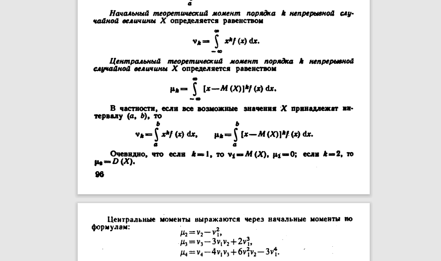

- Найти матожидание и дисперсию равномерного распределения.
- Найти первый и второй начальные и центральные моменты экспоненциального.
- Ввести аналог начальных и центральных моментов для дискретных распределений.
- Третий начальный момент называют коэффициентом асимметрии.
- Четвёртый центральный момент минус 3 называют коэффициентом эксцесса.

!!! warning "Пометка"
    В исходнике асимметрия и эксцесс названы без нормировки. На паре стоит уточнить стандартные определения.

## Медиана и квантили

Квантиль порядка $x \mapsto y$: $F(y) = x$.

Найдите квантили $0{,}25$, $0{,}5$ и $0{,}75$ экспоненциального распределения с $\lambda = 1$.

## Моменты преобразований

$Y = g(X)$

$$
\begin{aligned}
E(Y) &= \int g(x)\, f_X(x)\, dx \\
M_2(Y) &= \int g^2(x)\, f_X(x)\, dx \\
MC_2(Y) &= \int \bigl(g(x) - M(Y)\bigr)^2 f_X(x)\, dx
\end{aligned}
$$

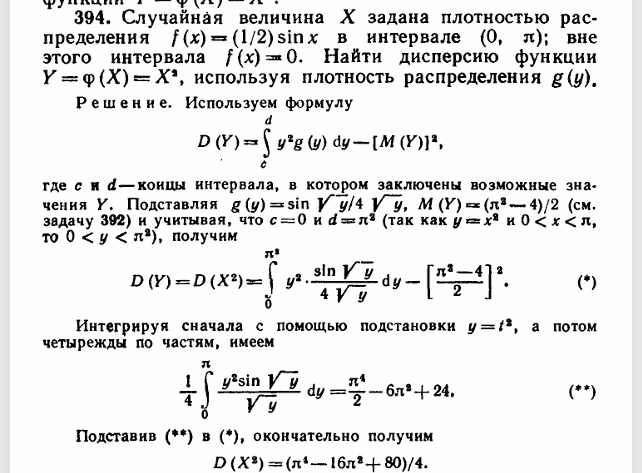

P.S. Решение здесь не то, что нам нужно — просто сверяем ответ.

## Моменты многомерных распределений

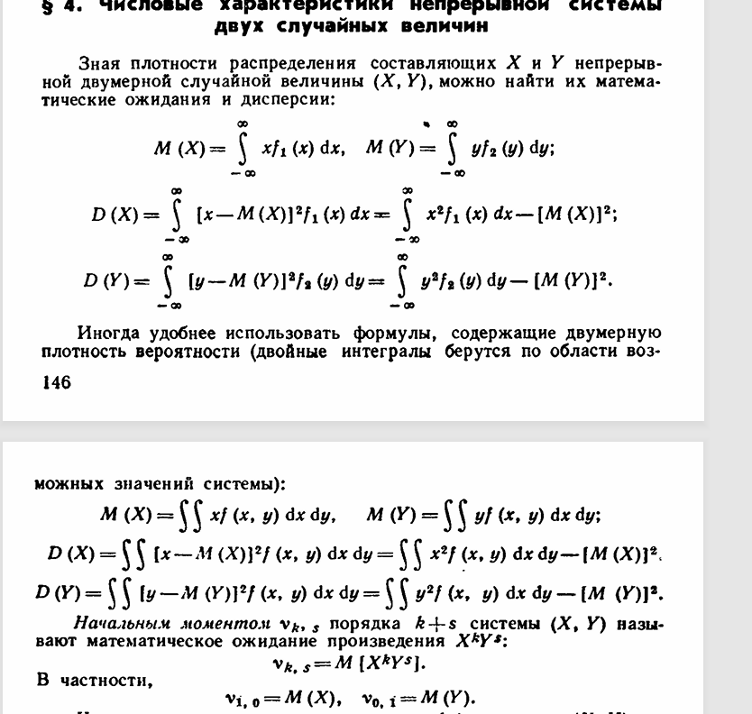

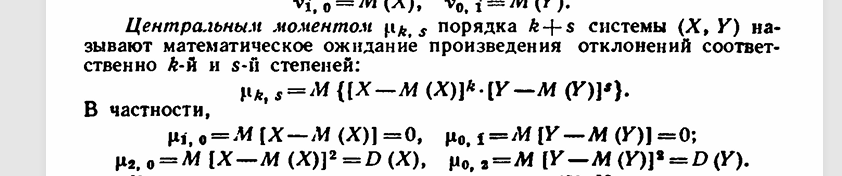

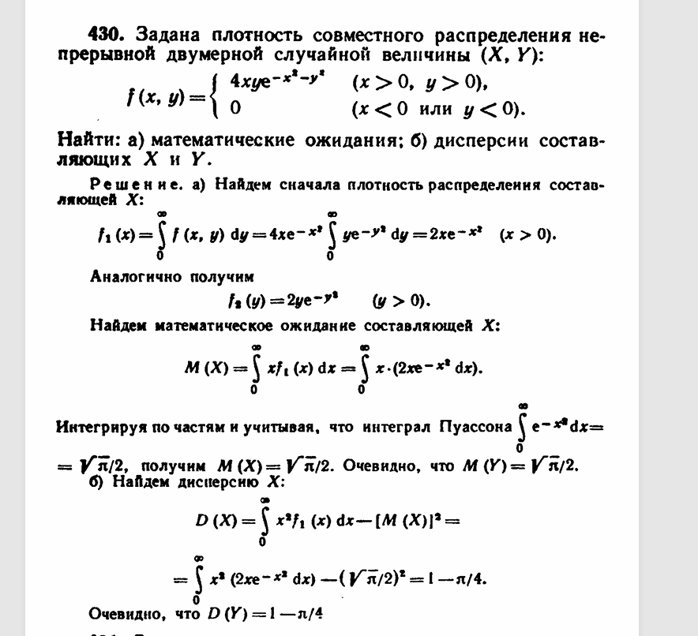

## Корреляция и ковариация

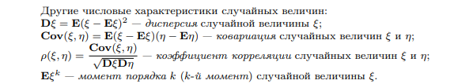

Если случайные величины принимают большие значения в одних и тех же точках и малые — в одних и тех же, $\operatorname{Cov}$ будет почти всегда положительной. Если разные — отрицательной. Если зависимости нет, скомпенсируется.

Корреляция измеряет лишь **линейную** зависимость.

Корреляция не означает причинность.

### Задача

Научное исследование выявило, что легализация оружия приводит к резкому росту преступности. Метод: взяли огромное количество регионов в разных странах и посчитали корреляцию между легализацией и уровнем убийств.

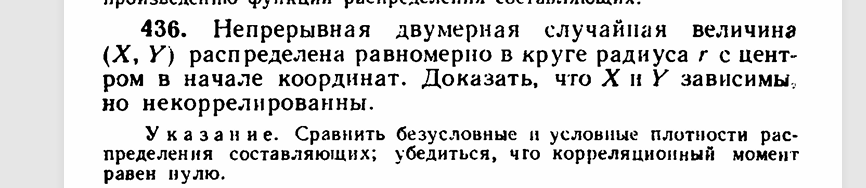

## Условное матожидание

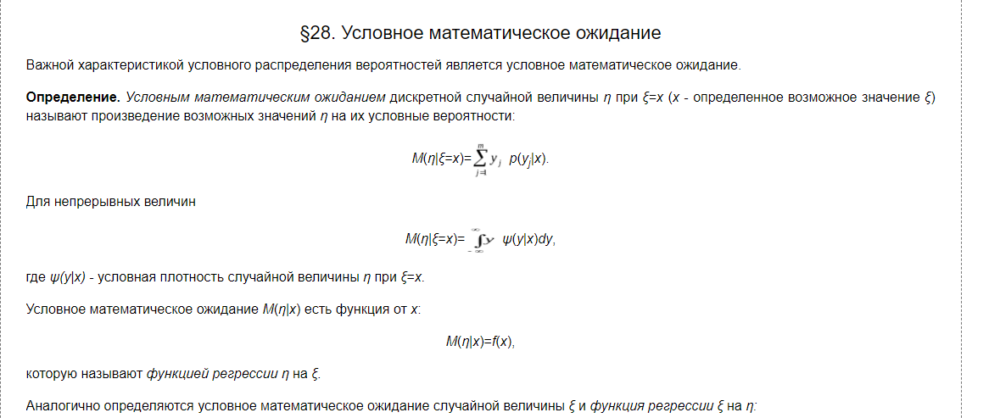

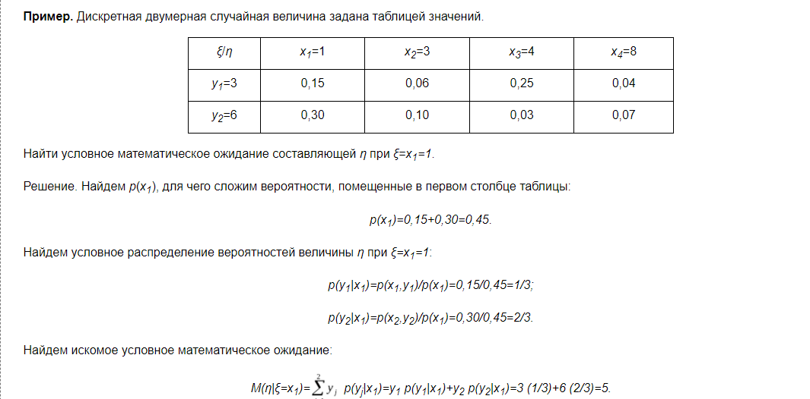

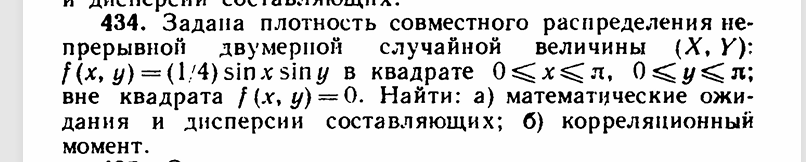

Давайте ещё найдём здесь условное матожидание $X$.

## Составное распределение

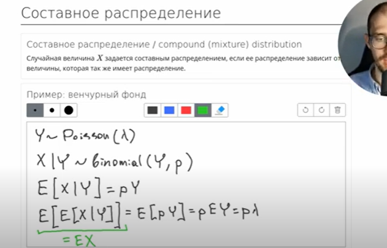

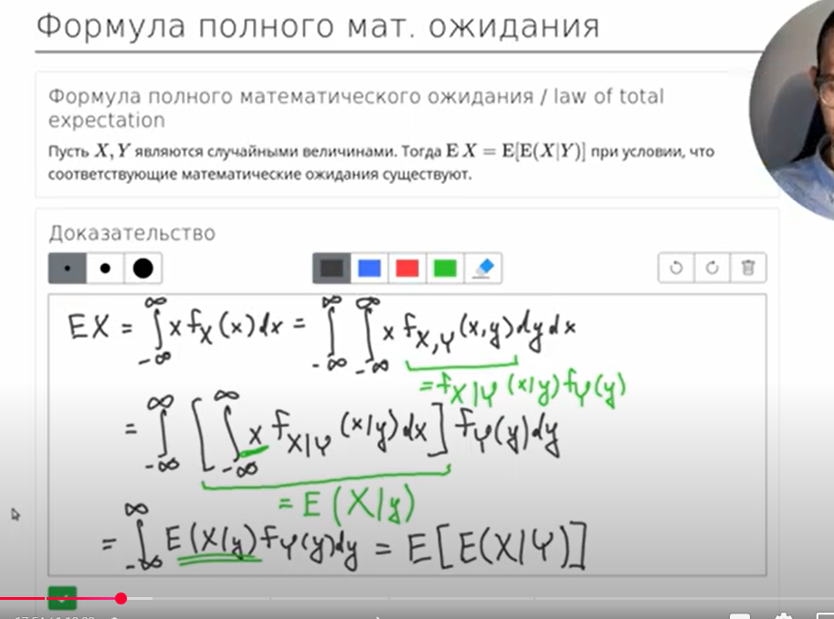

!!! note "Домашнее задание"
    `HW10_y2023.pdf`

!!! example "Самостоятельная"

    **7 минут.** Только ковариацию.

    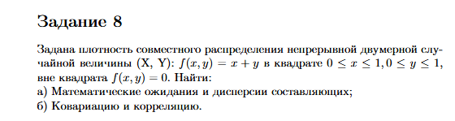

    **5 минут.**

    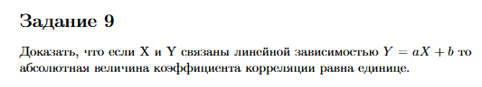
