# Практика 11. Характеристические функции

Вторая половина этой пары — [дисбаланс в играх](p11-balance.md).

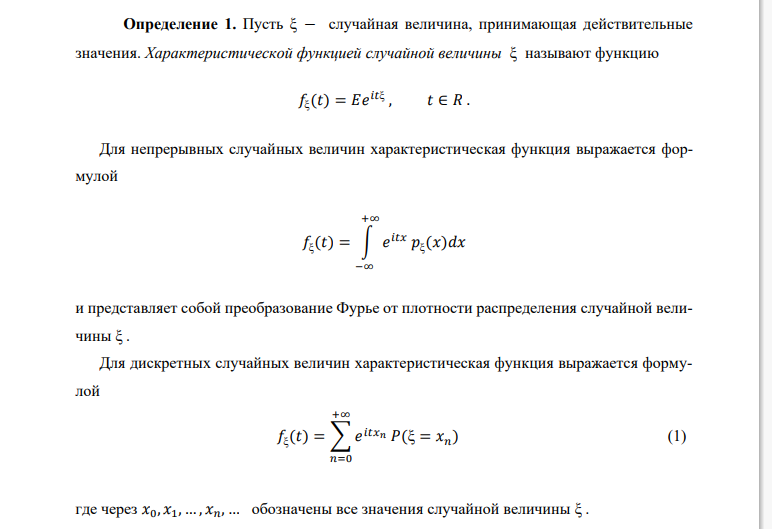

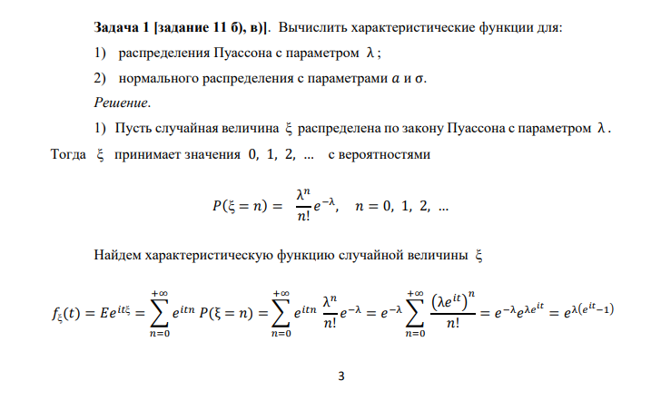

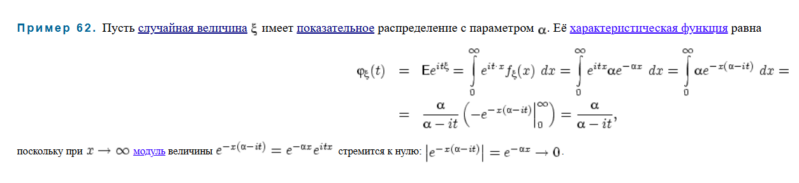

## Характеристическая функция нормального распределения

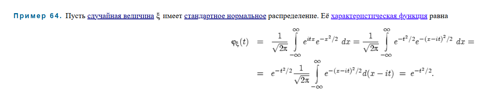

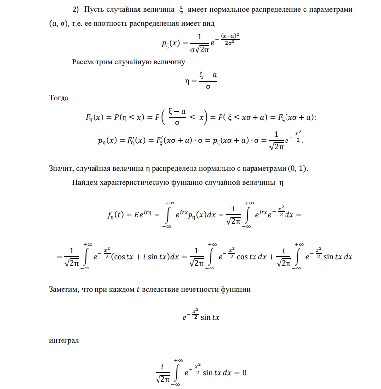

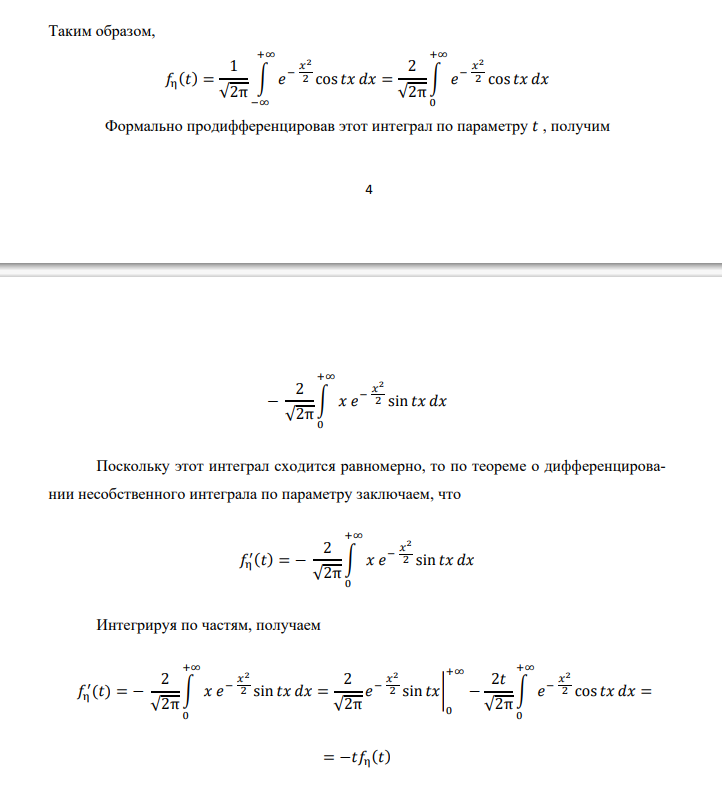

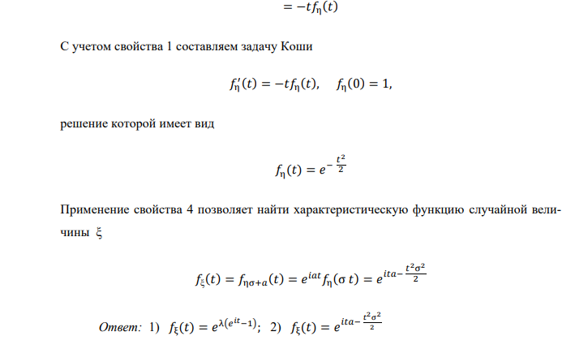

## Свойства

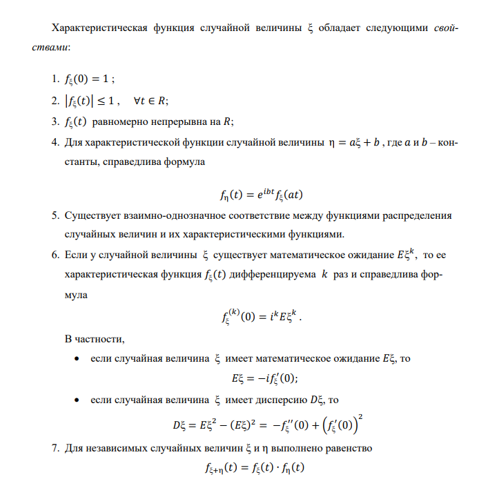

- Найти харфункцию нормального распределения с матожиданием $\mu$ и СКО $\sigma$.
- Найти матожидание и дисперсию распределения Пуассона.

## Предел характеристической функции

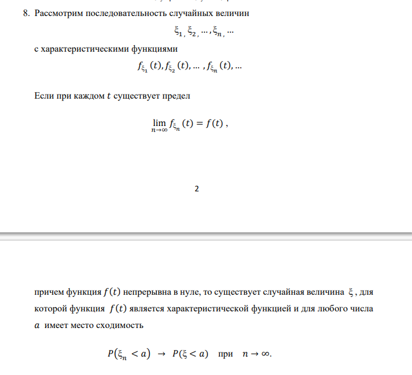

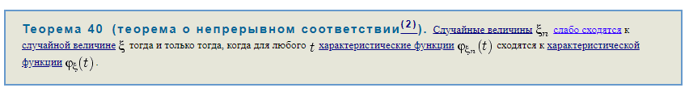

Слабо сходится = сходится по распределению.

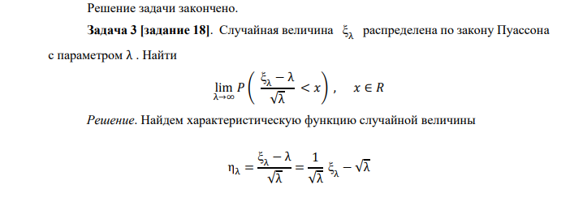

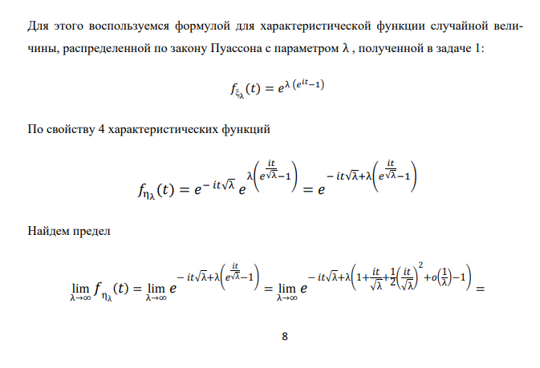

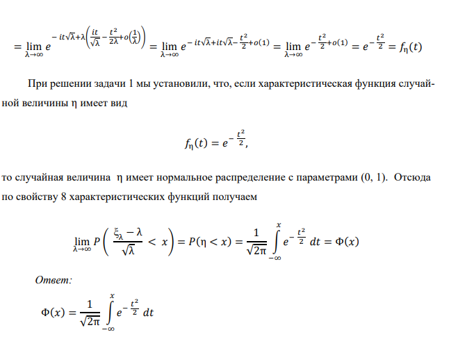

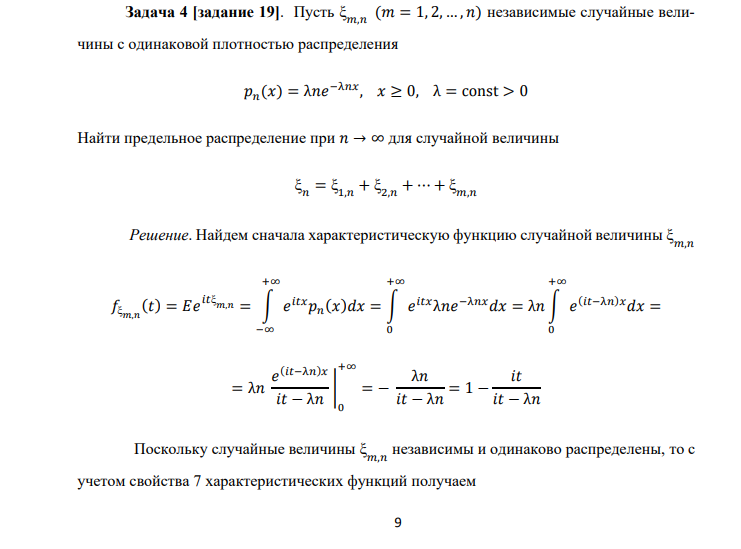

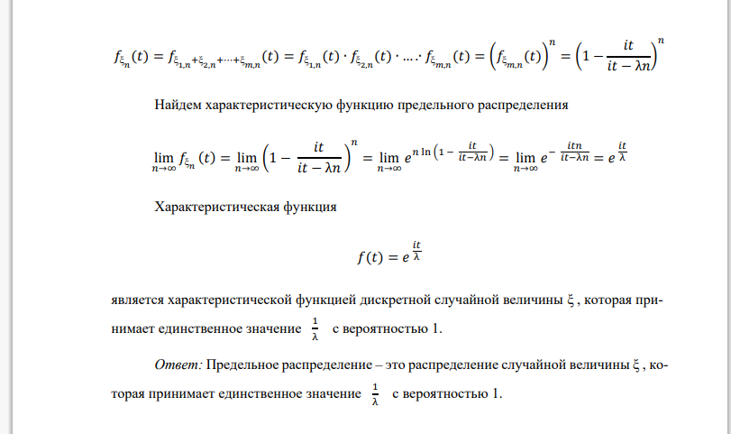

!!! note "Домашнее задание"
    `HW11_y2023.pdf`

!!! example "Самостоятельная"
    Всем $+$баллы.
